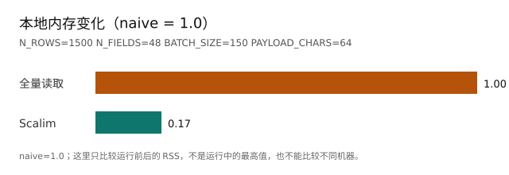

<p align="center">
  
</p>

| - | - |
| --- | --- |
| 库分发 | `scalim` [](https://pypi.org/project/scalim/) [](https://pypi.org/project/scalim/)<br>`scalim-cli` [](https://pypi.org/project/scalim-cli/) [](https://pypi.org/project/scalim-cli/)<br>`scalim-yaml-dsl-lsp` [](https://pypi.org/project/scalim-yaml-dsl-lsp/) [](https://pypi.org/project/scalim-yaml-dsl-lsp/) |
| 文档生成器 | [](https://zensical.org/docs/) |
| 项目工具 | [](https://github.com/astral-sh/uv) [](https://github.com/astral-sh/ruff) [](https://github.com/DetachHead/basedpyright) [](https://pnpm.io/) |
| 配套前端 | [](https://svelte.dev/) [](https://vite.dev/) |

# 简介

**Scalim** 是一个基于字段依赖和数据源加载关系的数据编排框架，通过统一的方式控制内存占用和资源调度，简化性能优化和开发。

它更适合反复生成的业务报表：从多个数据源取数，按关系组合，计算派生字段，再写成 CSV 或 XLSX。源表很宽、内存又容易吃紧时，它通常更有用。

如果只是临时改一份小 CSV，pandas 往往更直接。Scalim 是在规则开始变多、报表要反复跑时才值得引入的。报表可以写成 YAML，也可以直接在 Python 里定义。

- 可以用 Python 编写需求

<details>
<summary>查看 Python 示例</summary>

<!-- BEGIN AUTOGEN:readme-min-python -->
- 代码：[`notebooks/marimo/example_readme_suite/support/min_python.py`](./notebooks/marimo/example_readme_suite/support/min_python.py)
- 章节：`notebooks/marimo/example_readme_suite/chapters/ch010_min_python.py`；在仓库中可用 `just examples` 运行，也可用 `just notebook` 打开
<!-- END AUTOGEN:readme-min-python -->

</details>

- 也可以用 YAML DSL 配置需求

<details>
<summary>查看 YAML 示例</summary>

<!-- BEGIN AUTOGEN:readme-min-yaml -->
```yaml
name: readme_min_yaml_report

main_source:
  source_id: orders
  loader: "myapp.loaders:load_orders"
  fields:
    order_id:
      name: 订单ID
    amount:
      name: 金额
    pay_id:
      name: 支付ID

sources:
  payments:
    loader: "myapp.loaders:load_payments"
    key: id
    params:
      ids: {$keys: {as: set}}
    fields:
      method:
        name: 支付方式
        extract: payment_method
        relation: orders_to_payments

relations:
  orders_to_payments:
    steps:
      - from: orders.pay_id
        to: payments.id

fields:
  total_amount:
    name: 总金额
    compute: "amount * 2"

outputs:
  - name: detail
    to: {file: detail_csv}
    write: {header_fields_output_by: name}
    fields: [order_id, method, total_amount]

resources:
  files:
    detail_csv:
      csv_file:
        path: ./output
```

> 把 `myapp.loaders` 换成你的加载函数所在模块。这份示例会在仓库里自动运行。

- 完整配置：[`support/min_yaml_example.yaml`](./notebooks/marimo/example_readme_suite/support/min_yaml_example.yaml)
- 示例数据和运行脚本：[`support/min_yaml_loaders.py`](./notebooks/marimo/example_readme_suite/support/min_yaml_loaders.py) · [`support/min_yaml.py`](./notebooks/marimo/example_readme_suite/support/min_yaml.py)
<!-- END AUTOGEN:readme-min-yaml -->

</details>

## 快速上手

```bash
# 加入到你的项目
uv add scalim
```

```bash
# 加入到你的环境
uv pip install scalim
```

```bash
# 交互式教程（需要先 clone 仓库）
just notebook
```

运行库支持 Python 3.6 及以上版本。仓库中的交互式教程和文档工具需要 Python 3.10 及以上版本。

## 主要特性

- **多数据源报表**：在一份 YAML 中写清楚数据从哪里来、怎样关联、要计算哪些字段、最后写到哪个文件。可以从 [电商报表示例](./docs/doc/getting-started/demo-big-data-report.md) 看一份完整配置。

- **宽表只取需要的列**：报表只要订单号、金额和支付方式时，Scalim 不会先复制不相关的列。下面的比较把“先读完整张假表再处理”设为 1.0。

图里的数字是同一台机器上一次运行前后进程 RSS 的变化，不是运行中的最高内存，也不能直接和别人的电脑比较。

<!-- BEGIN AUTOGEN:readme-memory-chart -->



<!-- END AUTOGEN:readme-memory-chart -->

<details>
<summary>查看内存比较的代码、数据和重跑方法</summary>

- 默认测试数据在 [`support/knobs.py`](./notebooks/marimo/example_readme_suite/support/knobs.py)：1,500 行、48 个字段，每批 150 行。
- 图表内容来自 [`chart_snapshot.json`](./notebooks/marimo/example_readme_suite/support/chart_snapshot.json)。仓库会确认示例能运行，但不会要求某个固定的内存比例。
- 想自己重跑，可以在仓库中执行 `SCALIM_EXAMPLES_SUITES=example_readme_suite just examples`，然后执行 `just gen-readme-examples` 更新图表。

<!-- BEGIN AUTOGEN:readme-naive-baseline -->
- 代码：[`notebooks/marimo/example_readme_suite/support/naive_baseline.py`](./notebooks/marimo/example_readme_suite/support/naive_baseline.py)
- 对比章节：`notebooks/marimo/example_readme_suite/chapters/ch030_memory_compare.py`；在仓库中可用 `just examples` 运行，也可用 `just notebook` 打开
<!-- END AUTOGEN:readme-naive-baseline -->

<!-- BEGIN AUTOGEN:readme-scalim-path -->
- 代码：[`notebooks/marimo/example_readme_suite/support/scalim_path.py`](./notebooks/marimo/example_readme_suite/support/scalim_path.py)
- 对比章节：`notebooks/marimo/example_readme_suite/chapters/ch030_memory_compare.py`；在仓库中可用 `just examples` 运行，也可用 `just notebook` 打开
<!-- END AUTOGEN:readme-scalim-path -->

</details>

- **最后才用到的字段，不必提前算**：一个派生字段只用于最终写出，而且没有被其他字段或数据加载使用时，Scalim 会在写出前计算它。配置里不用多写开关；有下游依赖的字段仍按正常顺序计算。

- **输出和接入方式不止一种**：可以写 CSV、XLSX，也可以把多个报表放进一个 workflow。需要在运行前后接入日志、审计或自己的动作时，可以使用事件和 hooks；示例在 [这里](./notebooks/marimo/example_hooks_events_scenarios/demo_main.py)。

更多见 [参考文档](./docs/doc/index.md)。

## 质量保证

- 100% 核心测试覆盖率，低于这个值时 CI 会失败。
- 使用 `basedpyright` 做类型检查。
- `Python 3.6` 除了语法检查外，还会在 `typing-extensions==4.1.1` 的隔离环境中验证。
- 使用 Ruff 检查和格式化代码。
- README 中的示例、链接和图表来自 [`example_readme_suite`](./notebooks/marimo/example_readme_suite/demo_main.py)，会和实际运行结果一起检查。

## 设计哲学

1. 核心运行时与 YAML、CLI 等外围工具分开维护。
2. 类型注解要能帮助静态检查，而不是只让编辑器好看。
3. 运行过程可以观察；需要扩展时，可用 Hook、Observer 和 Policy。
