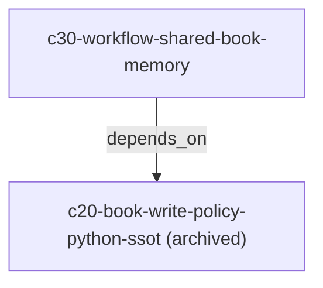

# Workflow 迭代方向 HANDOFF（临时）

> **临时进度追踪**：指导后续 agent/人类推进「YAML 编排瘦身 + Python policy SSOT + 共享 book 内存」方向。  
> `c20` 已归档；本文件在 `c30` 归档并合并进 specs 后可删除或迁入 `docs/doc/dev/` 常驻页。  
> 会话 SSOT 日期：2026-07-12。

## 方向一句话

- **YAML DSL**：只承担编排与资源 identity（runs / 依赖 / `resources.*.id+variant+path` / `outputs.to` / 内容字段）。
- **Python**：承担 book 写入策略、`budget` 及同类调参（`ResourcesPolicy`；开箱 builtin defaults；显式 policy 覆盖）。
- **共享 book**：多节点写入仍合法；openpyxl 仅最终 commit；性能问题在 plan 全量物化，不在并发写 xlsx。

## Active changes（依赖）



| Change | 角色 | 状态 | 校验 |
| --- | --- | --- | --- |
| `c20-book-write-policy-python-ssot` | 边界：write_defaults + budget → Python SSOT；YAML reject | **archived** → `llmanspec/changes/archive/2026-07-12-c20-book-write-policy-python-ssot/` | specs 已合并；`llman sdd validate --all` OK |
| `c30-workflow-shared-book-memory` | 性能：P0 尽早释放双驻留 + P1 `xlsx_memory` Python budget 验收 | **proposed（MUST 已收紧；待 apply）**；depends on c20（已满足） | `llman sdd validate … --strict --no-interactive --stage spec` OK；`--stage full` 待 apply 勾选后 |

推进命令：

```bash
llman sdd show c30-workflow-shared-book-memory
llman sdd graph c30-workflow-shared-book-memory --depth 2
# 下一步：llman-sdd-apply 实现 c30（P0+P1）
```

## 已拍板决策

| # | 决策 |
| --- | --- |
| 1 | `resources.books/files` 的 **id / variant / path**（及 `export_xlsx.path`）**留 YAML** |
| 2 | **`write_defaults` → Python SSOT**（选项①，不是 YAML+overlay 双轨） |
| 3 | **`budget` → Python SSOT** |
| 4 | **`allow_formulas` / `encoding` 暂保持 YAML 可写**（一般不动态改） |
| 5 | 开箱：不传 policy = 今日缺省（`mode=sheet`, `on_conflict=error`, …；budget unlimited） |
| 6 | 两线都落 formal change；c30 depends_on c20（c20 已归档） |
| 7 | **c30 P0**：消费者闭包 = 待执行 write nodes + 待执行 `book_sheet_rows` 可见性消费者；写成功无剩余消费者 → discard demand artifact；`commit_all`/`discard_all` 后清 plan segments；diagnostics 走既有通道（原因 `no_remaining_consumers\|commit\|discard`） |
| 8 | **c30 P1**：仅对 `xlsx_memory` 强制 `BookBudgetPolicy`；`xlsx_file` **不**套 cell/sheet budget |
| 9 | **c30 不做**：spill / seal / 默认边写 openpyxl / YAML release knobs / `xlsx_file` budget → 已迁 `futures/.../future.md` Deferred |

## 目标态例子

### YAML（瘦）

```yaml
workflow:
  resources:
    books:
      report:
        xlsx_file:
          path: ./out
  runs:
    - id: a
      demand: ./a.yaml
    - id: b
      demand: ./b.yaml
      depends_on: [a]
```

### Python（SSOT）

```python
result = run_workflow(
    "workflow.yaml",
    options=WorkflowRunOptions(
        demand=DemandRunOptions(...),
        # resources_policy=ResourcesPolicy(books={
        #   "report": BookResourcePolicy(
        #       write=BookWritePolicy(mode=BookWriteMode.APPEND, header_policy=BookWriteHeaderPolicy.ONCE),
        #       budget=BookBudgetPolicy(max_sheets=8, max_total_cells=1_000_000),
        #   )
        # }),
    ),
)
```

## 与其它 active changes 的协调

**结论：没有任何 active change 被 c30 整份取代。** 多数正交；下表仅列交叉项。

| Change | 关系 | 建议 |
| --- | --- | --- |
| `c0-output-write-path-allowlist` | 同碰 `books-resources` / shared-output；主题是 path 白名单（Python 入口） | **互补**；合 delta 时注意别互相覆盖。方向与「调参进 Python」一致 |
| `c1-allow-formulas-safe-default` | 同碰 books 的 `allow_formulas` | **不取代**；字段仍在 YAML。c1 只改默认 true→false |
| `c5-extract-openpyxl-shared-helpers` | 同改 `resources_workbook/sheetbook` | **有利前置（soft）**；先做可减 c30 重复，非硬 `depends_on` |
| `c5-workflow-temp-file-permissions` | staging/publish 邻近 | **正交加固**；可与 c30 并行，注意同一文件合并 |
| 其余 c0/c1/c10（timestamp、sleep fixtures、trusted-mode、compute-dos、preloaded-cache、adaptive-locks） | 无交叉 | 照旧推进 |

## 相关工件（合并 / 移除意向）

| 工件 | 意向 |
| --- | --- |
| `governance-mainline-principles` / `yaml-dsl-runtime-policy-boundary` | KEEP；c20 已扩展进 main specs |
| `yaml-dsl-write-policy-and-output-extras` | KEEP；c20 已 REWRITE 进 main |
| `yaml-dsl-books-resources` | KEEP；write_defaults/budget 已削出 YAML |
| `workflow-shared-output-containers` | KEEP；策略来源已改 Python；释放/budget 接线待 c30 |
| `notplan/c0-roadmap-yaml-dsl-oneof-checklist` | REMOVE/stale（oneOf 已落地） |
| `notplan/c1-streaming-xlsx-output` | REFRAME：禁止 YAML streaming knobs；另案 Python/profile（**非**被 c30 直接实现） |
| `notplan/c1-runtime-performance-profiles` | KEEP 为后续载体 |
| `futures/.../R2` 峰值内存 | c30 第一刀（释放 + xlsx_memory budget）；spill/seal/`xlsx_file` budget/边写 → Deferred later |

## 建议推进顺序

1. ~~Apply + archive `c20`~~（已完成）
2. ~~收紧 `c30` proposal（MUST-only A+B；P2+ → futures）~~（已完成）
3. **Apply `c30` P0/P1**（释放 + `xlsx_memory` budget 验收）
4. （可选）reframe streaming notplan / 引入 performance profiles
5. `c30` 归档后刷新本 HANDOFF 或删除

## 不要做的事

- 不要把 flush/streaming/budget/write_defaults 重新加回 YAML 主线
- 不要默认「边写边 openpyxl」破坏原子 discard（除非独立 change + 显式 profile）
- 不要手改 `*.gen.json` schema

## 指针

- Archived: `llmanspec/changes/archive/2026-07-12-c20-book-write-policy-python-ssot/`
- Active: `llmanspec/changes/c30-workflow-shared-book-memory/`
- Skill upgrade: `agentdev/skills/scalim-yaml-dsl/references/upgrades/2026-07-12-book-write-policy-python-ssot.md`
- 上位原则: `llmanspec/specs/governance-mainline-principles/spec.toon`
- Review checklist: `docs/doc/yaml-dsl/review-checklist.md`
- AGENTS 短规则: `AGENTS.md`（YAML authoring vs Python policy）
