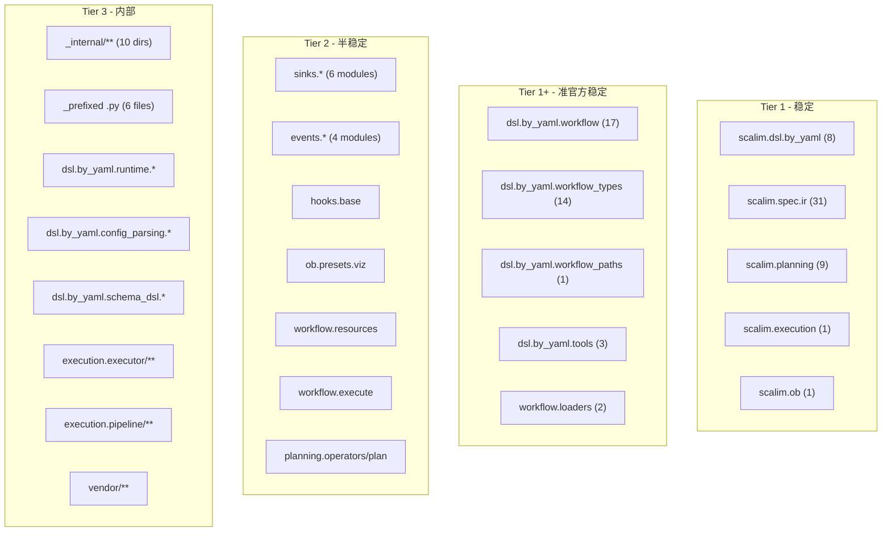

# scalim 公开 API 表面审计与治理方案

## 审计数据摘要

- 274 个 `.py` 文件, 49 个 `__init__.py`
- 23 个 `__init__.py` 有 `__all__`, 26 个无
- ~136 个非 init 文件有 `__all__`
- **34 个"泄漏模块"**: 公开文件名 + 无 `__all__`
- **5 个模块的 `__all__` 含 `_` 前缀符号** (19 个可疑条目)
- 10 个 `_internal/` 子包, 6 个 `_` 前缀 `.py` 文件

---

## 决策点 1: 分层 API 承诺体系设计

### 方案 A: 三层体系 (Tier 1 / Tier 2 / Tier 3)




- **优势**: 粒度细，区分准确；Tier 1+ 解决了 workflow 辅助模块的定位问题
- **劣势**: Tier 1 和 Tier 1+ 边界模糊，维护成本高；对外沟通需要解释"准官方"概念

### 方案 B: 两层体系 (Public / Internal)

将 Tier 1 + Tier 1+ + Tier 2 合并为 **Public**，其余为 **Internal**。

- **优势**: 极简，用户认知成本最低
- **劣势**: 把 sinks/events/hooks 这些半成熟模块也承诺为 public，未来修改受限

### 方案 C: 三层体系 (Stable / Provisional / Internal) -- 推荐


| 层级              | 语义                                     | 破坏性变更承诺                                                                                           | 包含模块                                                                        |
| --------------- | -------------------------------------- | ------------------------------------------------------------------------------------------------- | --------------------------------------------------------------------------- |
| **Stable**      | SemVer 保护                              | 仅 major 版本可以破坏                                                                                    | 五大 facade + workflow/workflow_types/workflow_paths/tools + workflow.loaders |
| **Provisional** | 可能在 minor 版本变更，但会有 deprecation warning | sinks.*, events.*, hooks.base, ob.presets.viz, workflow.resources, workflow.execute, planning 子模块 |                                                                             |
| **Internal**    | 随时可变，零承诺                               | _internal/**, _前缀模块, runtime/config_parsing/schema_dsl/executor/pipeline/vendor                   |                                                                             |


- **优势**: 三层语义清晰，与 Python 标准库的 provisional 概念一致 (PEP 411)；给 sinks/events/hooks 一个"试用但会稳定"的缓冲期
- **劣势**: 需要在文档中解释 provisional 的含义

---

## 决策点 2: `__all`__ 中 `_` 前缀符号的修复方案

涉及模块: [workflow/resources_base.py](src/scalim/workflow/resources_base.py), [resources_csv.py](src/scalim/workflow/resources_csv.py), [resources_workbook.py](src/scalim/workflow/resources_workbook.py), [resources_sheetbook.py](src/scalim/workflow/resources_sheetbook.py), [dsl/by_yaml/runtime/conversion.py](src/scalim/dsl/by_yaml/runtime/conversion.py)

当前模式:

```python
# 实现用 _前缀，然后创建公开别名，但两者都在 __all__ 里
class _CsvPlan: ...
CsvPlan = _CsvPlan
__all__ = ["CsvPlan", "_CsvPlan", ...]  # 问题: _CsvPlan 不应在 __all__
```

### 方案 A: 仅从 `__all__` 移除 `_` 前缀符号 -- 推荐

```python
__all__ = ["CsvPlan", ...]  # 只保留公开别名
# _CsvPlan 仍存在于模块中，只是不通过 __all__ 导出
```

- **优势**: 最小改动，不破坏任何现有 `from ... import _CsvPlan` (只影响 `import` *)
- **劣势**: `_CsvPlan` 仍然可以被直接 import，只是不再"宣传"

### 方案 B: 移除 `_` 前缀符号 + 删除双发布模式

```python
class CsvPlan: ...  # 直接用公开名定义
__all__ = ["CsvPlan", ...]
# 不再有 _CsvPlan
```

- **优势**: 彻底消除双发布的混乱
- **劣势**: 破坏所有 `from ... import _CsvPlan` 的现有代码；需要全量搜索内部使用点

### 方案 C: 反转方向 -- 公开名定义 + `_` 前缀作为 deprecated 别名

```python
class CsvPlan: ...  # SSOT
_CsvPlan = CsvPlan  # deprecated alias, will be removed in next major
__all__ = ["CsvPlan"]
```

- **优势**: 提供迁移过渡期
- **劣势**: 短期内代码更多

对 `conversion.py` 的 `_validate_source_id`:

- 如果确实是 "public for tests"，应重命名为 `validate_source_id` 并放入 `__all__`
- 如果只是内部函数意外泄漏，直接从 `__all__` 移除

---

## 决策点 3: 34 个泄漏模块的处理策略

### 分类处理矩阵

**A 类: 已在 `_internal/` 下 (14 个) -- 风险最低**

文件: hooks/_internal/ (5), ob/_internal/ (5+4)


| 方案  | 做法                      | 推荐            |
| --- | ----------------------- | ------------- |
| A1  | 补 `__all__ = []` 冻住表面   | 推荐 -- 防御性，零破坏 |
| A2  | 不管 (依赖 `_internal` 目录名) | 可接受但不严谨       |


**B 类: `spec/ir/` 叶子模块 (7 个)**

文件: demand.py, fields.py, helpers.py, relations.py, source_contracts.py, sources.py, workflow.py


| 方案  | 做法                                                                                          | 优势                                                         | 劣势                                   |
| --- | ------------------------------------------------------------------------------------------- | ---------------------------------------------------------- | ------------------------------------ |
| B1  | 补 `__all`__ 等于本模块导出到 `ir/__init__.py` 的那些符号                                                 | 用户可以继续 `from scalim.spec.ir.fields import FieldIr`，同时有显式声明 | 固化了两条导入路径                            |
| B2  | 重命名为 `_demand.py`, `_fields.py` 等                                                           | 彻底封死叶子路径，只剩 facade                                         | 破坏性大；需同步更新 `ir/__init__.py` 的 import |
| B3  | 补 `__all__ = []`，让叶子模块不再通过 `import` * 泄漏，但 `from scalim.spec.ir.fields import FieldIr` 仍然可用 | 最小改动                                                       | 只防 `import` *，不防显式路径导入               |


**推荐 B2** (既然不在乎破坏性)：将 `spec/ir/` 下的叶子文件重命名为 `_` 前缀，强制用户只从 `scalim.spec.ir` 导入。

**C 类: `dsl/by_yaml/` 下的实现模块 (~33 个)**

包括 config_parsing/parsers/*.py, config_parsing/validators/*.py, schema_dsl/models/*.py, runtime/_internal/*.py


| 方案  | 做法                                                                                                    | 优势               | 劣势                   |
| --- | ----------------------------------------------------------------------------------------------------- | ---------------- | -------------------- |
| C1  | 全部补 `__all__ = []`                                                                                    | 最简单，防 `import` * | 仍可直接 import          |
| C2  | 将整个 `config_parsing/`, `schema_dsl/`, `runtime/` 重命名为 `_config_parsing/`, `_schema_dsl/`, `_runtime/` | 彻底封死包路径          | 改动量极大，所有内部 import 需改 |
| C3  | 不改目录名，但在 `config_parsing/__init__.py` 等补 `__all__ = []` + 在文档/lint 层面禁止外部导入                           | 中等改动量            | 不如重命名彻底              |


**推荐 C3 + lint 规则**：不重命名目录（避免巨量 diff），但通过 `__all__ = []` + CI lint 规则（禁止从非 cataloged 路径导入）来强制约束。

**D 类: `execution/` 内部模块 (17 个)**

大多已在 `executor/`, `pipeline/`, `adaptive/` 下。

**推荐**: 统一补 `__all__ = []`。这些模块在治理 spec 中已明确标记为内部实现。

**E 类: 独立散模块 (cli/3, planning/3, utils/4, root/1, vendor/2)**


| 模块                                                                      | 推荐处理                                                          |
| ----------------------------------------------------------------------- | ------------------------------------------------------------- |
| `cli/main.py`, `cli/yaml_dsl.py`, `cli/yaml_dsl_lsp.py`                 | `__all__ = []` -- CLI 入口不是库 API                               |
| `planning/builder.py`, `metadata.py`, `stages.py`                       | 补 `__all`__ 列出需要公开的符号 -- 这些被 `planning/__init__.py` re-export |
| `utils/converters.py`, `excel.py`, `graph.py`, `json_like.py`           | `__all__ = []` -- 内部工具                                        |
| `typedefs.py`                                                           | `__all__ = []` 或重命名为 `_typedefs.py`                           |
| `vendor/compact/typing_extensionsx.py`, `vendor/litejinja2/typedefs.py` | `__all__ = []` -- vendor 内部                                   |


---

## 决策点 4: `sinks` 子包的 facade 归属

### 方案 A: 成为第六个官方入口 `scalim.sinks`

在 `sinks/__init__.py` 中 re-export 所有 sink 类:

```python
from .sink_base import BaseSink, BaseRowSink, BaseColumnSink
from .sink_csv import CSVSink, ColumnCSVSink, ...
# ...
__all__ = [...]
```

- **优势**: 用户发现路径清晰 (`from scalim.sinks import CSVSink`)；与五大 facade 并列
- **劣势**: 增加一个顶层入口；sink 可能还在演化

### 方案 B: 纳入 `scalim.execution` facade

```python
# execution/__init__.py
from ..sinks.sink_csv import CSVSink
```

- **优势**: 符合"执行 -> 输出"的概念模型
- **劣势**: 语义牵强；execution 目前只有 ScalimEngine

### 方案 C: 保持 `scalim.sinks.sink_`* 作为 Provisional 路径 -- 推荐

不做 facade 聚合，每个 sink 模块已有 `__all__`，标记为 Provisional。

- **优势**: 零改动；sink 模块已经自治；用户按需导入
- **劣势**: 没有统一入口，发现性稍差

### 方案 D: `scalim.sinks` facade + 保留子路径

```python
# sinks/__init__.py re-exports
__all__ = [...]
```

同时 `sink_csv.py` 等保持各自的 `__all__`。

- **优势**: 两条路径都能用
- **劣势**: 路径多义性

**推荐: 方案 A** -- 既然不怕破坏性变更，直接建立 `scalim.sinks` 作为第六个官方入口最为干净。

---

## 决策点 5: `events` / `hooks` 的表面归属

### 方案 A: 纳入 `scalim.ob` 作为扩展点子路径

```python
# ob/__init__.py
from ..events.event import ScalimEvent
from ..hooks.base import HookManager, BaseHook
```

- **优势**: 概念上 hooks/events 是可观测性的延伸
- **劣势**: ob 目前是纯观察者模式，hooks 是拦截器，语义不完全匹配

### 方案 B: 独立为 `scalim.hooks` 和 `scalim.events` 两个 Provisional 入口

- **优势**: 清晰分离；hooks 和 events 职责不同
- **劣势**: 入口数量持续膨胀 (5 -> 6 -> 8)

### 方案 C: 标记为 Provisional，不建 facade -- 推荐

events 和 hooks 目前的模块结构已有 `__all__`，标记为 Provisional，在文档中说明"高级扩展点"。

- **优势**: 不增加入口数；等成熟后再做 facade
- **劣势**: 用户需知道去 `scalim.hooks.base` / `scalim.events.event` 导入

---

## 决策点 6: API Inventory 格式

### 方案 A: TOML SSOT + 生成 .gen.md -- 推荐

在 `src/scalim/_api_inventory.toml` 中维护:

```toml
[stable."scalim.dsl.by_yaml"]
symbols = ["UNSET", "Compilation", "ResolverTrustedMode", ...]
tier = "stable"

[provisional."scalim.sinks.sink_csv"]
symbols = ["CSVSink", "ColumnCSVSink", ...]
tier = "provisional"
```

由 `scripts/gen-api-inventory.py` 生成 `docs/doc/api/api-inventory.gen.md`。

CI 脚本 `scripts/check-api-surface.py` 读取此 TOML:

1. 验证每个 cataloged 模块的 `__all__` 与 TOML 一致
2. 扫描所有非 internal 模块是否都已在 TOML 中注册
3. 检测新增公开符号 (PR diff)

- **优势**: SSOT 集中，机器可读可写，支持 CI 自动化，文档自动生成
- **劣势**: 新增一个治理文件需维护

### 方案 B: JSON inventory

与 A 类似但用 JSON。

- **优势**: 更广泛的工具支持
- **劣势**: JSON 不支持注释，不适合 SSOT

### 方案 C: 直接从 `__all__` 推导，不维护额外文件

CI 脚本扫描代码中的 `__all__`，根据路径规则自动分 tier。

- **优势**: 零维护成本，代码即 SSOT
- **劣势**: 路径规则会随代码演化而陈旧；无法表达"某个模块虽然有 `__all__` 但实际是 internal"的情况

---

## 决策点 7: CI 自动化门禁设计

### 检查 1: `__all__` 覆盖率检查

`scripts/check-api-surface.py --check-all-coverage`:

- 扫描 `src/scalim/` 下所有非 `_` 前缀、非 vendor 的 `.py` 文件
- 验证每个文件要么有 `__all__`，要么在已知的 internal 目录下
- 输出缺失 `__all__` 的文件列表

### 检查 2: `__all__` 内容合规检查

`scripts/check-api-surface.py --check-all-contents`:

- 验证 `__all__` 中无 `_` 前缀符号 (排除 `__version__` 等 dunder)
- 验证 `__all__` 中的每个符号确实在模块中定义/导入

### 检查 3: 公开表面 diff 检测

`scripts/check-api-surface.py --check-surface-drift`:

- 对比 `_api_inventory.toml` 与运行时 `__all__` 的实际值
- 新增符号 -> 警告 (需更新 inventory)
- 删除符号 -> 错误 (potential breakage)

### 检查 4: 禁止从非 cataloged 路径导入 (ruff 自定义)

利用 ruff 的 `[tool.ruff.lint.flake8-tidy-imports.banned-api]`:

```toml
"scalim.dsl.by_yaml.runtime".msg = "Internal module. Import from scalim.dsl.by_yaml instead."
"scalim.dsl.by_yaml.config_parsing".msg = "Internal module."
"scalim.dsl.by_yaml.schema_dsl".msg = "Internal module."
"scalim.execution.executor".msg = "Internal module. Import from scalim.execution instead."
"scalim.execution.pipeline".msg = "Internal module."
```

注意: 这只能约束 **本仓库内** 的导入，不能约束外部用户。但配合 `per-file-ignores` 可以精确控制哪些文件允许深入导入。

### 检查 5: 集成到 justfile

```
# 检查: API 表面治理门禁
api-surface-check:
    uv run python scripts/check-api-surface.py
```

纳入 `quick-check-only-py` 链。

---

## 推荐实施路径总结


| 决策点               | 推荐方案                           | 理由                |
| ----------------- | ------------------------------ | ----------------- |
| 分层体系              | C: Stable/Provisional/Internal | PEP 411 先例；清晰三层语义 |
| `_` 前缀符号          | A: 仅从 `__all__` 移除             | 最小改动，已有公开别名       |
| 泄漏模块 - _internal  | A1: 补 `__all__ = []`           | 防御性零破坏            |
| 泄漏模块 - spec/ir 叶子 | B2: 重命名为 `_` 前缀                | 彻底封死双路径           |
| 泄漏模块 - dsl 实现     | C3: 补 `__all`__ + lint 规则      | 平衡改动量与效果          |
| 泄漏模块 - 其余         | 分类处理 (见 E 类)                   | 各有合适策略            |
| sinks             | A: 第六个官方入口                     | 不怕破坏就直接给 facade   |
| events/hooks      | C: Provisional 不建 facade       | 等成熟再升级            |
| API inventory     | A: TOML SSOT + gen.md          | 机器+人可读            |
| CI 门禁             | 五检查 + justfile 集成              | 全方位覆盖             |


---

## 交付物清单

1. `**src/scalim/_api_inventory.toml**` -- 符号 -> 推荐路径 -> Tier -> 当前可达路径
2. `**docs/doc/api/api-inventory.gen.md**` -- 生成的人可读 API 目录
3. `**scripts/check-api-surface.py**` -- CI 检查脚本 (5 项检查)
4. `**scripts/gen-api-inventory.py**` -- 从 TOML 生成文档
5. **治理规则更新** -- [public-api-surface-governance/spec.md](openspec/specs/public-api-surface-governance/spec.md) 增加 Tier 定义
6. **justfile 新增** `api-surface-check` 任务并纳入 `quick-check-only-py`
7. **pyproject.toml** 新增 ruff banned-api 规则
8. **~80 个文件的 `__all`__ 补充/修正** (34 泄漏模块 + 26 无 **all** 的 **init**.py + 5 个 _ 前缀修复 + spec/ir 重命名)

