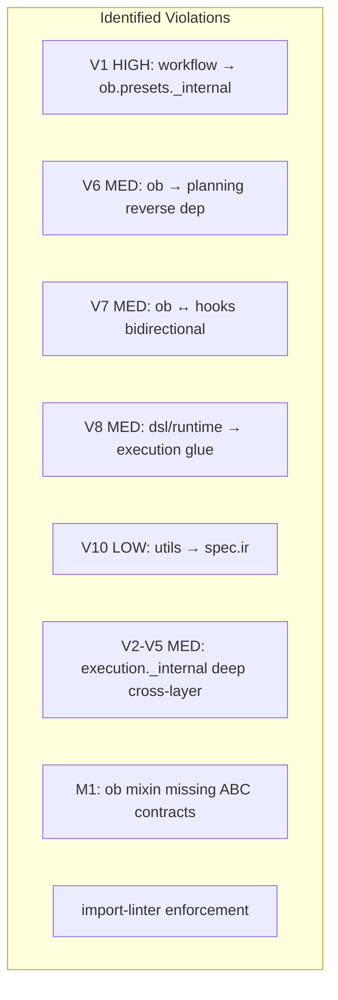
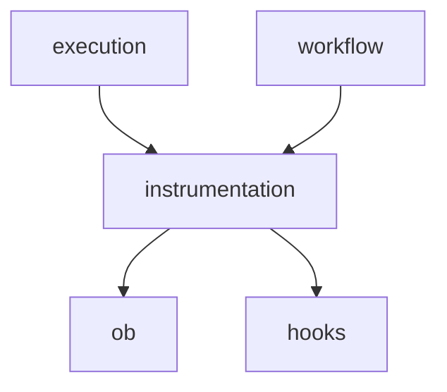
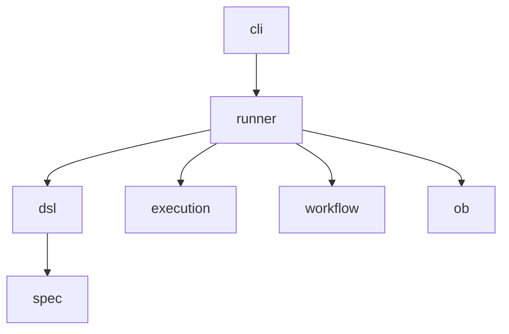

# scalim 内部依赖边界解耦方案全集

## 违规总览

---

## 主题 1: V1 — `workflow/execute.py` → `ob.presets._internal.viz_config`

**现状**: [workflow/execute.py](src/scalim/workflow/execute.py) 第 29-30 行直接导入 `ob.presets._internal.viz_config` 中的 `default_viz_dir()` 和 `normalize_output_dir()`。消费点在 `_bundle_run_dir()` (第 569-574 行)。

### 方案 A: 在 `VizObserverConfig` 上新增公开方法

在 `VizObserverConfig` 上添加 `resolve_bundle_dir(run_id)` 方法，将 `_bundle_run_dir` 的逻辑下沉到 config 类自身。

**改动**:

- `ob/presets/_internal/viz_config.py`: `VizObserverConfig` 新增 `resolve_bundle_dir(self, run_id: str) -> str` 方法
- `workflow/execute.py`: 删除第 29-30 行的 `_internal` 导入，`_bundle_run_dir` 改为调用 `config.resolve_bundle_dir(run_id)`

**优势**: 最小改动（2 个文件）；逻辑内聚到 config 类；不暴露底层函数
**劣势**: 给 `VizObserverConfig` 增加了 workflow 场景特有的方法，略微违反 SRP

### 方案 B: 在 `ob.presets.viz.__init__` 中 re-export 工具函数

在公开 API 层 re-export `normalize_output_dir` 和 `default_viz_dir`。

**改动**:

- `ob/presets/viz/__init__.py`: 新增 `from .._internal.viz_config import default_viz_dir, normalize_output_dir` 及 `__all__` 更新
- `workflow/execute.py`: 导入改为 `from ..ob.presets.viz import default_viz_dir, normalize_output_dir`

**优势**: 改动最少（2 个文件 2 行）；函数签名不变，无破坏性
**劣势**: 将内部工具函数提升为公开 API——一旦公开就要维护兼容性

### 方案 C: 将路径逻辑提取到独立的 `ob.presets.viz.paths` 模块

新建 `ob/presets/viz/paths.py`，将 `default_viz_dir` 和 `normalize_output_dir` 从 `_internal/viz_config.py` 移出。

**改动**:

- 新建 `ob/presets/viz/paths.py`: 迁入两个函数
- `ob/presets/_internal/viz_config.py`: 改为 `from ..viz.paths import ...`
- `ob/presets/viz/__init__.py`: re-export
- `workflow/execute.py`: 改导入

**优势**: 关注点分离最清晰；路径工具函数有独立归属
**劣势**: 新建文件；`_internal/viz_config.py` 需要反向引用 `../viz/paths.py`，可能有循环风险

**推荐: 方案 A** — 最内聚，不扩大公开 API 面

---

## 主题 2: V6 — `ob.presets.viz` → `planning.plan.ExecutionPlan`

**现状**: [ob/presets/viz/observer.py](src/scalim/ob/presets/viz/observer.py) 第 5 行导入 `planning.plan.ExecutionPlan`，用于 `VizObserver.from_plan()` 类方法（第 47 行）。调用者 2 处: `execution/run_ir.py:524` 和 `dsl/by_yaml/runtime/introspection.py:111`。

`ExecutionPlan.to_viz_graph_snapshot()` 返回 `Dict[str, Any]`。

### 方案 A: 消除 `from_plan`，调用侧自行转换

删除 `VizObserver.from_plan()`，让调用侧直接调用 `plan.to_viz_graph_snapshot()` 再传 dict 给 `VizObserver`。

**改动**:

- `ob/presets/viz/observer.py`: 删除 `from_plan` 类方法和 `planning` 导入
- `execution/run_ir.py:524`: 改为 `snapshot = plan.to_viz_graph_snapshot(); viz = VizObserver(config=cfg, snapshot=snapshot)`
- `dsl/by_yaml/runtime/introspection.py:111`: 同上
- 测试文件同步更新

**优势**: 彻底消除 ob → planning 依赖；ob 层变得纯净；逻辑更显式
**劣势**: 破坏公开 API（`VizObserver.from_plan` 消失）；调用侧代码略微增加；output_composition 增强逻辑需调用侧自行处理

### 方案 B: 将 `from_plan` 改为接受 `Dict[str, Any]` snapshot

`from_plan` 重命名为 `from_snapshot`，只接受 dict，不再接受 `ExecutionPlan`。

**改动**:

- `ob/presets/viz/observer.py`: `from_plan(plan)` → `from_snapshot(snapshot: Dict[str, Any])`, 删除 planning 导入
- 调用侧: `VizObserver.from_snapshot(plan.to_viz_graph_snapshot(), config=cfg)`

**优势**: 保留工厂方法的便利性；ob 不再依赖 planning；渐进迁移（可保留 `from_plan` 作 deprecation wrapper）
**劣势**: 仍有轻微 API 变化

### 方案 C: 引入 `VizSnapshotSource` Protocol

定义一个 Protocol `VizSnapshotSource`，要求有 `to_viz_graph_snapshot() -> Dict[str, Any]`，`from_plan` 改为接受 Protocol。

**改动**:

- `ob/presets/viz/observer.py`: 新增 `VizSnapshotSource = Protocol` (需 `typing_extensionsx`)
- `from_plan(cls, source: VizSnapshotSource, ...)` — 不再引用 `ExecutionPlan` 类型

**优势**: 零破坏性；ob 层完全解耦；未来任何有 `to_viz_graph_snapshot` 的对象都能用
**劣势**: 增加了一层抽象；Python 3.6 下 Protocol 需走 `typing_extensionsx` shim；运行时检查受限

**推荐: 方案 B** — 最直接，破坏性可控

---

## 主题 3: V7 — `ob` ↔ `hooks` 双向耦合

**现状**:

- `ob/hub.py` 导入 `hooks.base.HookManager, IExecutionHook` — ob 依赖 hooks
- `ob/components.py` 导入 `hooks.base.IExecutionHook` — ob 依赖 hooks
- hooks 不依赖 ob (单向)

问题: `InstrumentationHub` 同时管理 `ObserverManager` + `HookManager`，使 ob 包硬依赖 hooks 包。

### 方案 A: 将 `InstrumentationHub` 提升到独立的 `instrumentation` 包

将 `ob/hub.py` 和 `ob/components.py` 移到新包 `src/scalim/instrumentation/`，它依赖 ob + hooks 但 ob/hooks 互不依赖。

**改动**:

- 新建 `src/scalim/instrumentation/` 包
- 移动 `ob/hub.py` → `instrumentation/hub.py`
- 移动 `ob/components.py` → `instrumentation/components.py`
- 更新所有引用 `ob.hub` / `ob.components` 的文件（约 8 处）

**优势**: 彻底解耦 ob 和 hooks；架构层次最清晰
**劣势**: 大面积重命名；破坏已有 `from scalim.ob.hub import InstrumentationHub` 的外部用户；新增一个包

### 方案 B: 在 `ob/hub.py` 中使用延迟导入 + Protocol

将 `HookManager` 的导入改为 `TYPE_CHECKING` 下的类型引用，运行时通过 Protocol 约束。

**改动**:

- `ob/hub.py`: hooks 导入移入 `TYPE_CHECKING`；定义 `HookManagerLike(Protocol)` (hooks 已有此 Protocol)
- `ob/components.py`: 同理，用 Protocol 替代 `IExecutionHook` 硬导入

**优势**: 无文件移动；破坏性最小；运行时不再硬 import hooks
**劣势**: Protocol 在 Python 3.6 下受限（需 `typing_extensionsx`）；`split_components` 用了 `isinstance(c, IExecutionHook)` 检查，Protocol 不支持默认的 isinstance

### 方案 C: 接受现状，标注为"设计决策"

ob 包含 `InstrumentationHub` 这个"聚合器"角色，hooks 是它的自然组成部分。不改。

**优势**: 零成本；当前能正常工作
**劣势**: ob 包永远不能脱离 hooks 单独使用

**推荐: 方案 A**（如果不在乎破坏性），否则 **方案 C**

---

## 主题 4: V8/V9 — `dsl/by_yaml/runtime/` → `execution` / `workflow` 跨层胶水

**现状**: `dsl/by_yaml/runtime/` 下 8 个文件直接导入 `execution.`*（GuardrailsPolicy, ExecutionRequest, run_ir 等），4 个文件导入 `workflow.*`。这使 dsl 成为一个"全知层"。

### 方案 A: 提取 `runner` 包 — 胶水代码独立

将 `dsl/by_yaml/runtime/` 中的运行时整合逻辑（entrypoints, unsafe_entrypoints, compiler, stages, observability, output_composition_yaml）移到新顶层包 `src/scalim/runner/`。`dsl` 只负责 YAML 解析 → spec.ir 编译。

**改动**:

- 新建 `src/scalim/runner/` 包
- 移动约 8 个文件
- `dsl/by_yaml/` 保留纯编译逻辑 (conversion*, workflow_compile, config_parsing)
- 更新所有导入（估计 15-20 处）

**优势**: dsl 变成纯编译层，不再跨层；架构分层最干净；runner 的角色（组装+执行）清晰
**劣势**: 大规模重构；破坏 `from scalim.dsl.by_yaml import run_demand` 的用户接口；新包需要文档

### 方案 B: 在 `dsl/by_yaml/runtime/` 内部标注为 "integration layer"

承认 `runtime/` 是跨层集成代码，通过 import-linter 给予特殊豁免，并在文档中标注。

**改动**:

- import-linter 配置中给 `dsl.by_yaml.runtime` 豁免
- `runtime/__init__.py` 添加文档说明其"胶水"角色
- 无代码结构变更

**优势**: 零破坏性；实际可用
**劣势**: 没有真正解耦；豁免越多 linter 越没价值

### 方案 C: 引入 facade 接口层

在 `execution` 和 `workflow` 各自的 `__init__.py` 中暴露"编排 facade"，dsl/runtime 只依赖 facade 而非深层模块。

**改动**:

- `execution/__init__.py` 或 `execution/facade.py`: re-export `GuardrailsPolicy, ExecutionRequest, run_ir, ...`
- `workflow/__init__.py`: re-export `run_workflow_ir, WorkflowResult, ...`
- `dsl/by_yaml/runtime/` 改为 `from ....execution.facade import ...`

**优势**: 不需要移动文件；依赖从"深层模块"收敛到"包入口"；更易追踪
**劣势**: facade 可能变成巨型 re-export 文件；不解决跨层依赖的本质问题

**推荐: 方案 A**（彻底），或 **方案 B**（务实）

---

## 主题 5: V10 — `utils/` → `spec.ir`

**现状**: 3 个文件依赖 `spec.ir`:

- `utils/relation_signature.py` → `spec.ir.aliases`, `spec.ir.binding`, `spec.ir.relations`
- `utils/converters.py` → `spec.ir.aliases`
- `utils/relation_diagnostics.py` → `spec.ir.relations`, `spec.ir.sources`

### 方案 A: 迁移到 `spec/ir/utils/`

将 3 个 spec-aware 工具文件移入 `spec/ir/` 下。

**改动**:

- 移动 `utils/relation_signature.py` → `spec/ir/relation_signature.py`
- 移动 `utils/relation_diagnostics.py` → `spec/ir/relation_diagnostics.py`
- 移动 `utils/converters.py` → `spec/ir/converters.py`
- 更新引用（planning 约 5 处, execution 约 6 处, dsl 约 4 处）

**优势**: utils 变成纯基础设施；spec-aware 逻辑归位；import-linter 无需豁免
**劣势**: 改动面广（约 15 个文件的导入需更新）；`converters.py` 中的通用类型转换函数（如 `auto_normalize_key`）可能不适合放在 spec 下

### 方案 B: 拆分 `converters.py` — 通用部分留 utils，spec 部分移走

`converters.py` 中 `LookupKeyCast` 相关的逻辑移到 `spec/ir/`，纯类型转换（`ConvertibleToInt` 等）留在 `utils/`。

**改动**:

- `converters.py` 拆为 `utils/converters.py`（纯通用）+ `spec/ir/lookup_converters.py`（spec-aware）
- 其余 2 个文件同方案 A

**优势**: 更精确的分离
**劣势**: 拆分 `converters.py` 增加文件数；`relation_signature.py` 引用 `converters.py` 里的 `NamedLookupCast`，移动后可能需要跨包引用

### 方案 C: 接受 utils 对 spec 的依赖

在 import-linter 中给 `utils → spec` 豁免，文档标注 utils 分两类: 纯工具 vs spec-aware 工具。

**优势**: 零改动
**劣势**: utils 不纯

**推荐: 方案 A** — 干净彻底

---

## 主题 6: V2-V5 — `execution/_internal` 深层跨包引用

**现状**:

- `execution/adaptive/_internal/loadref_scheduler_support.py` 引入 events, hooks, ob, planning, spec (5 个外部包)
- `execution/executor/batch/_internal/stage_spans.py` 引入 events.catalog, planning.operators

### 方案 A: 依赖注入 — 将外部依赖通过构造参数传入

`loadref_scheduler_support.py` 中的 `ObserverManager`, `HookManager` 等通过参数注入，而非直接导入。

**改动**:

- `loadref_scheduler_support.py`: `run_task_in_process` 的 `ObserverManager`/`HookManager` 改为由 `BatchContext` 或专门的 `SchedulerContext` 携带
- 类型标注移入 `TYPE_CHECKING`
- `stage_spans.py`: `EVENT_STAGE_SPAN` 常量和 `OperatorType` 通过参数传入

**优势**: `_internal` 模块不再直接跨层引用；更易测试
**劣势**: 函数签名膨胀；`BatchContext` 需要扩展字段；对 `stage_spans.py` 而言传入一个字符串常量有些过度

### 方案 B: 将 `stage_spans.py` 内联到 `batch/executor.py`

`stage_spans.py` 只有一个 25 行的函数 `init_stage_span_tracking`，直接内联到调用者。

`loadref_scheduler_support.py` 保持现状但加 import-linter 豁免文档。

**改动**:

- 删除 `stage_spans.py`，内联到 `batch/executor.py`
- `loadref_scheduler_support.py`: 通过 import-linter 显式豁免

**优势**: 消除一个不必要的 `_internal` 文件；`loadref_scheduler_support.py` 的跨层引用是 execution 包内实现的合理需要
**劣势**: `executor.py` 文件变大（但仅增加 ~20 行）；`support.py` 的 5 包依赖未解决

### 方案 C: 收窄 `_internal` 的定义 — 只约束跨包，不约束包内

重新定义 linter 规则: `_internal` 的封装契约是"其他顶层包不得直接引用本包的 `_internal`"，而非"_internal 内部不得引用外部"。这意味着 V2-V5 不是违规，而是合法的实现细节。

**优势**: 零改动；与 Python 社区对 `_internal` 的主流理解一致（"不要从外面调用我"，而非"我不能调用外面的东西"）
**劣势**: 放弃对 `_internal` 模块的依赖纯度追求

**推荐: 方案 C** — 重新定义规则更合理，配合方案 B 消除 `stage_spans.py`

---

## 主题 7: M1 — `ob/_internal/` mixin 缺少 ABC 契约

**现状**:

- `ObserverManagerEmitMixin(ABC)` — 有 5 个 `@abstractmethod` ✅
- `ObserverManagerStateMixin(ABC)` — 有 1 个 `@abstractmethod` ✅
- `ObserverManagerRegistryMixin` — **无 ABC** ❌
- `ObserverManagerCaptureMixin` — **无 ABC** ❌

对比 `hooks/_internal/` 全部继承 `HookManagerBase`，有 Protocol。

### 方案 A: 给 RegistryMixin 和 CaptureMixin 补 ABC + abstractmethod

识别这两个 mixin 通过 `self.`* 隐式依赖的属性/方法，声明为 `@abstractmethod`。

**改动**:

- `ob/_internal/manager_registry.py`: `class ObserverManagerRegistryMixin(ABC):` + 声明其隐式依赖的方法为 abstractmethod
- `ob/_internal/manager_capture.py`: 同上
- 需分析每个 mixin 的 `self.xxx` 调用确定哪些需要声明

**优势**: 运行时契约显式化；IDE 能检测未实现的方法；与 EmitMixin/StateMixin 风格一致
**劣势**: 需要仔细分析隐式依赖；可能发现需要声明很多 abstract 属性

### 方案 B: 引入 `ObserverManagerBase` 类（对标 hooks 的 HookManagerBase）

创建 `ob/_internal/manager_base.py`，定义共享属性/方法，所有 mixin 继承它。

**改动**:

- 新建 `ob/_internal/manager_base.py`: 声明公共属性和方法签名
- 4 个 mixin 改为继承 `ObserverManagerBase`
- `ob/manager.py` 的 `ObserverManager` 不变（仍继承 4 个 mixin）

**优势**: 与 hooks 模式完全一致；共享属性有单一定义点
**劣势**: 需要提取公共接口；多一个文件

### 方案 C: 接受现状

EmitMixin 和 StateMixin 已有 ABC，覆盖了核心契约。RegistryMixin 和 CaptureMixin 的隐式依赖通过 common.py 间接表达。

**优势**: 零改动
**劣势**: 不完全一致

**推荐: 方案 B** — 与 hooks 风格对齐，长期可维护

---

## 主题 8: Import-Linter 配置落地

### 方案 A: 使用 `import-linter` + layers contract

**配置位置**: `pyproject.toml` 的 `[tool.importlinter]` section 或独立 `.importlinter` 文件。

**核心契约**:

1. **Layers

