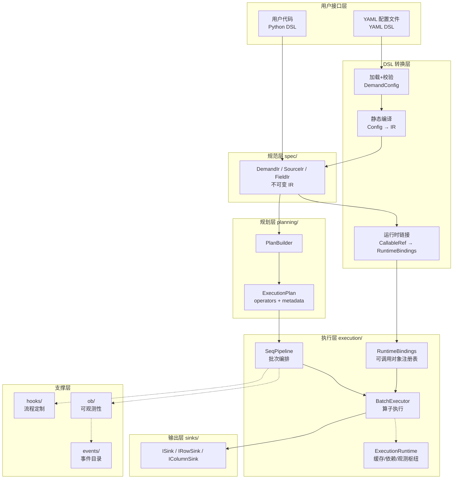
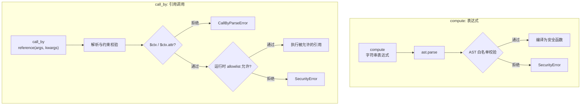
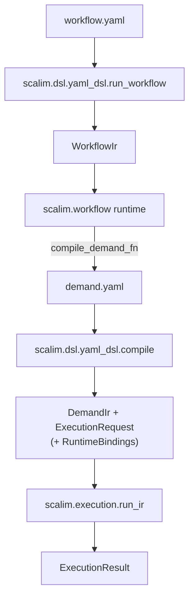
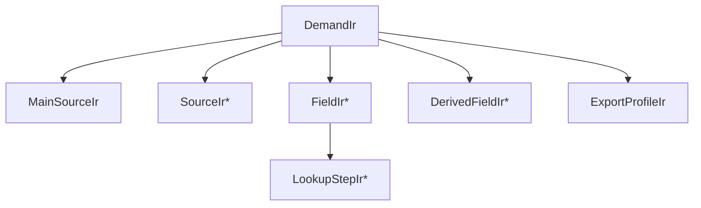
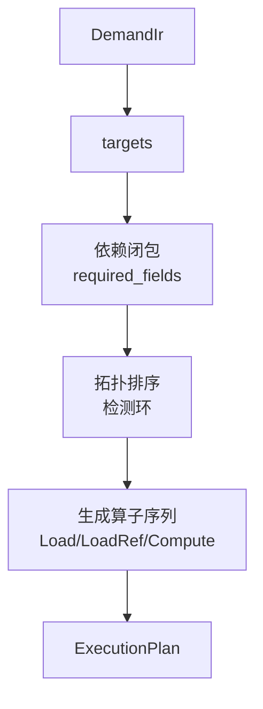
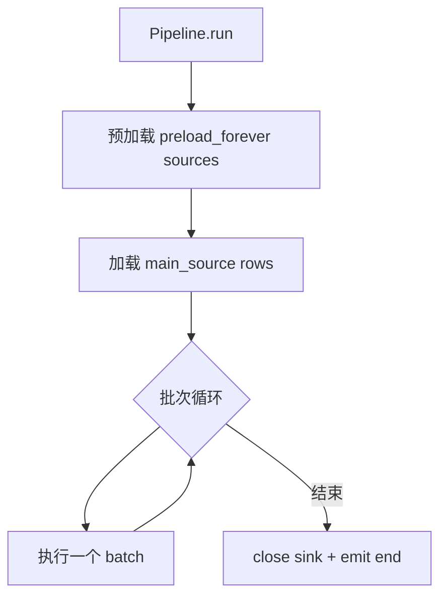
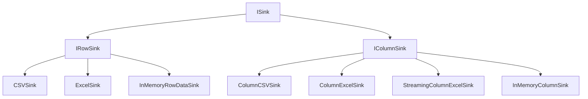
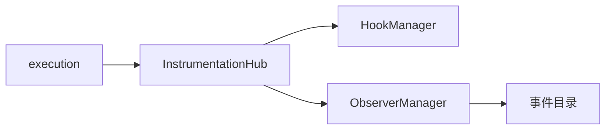

# 架构详解

??? note "适用读者"
    - 需要理解执行边界/扩展点的二次开发者与项目贡献者
    - 需要排查“从 YAML 到执行”链路的使用方开发者

本页汇总 Scalim 的分层结构、从 YAML 到执行的关键边界,以及扩展点与观测点.

- [架构速览](index.md)
- [如何阅读本项目](../getting-started/reading-guide.md)
- [YAML DSL](../yaml-dsl/index.md)
- [并行模式(seq/adaptive)](parallel-modes.md)
- [Excel 列式写出策略(HOLD/WINDOW)](../getting-started/excel-column-residency.md)

??? note "维护提示"
    本页内容通常会在以下变更后需要同步检查:

    - YAML DSL → IR 的编译/安全边界调整
    - ExecutionPlan 的算子序列或批次执行边界调整
    - 并行模式与 `LoadRef` 调度语义调整
    - hooks/ob/events 的分发与回放策略调整
    - 稳定 sinks / 写出策略新增（例如列式 Excel HOLD vs WINDOW）

更严格的语义/约束以 `llmanspec/specs/` 为准.

## 1. 分层总览

Scalim 的核心是“分层 + 批次流水线”:

- 入口可以是 YAML DSL 或 Python DSL
- 中间统一为不可变 IR(`DemandIr`)
- 执行期所需 `Python` 可调用对象集中在 `RuntimeBindings`(通过 `ExecutionRequest.runtime_bindings` 注入)
- 规划层产出执行计划(`ExecutionPlan`)
- 执行层按批次执行 plan,写入 sink,并发边界被严格控制

## 2. 从 YAML 到执行: 关键边界

### 2.1 YAML DSL 的“事实来源”

YAML DSL 的语法与约束来自两部分:

1. JSON Schema(结构与类型/默认值/枚举)
2. 语义校验(内置 validator): `scalim-cli yaml-dsl validate ...`

站点内对应文档:

- [语法总览](../yaml-dsl/syntax.md)
- [用户指南](../yaml-dsl/user-guide.md)

### 2.2 安全边界(当前实现)

这部分经常被误解,这里把边界写死:

- `compute` 表达式使用 AST 白名单校验,**不允许属性访问/下标/任意调用**等高风险语法
- `call_by` 是另一套解析器: 仅允许 `$ctx` 或 `$ctx.<attr>`,且 `attr` 受白名单限制
- YAML 运行时需要 allowlist(运行时参数),不是 YAML 字段
- 静态编译阶段不 `import`/不解析引用;仅“运行时链接”阶段会在 allowlist 约束下解析引用并构建 `RuntimeBindings`

这条“静态编译 / 运行时链接”的边界主要是为了可维护性与安全性:

- `IR/plan` 变为纯数据,更易快照/缓存/对拍/做 LSP 分析(不依赖运行环境 `import` 状态)
- allowlist/import 只发生在“运行时链接”阶段,安全边界更清晰

性能上,解析引用/编译表达式的成本只是从 conversion 阶段集中到 runtime_linking(一次性启动成本);
执行期只是从 `RuntimeBindings` 取函数并调用,通常相对 I/O/数据处理开销可忽略.

### 2.3 Workflow YAML 的边界与分层

除单次 demand YAML 的运行入口外,Scalim 还支持 workflow YAML 用于编排多个 demand run 与 workflow shared resources 写出.

分层约束(以 `llmanspec/specs/` 为准):

- `scalim.dsl.yaml_dsl.run_workflow` / `scalim.dsl.yaml_dsl.workflow*` 是 workflow 的稳定入口:负责 workflow YAML 的加载/校验/编译,并通过 per-call callbacks 注入执行依赖.
- `scalim.workflow.*` 是 workflow runtime 的 framework/SSOT:负责调度执行、ctx/artifacts/resources 管理与 workflow-level events.
- workflow runtime MUST NOT 反向依赖 `scalim.dsl.*`(由 pytest gate 守护).

## 3. 规范层(spec): IR 的角色

IR(Intermediate Representation) 是框架内部统一的“需求描述”.

你可以把它理解成:

- DSL 层的输出
- planning/execution 层的输入

## 4. 规划层(planning): ExecutionPlan 怎么来

规划层做两件事:

1. 从目标字段出发做依赖闭包(只保留需要的字段与中间依赖)
2. 生成核心算子序列: `Load` / `LoadRef` / `Compute`

说明:

- `WRITE_*` / `RELEASE` 属于执行编排范畴,不是 `PlanBuilder` 的产物

## 5. 执行层(execution): plan 怎么跑

### 5.1 Pipeline 的批次主循环

执行层依然是“顺序批处理”: 一个批次跑完再跑下一个.

### 5.2 `seq` vs `adaptive` 的边界

并行模式只影响一件事: **批次内 `LoadRef(keys)` 怎么跑**.

细节与流程图放在独立页面:

- [并行模式(seq/adaptive)](parallel-modes.md)

### 5.3 write-precompute: 只用于写出的派生字段延后到写出前算

**0.10.0** 人类可读性能专页（workload 表、Mermaid、D3 图）: [write-precompute-0.10](../getting-started/write-precompute-0.10.md)。

规划期会自动挑出一批“只喂给最终写出”的派生字段(`ExecutionPlan.late_fields`),它们在 `Compute` 段被跳过,改为在写出前现场物化:

- 行式 sink: 写该行之前按拓扑序算出这些字段,值直接进入写出行,不回写 `BatchContext`
- 列式 sink: 写该列之前算出整列;链式依赖的中间列暂留到其消费列写完即释放

判定完全依据 `Plan`/`IR` 的显式依赖,任何不确定的情况都退回早算:

- 必须是写出目标,且在 `late` 子图之外没有消费者(被别的派生字段或 `LoadRef` 消费即退回)
- 主键/外键与 `order_by` 排序键不参与
- `call_by` 若需要注入 `$ctx`(或 `ctx_attr`)则永远早算;常量 `compute` 同样早算(求值次数语义)

对二次开发的可见影响:

- 计算器/`call_by` 的调用**次数**不变,但**时机**后移到写出前;因此不要依赖“`compute` 段结束时所有派生值都在上下文里”
- `FIELD_COMPUTE` 事件带 `meta` 键 `scalim_compute_phase`(`operator` / `write_precompute`),用于区分两个阶段
- `guardrails` 语义不变: `quiet` 把失败单元格降级为 `None`,`fast_fail` 抛错并 `discard` sink(不产出半成品)

## 6. 内存优化: 三个层次(定位用)

内存相关问题通常可以按三个层次定位:

- FR021(规划时剪枝): `planning/`
- FR022(运行时瘦身): `execution/`(含 [write-precompute](#53-write-precompute-只用于写出的派生字段延后到写出前算): 只用于写出的派生字段不在批次内驻留)
- FR023(流式输出): `sinks/` + `execution/pipeline/`

规范说明:

- `llmanspec/specs/runtime-pruning/spec.md`
- `llmanspec/specs/streaming-output/spec.md`

## 7. 输出层(sinks): 行式/列式/内存

输出层按接口能力分层,核心是:

- `ISink`: 批量写入接口
- `IRowSink`: 行式流式写出
- `IColumnSink`: 列式写出(更适合宽表,可配合运行时瘦身)

列式 Excel 默认 `ColumnExcelSink`（HOLD）；宽表峰值可 opt-in `StreamingColumnExcelSink` / `ExcelColumnResidency.WINDOW`，见 [Excel 列式写出策略](../getting-started/excel-column-residency.md)。YAML `resources.books` 组合层仍是行式写出，不提供 streaming knobs。

## 8. hooks / ob / events: 扩展点与观测点

执行热路径统一通过一个“观测枢纽”发事件,再分发给:

- Hook: 流程定制(可能影响行为)
- Observer: 只读观测(不应影响行为)

在 `adaptive` 模式下,部分 hook/observer 会走“捕获 + 提交点回放”以保持确定性,细节见并行模式专页.

事件身份与订阅约定:

- 进程内事件身份以 `EventType` 为 SSOT;`Observer.event_types` / `Hook.event_types` MUST 使用 `Set[EventType]`(裸 `str` 注册会 fail-fast).
- typed payload 数据类(例如 `PipelineStartEvent`)从 `scalim.events` 公开导出;不要依赖包内私有实现模块作为用户导入契约.
- 落盘/JSONL/viz 边界 MAY 编码 `event_type` 为 builtin `str`(`.value`);读回进程内 `Event` 时 MUST 经 `parse_event_type` 归一为 `EventType`.
- `supports_unknown_event_types` 仅作逃生口,不是推荐二开路径;扩展新事件应先登记 `EventType`/事件目录.
