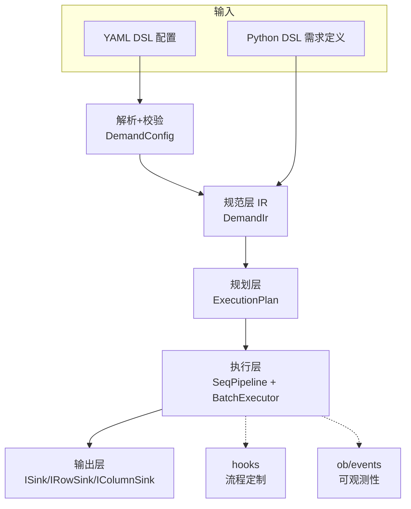
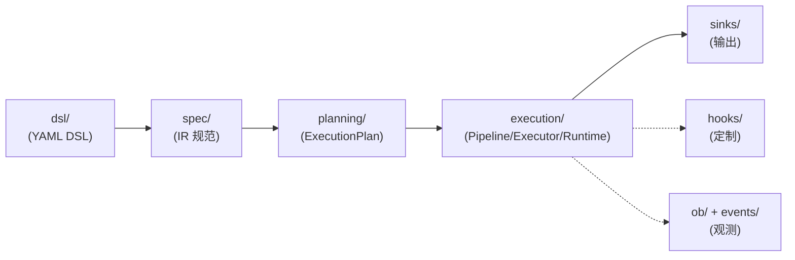

# 架构

??? note "适用读者"
    - 需要快速定位模块边界与分层职责的开发者
    - 项目贡献者(改行为前对齐语义边界)

这页给你一个“能快速定位目录/边界”的架构速览.更完整的架构细节见:

- [架构详解](arch.md)

建议先看:

- [如何阅读本项目](../getting-started/reading-guide.md)
- [并行模式(seq/adaptive)](parallel-modes.md)
- [Excel 列式写出策略(HOLD/WINDOW)](../getting-started/excel-column-residency.md)

## 1. 一图看懂: 从需求到输出

Scalim 的主干可以概括成: **需求(IR) → 执行计划(plan) → 批次流水线(pipeline) → 输出(sink)**.

## 2. 分层与职责(按目录)

## 3. 从哪里开始读

- 想看“配置怎么变成可运行的东西”: [YAML DSL](../yaml-dsl/index.md)
- 想看“执行语义与并发边界”: [并行模式(seq/adaptive)](parallel-modes.md)
- 想看“整条链路怎么串起来”: [如何阅读本项目](../getting-started/reading-guide.md)
