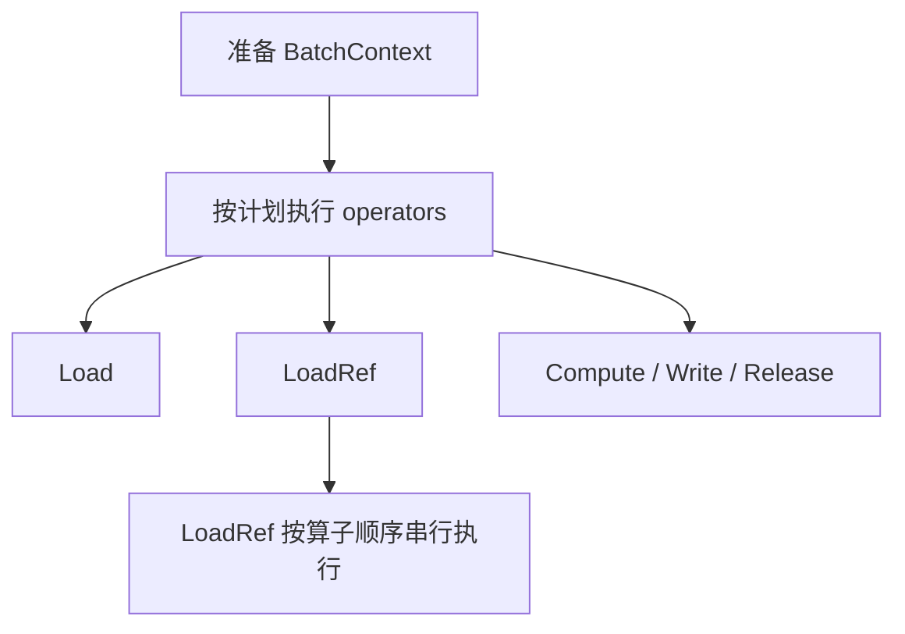
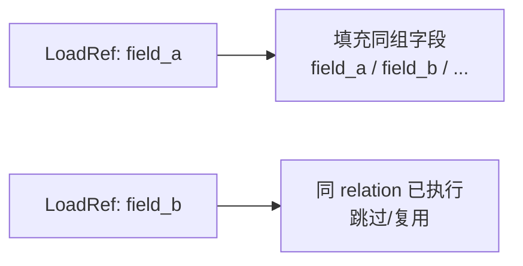
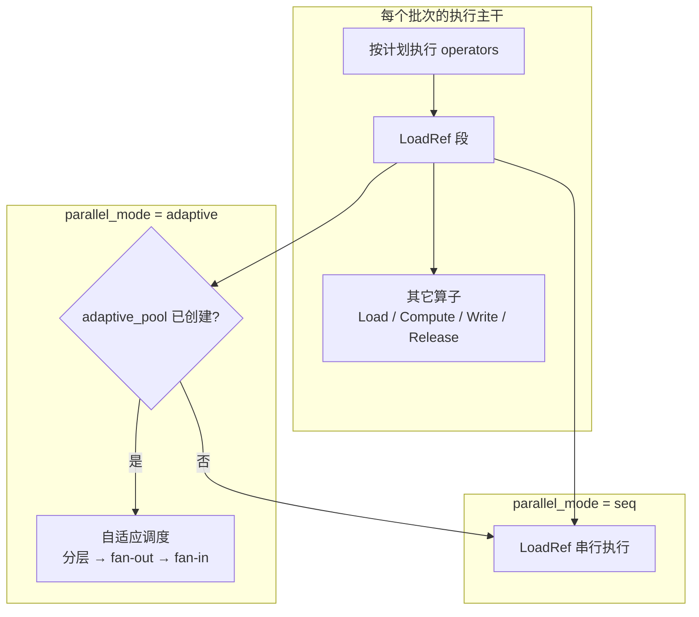
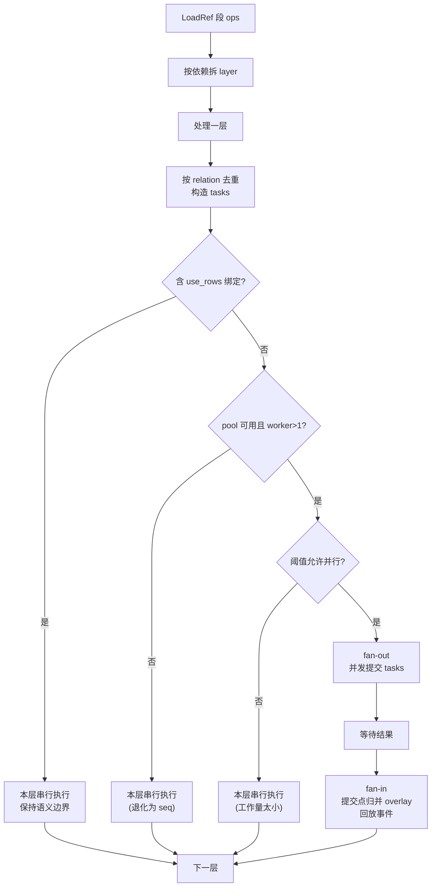
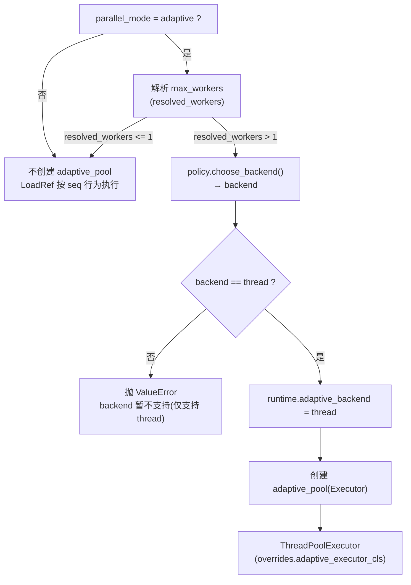
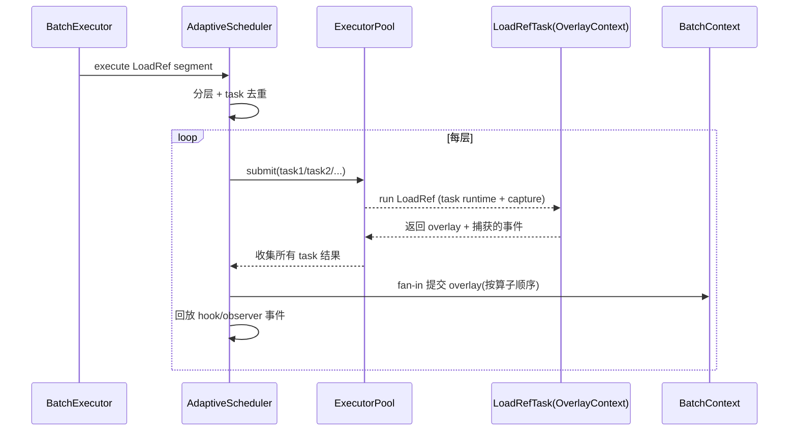
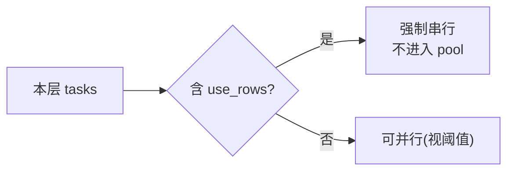

# 执行并行模式: `seq` 与 `adaptive`

??? note "适用读者"
    - 需要选择/调优并行模式的使用方开发者
    - 需要排查 `LoadRef` 调度行为的项目贡献者

这两个模式的区别只影响一件事:

- 批次内 `LoadRef(keys)` 怎么跑

其他部分依然是顺序批处理: 一个批次跑完再跑下一个;算子仍按计划顺序推进.

??? note "维护提示"
    本页内容通常会在以下变更后需要同步检查:

    - `LoadRef` 分层/去重/提交点的语义调整
    - `bind.use_rows` 的 barrier 判定逻辑变更
    - `max_workers` 的解析策略与池创建条件调整
    - `adaptive` backend seam(policy/overrides/scheduler)调整(当前仅支持 `thread`;`process`/`async` 暂不支持)
    - hook/observer 的捕获与回放边界调整(影响确定性与可观测性)

## 1. `seq`: 顺序执行

`seq` 是默认模式,可预测、方便排查.

### 1.1 一图看懂: 一个批次怎么执行

### 1.2 批次内“关联复用”(同 relation 只跑一次)

在同一个批次内,如果多个字段共享同一条 relation(同一份 relation signature),框架会尽量复用:

这能减少重复 loader 调用,也让同一条 relation 的“提交点”更清晰.

适合的场景:

- 需要可预测的逐步执行、便于断点/日志定位
- `bind.use_rows` 较多(见下文的 barrier)
- 并发会放大外部系统压力,需要更保守的节奏

## 2. `adaptive`: 批次内 `LoadRef(keys)` 自适应并发

### 2.1 一图看懂: 并行范围

`adaptive` 的并发范围很窄,只覆盖**批次内的 `LoadRef` 段**,其它算子仍是串行.

要点:

- 批次之间仍然不并发
- `adaptive_pool` 没创建出来(或并发数解析后 <= 1)时,行为会退化成 `seq`

### 2.2 为什么是 “fan-out / fan-in”

自适应调度器把一个 `LoadRef` 段拆成多层(layer),每层是一组“在依赖上可以并行”的关联任务.

- fan-out: 同一层里的任务并发提交到执行池
- fan-in: 任务完成后,在提交点把结果归并到主 `BatchContext`,再进入下一层

下面是调度决策的主流程(只画关键分支):

### 2.3 adaptive backend seam(当前 thread-only)

`adaptive` 模式保留 backend 的“选择接口形状”(policy 常量/返回值),但当前版本内置实现**仅支持 `thread`**:

- backend 选择入口: `AdaptivePolicy.choose_backend(...)`
- 当选择到 `process`/`async` 时: 系统会立即抛 `ValueError`(暂不支持;当前仅支持 thread;请将 backend 改为 `thread`)

#### 2.3.1 backend 选择 + 池创建(线程)

说明:

- 如果池没创建出来(例如 `resolved_workers <= 1`),`adaptive` 会在运行时退化成 `seq` 行为.
- backend seam 仍保留,但当前不会静默 fallback: 选择到未实现 backend 会明确失败.

#### 2.3.2 scheduler 侧 backend 取值

调度器在执行 `LoadRef` 段时,会优先使用 `runtime.adaptive_backend`;若为空才会再次调用策略的 `choose_backend(...)`.

这保证了: **只要池创建阶段已经确定了 backend,后续调度不会“每段变一次”**.

### 2.4 fan-out / fan-in 的“结果归并 + 事件回放”

每个并发任务不会直接往主 `BatchContext` 写数据,而是写到自己的 overlay,任务完成后再统一提交.

说明:

- 任务内仍是串行执行 `LoadRef`(只是多个 relation 并发跑)
- 提交点会把 overlay 归并回主上下文,并把捕获的事件集中回放

#### 2.4.1 事件回放顺序(typed hooks vs observer/on_event)

`adaptive` 下事件不是“边跑边发”,而是**捕获后在提交点回放**. 当前实现的回放顺序是:

- 对每个 task: 先回放 typed hook 事件(`HookManager.emit_typed`),再回放 observer/on_event 事件
- tasks 的提交顺序按算子顺序推进(同一 relation 去重后只提交一次)

这意味着:

- 与 `seq` 模式的逐事件 interleaving 语义不完全一致
- 对 streaming sink/实时展示,可能出现“结果已写出,对应的部分事件稍后才出现”的观感差异

如果你依赖严格的事件顺序(例如把事件流当作写出驱动),优先使用 `seq` 或把副作用放到更明确的边界事件里处理.

### 2.5 barrier: 遇到 `bind.use_rows` 会强制串行

调度器会把 `bind.use_rows` 视为层级屏障(barrier),直接把这一层按串行执行:

这也是为什么 `adaptive` 主要针对 `LoadRef(keys)`——它依赖 `keys` 绑定来维持“批次内可并行”的语义边界.

## 3. 如何开启与基础调参

### 3.1 YAML DSL 入口

YAML 文件本身不声明 `parallel_mode`. 需要在调用 YAML 运行入口时传入:

- `parallel_mode="adaptive"`
- `max_workers=0`(自动)或指定一个正整数上限

相关背景与运行入口参数说明见: [YAML DSL 使用指南](../yaml-dsl/user-guide.md)

### 3.2 IR / Engine 入口

如果你不是从 YAML DSL 入口执行,也可以在 Engine/IR 入口传入同名参数(`parallel_mode` / `max_workers`).

### 3.3 `max_workers` 的语义

`max_workers` 是一个“并发上限提示”:

- `0`/负数: 自动,按 CPU 等信息解析出上限,并保证 `>= 1`
- 解析后 `<= 1`: 不会创建池,`adaptive` 会退化成 `seq` 行为(仍走同一条串行路径)
- 显式 `max_workers > 0` 会被 guardrails 施加 hard cap(DoS hardening),避免外部输入放大并发:
    - `cap = min(256, max(32, cpu_count * 5))`
    - `resolved = min(requested, cap)`
    - 当发生裁剪时会发出 warning,包含 `requested/resolved/cap/cpu`

建议: 不要把未校验的外部输入(例如 HTTP 参数/配置文件)直接映射到 `max_workers`;先做 allowlist/上限收敛.

### 3.4 可选 timeout: 卡死场景的 fail-fast 诊断

`adaptive` 支持一个可选的“任务等待 timeout”(默认关闭),用于在 loader/用户代码卡住时 fail-fast 并给出定位信息.

启用方式(仅 Python/IR 注入面):

- `PipelineOverrides(adaptive_tuning=AdaptiveTuning(task_timeout_s=...))`
- `task_timeout_s <= 0` 表示关闭(默认)

当触发 timeout 时:

- 抛出 `ScalimAdaptiveTaskTimeoutError`
- 异常信息会包含 pending 的 task keys/字段标识等诊断线索

重要限制:

- Python 线程无法安全强杀;timeout 只能 fail-fast 返回,后台线程可能继续运行一段时间.
- 如果你需要“硬超时/强隔离”,建议将不受信任的 loader/用户代码放到子进程中执行.

### 3.5 并发使用约束(线程安全)

#### 3.5.1 `preloaded_cache` 不要跨并发 runs 共享普通 `dict`

`preloaded_cache` 用于缓存 `preload_forever` 的 loader 结果:

- 单次 `run` 内使用普通 `dict` 没问题
- 若要跨多个并发 `runs` 共享缓存,不要共享普通 `dict`(非线程安全);推荐使用 `PreloadCache`(线程安全)或每次 `run` 使用独立 cache

#### 3.5.2 hooks 注册生命周期: 不要在一次 run 期间动态注册/卸载

`adaptive` 会为并发任务创建捕获管理器,订阅发现基于 `HookManager.hooks` 的快照语义.
因此在一次 `run` 期间动态 `register/unregister hooks` 属于不受支持用法,可能不会影响并发任务的捕获/回放.

#### 3.5.3 `load_ref_cache` 不跨并发任务共享

`adaptive` 下每个 `LoadRef` 任务使用**独立的** `ExecutionRuntime`(各自一份空的批次级 `load_ref_cache`),
fan-in 时不回写主 runtime. 因此多条 relation 打同一个 source 时,可能各调一次 loader(这是既有语义,不是分片并行引入的).
热维表请用 `cache_mode: preload_forever`;分片并行与该缓存层正交.

### 3.6 opt-in: `lookup_chunk_size` 分片并行(仅 `adaptive`)

`adaptive` 重叠的是**不同** `LoadRef` 任务之间的等待;而 `lookup_chunk_size` 把一次 `LoadRef(keys)` 拆成多片后,
这些片默认仍然**顺序**调用 loader. 在 RTT 主导(DB/远程接口)时,片数会线性放大固定等待.

可以显式许可「同一 `LoadRef` 内的多片并行」:

- `DemandRunRuntimeOptions(parallel_mode="adaptive", parallelize_lookup_chunks=True, max_chunk_workers=None)`(YAML DSL 运行入口)
- `ExecutionRequest(parallel_mode="adaptive", parallelize_lookup_chunks=True, ...)`(IR 入口)
- `ScalimEngine(parallel_mode="adaptive", pipeline_overrides=PipelineOverrides(parallelize_lookup_chunks=True))`(Engine 入口)

语义边界:

- **默认关闭**;未 opt-in 时与改前完全一致(顺序分片、调用次数不变).
- **`seq` 永不分片并行**:`parallel_mode="seq"` 即使 opt-in 也保持顺序分片.
- **不是第三种 `parallel_mode`**:它是运行级的附加许可,`parallel_mode` 仍只有 `seq` / `adaptive`.
- **`lookup_chunk_size` 不是并行开关**:只设置它不会产生任何并发.
- 合并结果与顺序分片**完全一致**:按 chunk 在 keys 列表上的 offset 升序合并,同 key 冲突时先写入者胜.
- 失败/超时跟随父 `LoadRef` 任务(含 `AdaptiveTuning.task_timeout_s`),不新增 chunk 级 timeout;失败时不会写入半份合并结果.
- `bind.use_rows`(`rows` 模式)强制不分片,因此也不会出现分片并行.

限流(必须理解的护栏):

- 分片使用**独立**的小线程池(不复用 `adaptive` 池),避免「同池 submit 后再 wait」的嵌套死锁.
- 全局在途 ref-loader 调用数 ≤ 解析后的 `adaptive` workers `W`(与 `max_workers` 同一护栏),由进程内共享信号量强制.
- `max_chunk_workers` 额外限制**单步**扇出(默认 `None` = 只受 `W` 与分片数限制).

风险提示: opt-in 会把「片数 × 并发」直接压到外部系统上. 请先确认数据库/接口的 QPS 与连接池能承受 `W` 个并发查询,
再决定是否开启;必要时用 `max_workers` / `max_chunk_workers` 收敛.

可观测性: 每个 chunk 仍会发出一条 `loader_call`(条数 = 分片数,`lookup_key_count` 为当片大小),
并携带 `chunk_offset`(keys 切片起点). 并行下事件按**完成序**发出,框架不做排序缓冲;
若需要稳定顺序,请订阅方自行按 `chunk_offset` 排序.

!!! warning "订阅方必须线程安全"

    这是分片并行相对 §3.5 capture/replay 的**例外**. 当分片所在的 LoadRef 没有跑在 adaptive 工作任务里
    (例如该层只有一个 LoadRef,按阈值退化为串行——恰恰是「单 ref 超大键集」的典型场景),
    `loader_call` 回调会**直接在分片工作线程上并发执行**,而不是在提交点由主线程回放.

    因此 opt-in 之前,请确认你的 hook / observer / sink 对 `loader_call` 的处理是线程安全的
    (共享计数器、文件句柄、列表追加等都需要自行加锁). 其它事件类型不受影响.

## 4. 深度调参(需要 Python/IR 注入)

如果你要调的不是“并发上限”,而是“每层是否并行 / 资源池怎么分 / backend seam(当前仅支持 `thread`)”,需要走 `PipelineOverrides`.

可调项一览:

- `PipelineOverrides`
  - `adaptive_min_parallel_tasks`: 每层最小并行任务数阈值(默认 2)
  - `adaptive_tuning`: `AdaptiveTuning`(池/阈值/全局上限等)
  - `adaptive_policy`: `AdaptivePolicy`(决策/backend seam/池选择)
  - `parallelize_lookup_chunks` / `max_chunk_workers`: 分片并行 opt-in(见 §3.6;默认关闭,`seq` 下无效)

重要约束:

- `AdaptiveTuning` 刻意不进入 YAML DSL: 只能通过 Python/IR 入口(例如 `ScalimEngine(pipeline_overrides=...)`)注入.

## 5. 不同场景的选择建议(按当前实现)

这些建议只基于当前实现的语义边界,不承诺任何具体性能提升:

- 优先 `seq`
    - 你在排查数据问题/关联链路,希望执行路径尽量直观
    - 你的关联大量使用 `bind.use_rows`(调度会频繁触发 barrier,最终还是串行)
    - 你需要严格控制外部系统的并发压力

- 尝试 `adaptive`
    - 批次内存在较多相互独立的 `LoadRef(keys)` 任务
    - loader 主要是 I/O 等待(HTTP/DB/远程服务),并发能隐藏等待时间
    - 你能接受并发带来的外部压力,并愿意用 `max_workers` 做上限

- 再考虑 `adaptive` + 分片并行 opt-in(§3.6)
    - 单个 `LoadRef` 的键集很大且被 `lookup_chunk_size` 拆成多片
    - 片数 × RTT 已经成为主要耗时,而外部系统能承受 `W` 个并发查询
    - 你不需要「顺序观感」的 `loader_call` 事件流(并行下为完成序 + `chunk_offset`)

- backend seam(只在 `adaptive` 下生效)
    - 当前仅支持 `thread`(默认策略也只返回 `thread`;可通过 `overrides.adaptive_executor_cls` 替换线程执行器实现)
    - `process`/`async` 仅保留接口形状: 选择到这些值会直接失败(暂不支持)

## 6. 如何观察调度决策(排查用)

自适应调度器可按需发出决策事件,用于解释为什么某一层串行/并行.

事件里会带:

- `decision`: `serial` / `parallel`
- `backend`: 当前固定为 `thread`(选择到 `process`/`async` 会直接失败)
- `reason`: 串行原因(例如 `rows_binding_barrier` / `single_worker` / `below_min_parallel_tasks`)
- 可选的 pool 等待统计(开启该事件订阅后才会收集)

## 下一步

- [可视化工具](../viz/scalim-viz.md)
- [基准测试](../benchmark/index.md)
