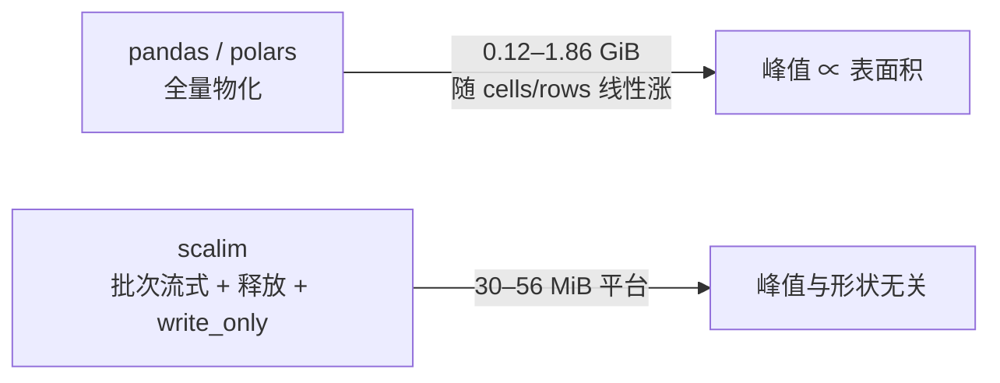

# 外部基线对比（scalim vs pandas / polars 惯用法）

??? note "适用读者"
    - 正在评估「现有 pandas/polars 报表脚本要不要换 scalim」的数据同学
    - 需要引用外部对比数字的维护者与 agent（含版本/环境/口径约束）
    - 图表中的英文缩写（RSS/RTT/golden 等）在页首「术语与缩写对照」有白话解释

**版本锚定：scalim 0.10.3（local src）/ pandas 2.3.3 / polars 1.42.1 / openpyxl 3.1.5 / Python 3.10.18。**  
两侧外部库取**惯用法**（DataFrame 全量物化 + 向量化派生 + 库内写出）；scalim 侧测 **seq 与 adaptive(max_workers=4)** 两种模式。  
本页只回答一个问题：**在你熟悉的写法面前，scalim 的时间/内存处于什么位置、什么时候不占优。**

| 口径 | 说明 |
|------|------|
| 时间 | 墙钟，从「开始消费源行」到「文件关闭」；子进程隔离；每 shape 每配置 **3 次**（短耗时 shape **5 次**）取 median |
| 内存 | 子进程 VmHWM（真实峰值 RSS），不是采样估计、不是前后差值代理 |
| 正确性 | run0 全表读回校验（行数 + 派生列校验和）；其余 run 行数 + 首 50 行精确校验；**108/108 通过** |
| 环境 | 单机 60 GiB；单 run 峰值 ≤ MemAvailable − 10%×MemTotal 预算内；**数字不可跨机迁移** |
| 对照物 | pandas / polars **惯用法**，不含手写 openpyxl write_only 流式（那等于自己手写流式管道，正是 scalim 要替代的工程）；polars 自身默认多线程，其 `write_excel` 经 xlsxwriter |
| S7 特例 | 多源关联 shape 用**本机 SQLite 真实 IO**（脚本确定性生成 fixture，双侧共读同一库文件），非纯内存合成数据 |

数据文件（可复用，含全部 108 run 明细）：[`assets/data/external-baseline-0.10.json`](../assets/data/external-baseline-0.10.json)。

### 术语与缩写对照（图表通用）

| 图表中出现 | 全称 / 通俗解释 |
|------|------|
| **RSS / 峰值 RSS** | 常驻内存（Resident Set Size）。进程实际占用物理内存的大小；「峰值」= 整个运行期间的最高点，看任务会不会撑爆容器/机器内存就看它 |
| **总耗时** | 墙钟时间（wall clock）：从开始读数据到文件写完所经过的真实时间，和秒表口径一致 |
| **median / 中位数** | 多次运行取中间值，比平均值更能代表「典型一次」的表现，不易被偶发抖动带偏 |
| **golden / 正确性对拍** | 写出的文件重新读回来，逐列核对校验和，确认计算结果与预期完全一致后才计入成绩 |
| **惯用法（pandas/polars）** | 普通用户最可能写出的方式：一次性读入整表 → 向量化计算 → 库自带写出；不含手写流式管道 |
| **批次流式（scalim）** | 数据按小批次流过引擎，算完即写、用完即释放，不需要整表驻留内存 |
| **flat / chain 派生列** | flat = 由原始列直接算出的独立派生列；chain = 后一列依赖前一列的链式派生列 |
| **cells** | 单元格数 = 行数 × 列数，衡量表面积 |
| **seq / adaptive** | scalim 的两种执行模式：seq = 串行；adaptive = 自适应并发（自动寻找可并行环节） |
| **W / max_workers** | 并发工作线程数上限 |
| **RTT** | 一次请求的往返耗时（Round-Trip Time）。模拟「向远端数据库/接口取一次数要等多久」 |
| **分片（chunk）** | 把一大批关联键拆成若干小片分次请求，避免单次请求过大 |

---

## 1. Shapes：七种典型表

| id | 典型 | 形状 | 输出 |
|----|------|------|------|
| S1 | 报表宽表 | 30k × (3 + 100 flat) | xlsx |
| S2 | 大宽表 csv 导出 | 150k × (3 + 100 flat) | csv |
| S3 | 链式派生边界 | 20k × (3 + 4 flat + 30 chain) | xlsx |
| S4 | 大长表 | 2M × (3 + 4 flat) | csv |
| S5 | 超多列宽表 csv | 20k × (3 + 600 flat) | csv |
| S6 | 超多列宽表 xlsx | 12k × (3 + 400 flat) | xlsx |
| S7 | 多源关联（真实 IO） | 30k main × (id,fk,v0,v1) → side 5k，1:1 lookup + 2 派生 | csv |

---

## 2. 结果总表（median；时间比/内存比均以 pandas 为 1.0）

| shape | 侧 | 总耗时 (s) | 峰值 RSS (MiB) | 时间比 | 内存比 |
|------|-----|----------:|---------------:|-------:|-------:|
| S1 报表宽表 xlsx | pandas | 28.40 | 1251.5 | 1.00 | 1.00 |
| S1 | polars | **11.16** | 1014.7 | 0.39 | 0.81 |
| S1 | scalim seq | 17.96 | **55.6** | 0.63 | **0.044** |
| S1 | scalim adaptive | 18.90 | 55.5 | 0.67 | 0.044 |
| S2 大宽表 csv | pandas | 4.72 | 353.1 | 1.00 | 1.00 |
| S2 | polars | **0.16** | 613.0 | 0.03 | 1.74 |
| S2 | scalim seq | 10.89 | **30.7** | 2.31 | **0.087** |
| S2 | scalim adaptive | 10.82 | 30.8 | 2.29 | 0.087 |
| S3 链式边界 xlsx | pandas | 7.02 | 393.4 | 1.00 | 1.00 |
| S3 | polars | **2.79** | 390.1 | 0.40 | 0.99 |
| S3 | scalim seq | 4.53 | **54.2** | 0.65 | **0.138** |
| S3 | scalim adaptive | 4.44 | 54.3 | 0.63 | 0.138 |
| S4 大长表 csv | pandas | 4.54 | 892.3 | 1.00 | 1.00 |
| S4 | polars | **0.87** | 1123.9 | 0.19 | 1.26 |
| S4 | scalim seq | 21.73 | **30.5** | 4.79 | **0.034** |
| S4 | scalim adaptive | 21.86 | 30.5 | 4.82 | 0.034 |
| S5 超宽 csv | pandas | 4.10 | 306.5 | 1.00 | 1.00 |
| S5 | polars | **0.09** | 499.3 | 0.02 | 1.63 |
| S5 | scalim seq | 8.19 | **32.5** | 2.00 | **0.106** |
| S5 | scalim adaptive | 8.24 | 32.7 | 2.01 | 0.107 |
| S6 超宽 xlsx | pandas | 44.30 | 1860.0 | 1.00 | 1.00 |
| S6 | polars | **16.93** | 1480.8 | 0.38 | 0.80 |
| S6 | scalim seq | 27.05 | **53.7** | 0.61 | **0.029** |
| S6 | scalim adaptive | 27.38 | 53.6 | 0.62 | 0.029 |
| S7 多源关联（SQLite） | pandas | 0.086 | 124.8 | 1.00 | 1.00 |
| S7 | polars | **0.051** | 409.2 | 0.59 | 3.28 |
| S7 | scalim seq | 0.621 | **32.6** | 7.22 | **0.261** |
| S7 | scalim adaptive | 0.624 | 32.6 | 7.27 | 0.261 |

> 短耗时 shape（S3/S4/S7）跑 5 次取 median；其余 3 次。108/108 golden 通过；全部 run 峰值在内存预算内（最大 1.86 GiB）。

---

## 3. 读法（诚实版）

### 3.1 内存轴：scalim 全场断层领先，且与表面积无关



- scalim 峰值 RSS 在 **0.74M–15.5M cells 全区间保持 30–56 MiB 平台**（覆盖 S1–S6 全部形状）
- 对 pandas：峰值 1/3.8（S7）～ **1/35**（S6）；对 polars：1/7（S3）～ **1/37**（S4）
- **polars 内存并不总是更低**：csv 大导出（S2/S4/S5）与关联（S7）场景，polars 峰值反而**高于 pandas**（1.3×–3.3×）；仅 xlsx 场景优于 pandas（0.8×）

### 3.2 时间轴：polars 全场最快；scalim 的位置分场景

| 场景 | scalim vs pandas | scalim vs polars | 说明 |
|------|------------------|------------------|------|
| xlsx 报表（S1/S3/S6） | **0.61–0.65×**（更快） | ~1.6×（更慢） | openpyxl write_only 流式同时省时间与内存 |
| csv 大导出（S2/S4/S5） | 2.0–4.8×（更慢） | 25–96×（更慢） | pandas C 引擎 / polars 多线程是时间强项；scalim 用时间换峰值内存 |
| 多源关联（S7） | 7.2×（更慢） | 12×（更慢） | 分批 IN 查询的 lookup 成本；内存 1/4 |

### 3.3 adaptive：单 demand 报表形状下 ≈ seq

S1–S7 全部形状 adaptive 与 seq 差异在噪声内（±4%）。这类「单一数据流 + 派生链」demand **没有可识别的并行机会**，adaptive 不带来收益也不劣化；其收益场景是**多个独立任务/源**的 fan-out/fan-in 编排，不在本矩阵范围。

### 3.4 选型暗示

| 你的场景 | 建议 |
|----------|------|
| 内存受限（容器/cgroup、共驻服务）、宽表报表/导出 | scalim 主收益区：峰值 1/4–1/35 |
| xlsx 报表、时间也敏感 | scalim 双优（vs pandas）；若纯追时间且内存充裕可比较 polars |
| csv 大导出、内存充裕、纯追吞吐 | 留在 pandas/polars 是合理选择 |
| 关联查询为主、数据量小 | 本页 S7 显示 scalim 时间不占优；scalim 关联收益在大键集/慢源场景（另见 [lookup chunk 并行](../releases/lookup-chunk-parallel-0.10.md)） |

!!! warning "非保证边界"
    - 本页是**薄算术 calculator**：业务重计算会缩小时间差（scalim 不减少业务函数调用次数）。
    - S7 的 SQLite 是本机磁盘；真实远端源的 RTT 会改变关联场景的时间结论（参见 chunk 并行页的 RTT 分析）。
    - polars `write_excel` 依赖 xlsxwriter；polars 自身多线程，本页未限制其线程数。
    - 单机单环境合成数据；**不是通用加速承诺、不是真实业务基准、不是跨机器 SLA**。

---

## 4. 补充证据（交互图表）

以下图表由数据 JSON 实时渲染；口径与 §2 一致。图表术语见页首「术语与缩写对照」。

### 4.1 扫参曲线：峰值内存与行数/列数的关系

固定 20 个派生列、行数从 1k 扫到 1M（csv）；或固定 1 万行、派生列从 5 扫到 600（csv）。
看两个事实：scalim 的内存线是不是一条平线；另外两家随表面积涨多快。

<div id="eb-chart-sweep-rows-rss" class="eb-chart" style="width:100%;min-height:300px;margin:0.5rem 0;"></div>

<div id="eb-chart-sweep-cols-rss" class="eb-chart" style="width:100%;min-height:300px;margin:0.5rem 0;"></div>

**怎么读（官方数字）**：

- 行数轴：pandas 峰值 111 → 499 MiB（每 100 万行约 +390 MiB）；polars 起点 343 → 1M 行 775 MiB；**scalim 全程 29.8–30.2 MiB 一条平线**（1k 行与 1M 行完全一致）。
- 列数轴（1 万行）：pandas 116 → 212 MiB；polars 平稳在 410–470 MiB（起手就高）；scalim 30.1 → 32.4 MiB（600 列仅 +2.3）。
- 结论：**「峰值内存 ∝ 表面积」对全量物化两家都成立；scalim 的峰值与表面积无关**。

时间轴（同口径，看三侧的斜率差异；csv 场景 polars 最快、scalim 最慢，与 §3.2 一致）：

<div id="eb-chart-sweep-rows-time" class="eb-chart" style="width:100%;min-height:300px;margin:0.5rem 0;"></div>

<div id="eb-chart-sweep-cols-time" class="eb-chart" style="width:100%;min-height:300px;margin:0.5rem 0;"></div>

### 4.2 派生函数变重后会怎样

派生函数从「一行算术」（L0）加重到「十次循环」（L1）、「百次循环」（L2）。
pandas/polars 的向量化只对 L0 有效；L1/L2 属于「逻辑不可向量化」，惯用写法是 `apply`/`map_elements` 逐行执行 Python 函数。
预期：函数越重，框架开销占比越小，三侧时间差越窄。

<div id="eb-chart-calc-weight" class="eb-chart" style="width:100%;min-height:300px;margin:0.5rem 0;"></div>

**怎么读（官方数字，10k 行 × 20 派生列，总耗时秒）**：

| 级别 | pandas | polars | scalim | scalim vs pandas |
|------|-------:|-------:|-------:|------------------|
| L0 算术（可向量化） | 0.07 | 0.02 | 0.22 | 3.2× 慢 |
| L1 十次循环（不可向量化） | 1.01 | 0.20 | 0.34 | **0.33×（反超）** |
| L2 百次循环（不可向量化） | 1.75 | 0.87 | 1.14 | **0.65×（反超）** |

- 交叉点在 L0→L1 之间：**业务逻辑一旦不可向量化，pandas 的 `apply` 反而比 scalim 慢 3 倍**；polars 的 `map_elements` 始终最快但内存仍是 scalim 的 13 倍以上。
- 这验证了 §3.4 非保证边界的前半句「重计算会缩小时间差」——实测不仅缩小，还会反转。

### 4.3 慢源关联：分片并行（keys 模式）

模拟「向远端源做 2 万个键的关联查询，每次往返 RTT 毫秒级」：
全量单次拉取（1 次请求，要求 side 表能整表放内存）vs 分片串行 vs 分片并行（W=4）。

<div id="eb-chart-rtt" class="eb-chart" style="width:100%;min-height:300px;margin:0.5rem 0;"></div>

**怎么读（官方数字，总耗时秒）**：

| RTT | 全量单次 | 分片100·串行 | 分片100·并行W=4 | 分片250·并行W=4 |
|------:|-------:|-------:|-------:|-------:|
| 5ms | 0.42 | 1.53 | 0.68 | 0.52 |
| 20ms | 0.44 | 4.59 | 1.55 | 0.84 |
| 50ms | 0.47 | 10.59 | 3.06 | 1.55 |

- 分片并行对**串行分片**提速约 **3–7×**（W=4 下近似 ÷W，与 [lookup chunk 并行](../releases/lookup-chunk-parallel-0.10.md) 的 3.3–6.4× 相符）。
- **全量单次最快**——前提是 side 表能整表放进内存、且服务端接受大 IN 请求。分片并行的适用前提是「side 表拉不动 / 接口有分页上限」，此时它是唯一能既流式又并行的方式。

### 4.4 Python 3.6 最低兼容边界

官方测量环境是 3.10；本节回答「最低承诺的 Python 3.6 下行为是否一致」：
同一份 3.6 兼容的 runner 在 docker `python:3.6.15` 与宿主 3.10 各跑同 shape（csv，串行），口径同上。

<div id="eb-chart-py36-rss" class="eb-chart" style="width:100%;min-height:300px;margin:0.5rem 0;"></div>

**怎么读（官方数字，median）**：

| 形状 | 3.10 耗时 | 3.6 耗时 | 3.10 峰值 | 3.6 峰值 | golden |
|------|-------:|-------:|-------:|-------:|:---:|
| 宽表 csv · 5 万行 | 3.51s | 5.18s（1.48×） | 58.3 MiB | 54.5 MiB | ✓ |
| 长表 csv · 50 万行 | 5.29s | 7.22s（1.37×） | 81.8 MiB | 74.5 MiB | ✓ |
| 关联 csv · 3 万行 | 0.60s | 0.80s（1.33×） | 33.4 MiB | 29.2 MiB | ✓ |

- **功能与正确性一致**（golden 全过），峰值内存同量级甚至略低，时间约 1.3–1.5×（解释器代差，预期内）。
- 结论：scalim 在最低兼容 3.6 下的内存主张与正确性**不依赖高版本 Python**。

---

## 5. 复现

复现脚本（已入库）：[`docs/doc/releases/repro/external-baseline/run_ab.py`](../releases/repro/external-baseline/run_ab.py)。测量环境需 Python 3.10+（pandas/polars 依赖）。

```bash
# 冒烟（缩放 5%，~1 分钟）
just bench-external --runs 1 --rows-scale 0.05

# 完整官方测量（7 shapes × 4 配置 × 3/5 runs，约 25–40 分钟；产物在 .tmp/ 不入库）
just bench-external --runs 3

# 扩展证据探针（扫参 / 函数复杂度 / 慢源分片并行 / py36 边界；约 20–30 分钟）
just bench-external-probes --runs 3
```

> **刷新约定**：minor 版本发布前用 `just bench-external` 与 `just bench-external-probes` 官方重测一次，同步更新本页、数据 JSON 与 README 性能小节。

| 证据 | 位置 |
|------|------|
| 主矩阵数据 | `docs/doc/assets/data/external-baseline-0.10.json`（108 run 明细 + 版本/内存预算 meta） |
| 补充探针数据 | `docs/doc/assets/data/external-baseline-0.10.probes.json`（扫参/复杂度/RTT/py36） |
| 官方测量目录 | `.tmp/evidence/external-baseline/`（rebuildable，不入库） |
| 0.10.0 内部写路径证据（同族叙事） | [write-precompute-0.10](../releases/write-precompute-0.10.md) |
| 分片并行方法论出处 | [lookup chunk 并行](../releases/lookup-chunk-parallel-0.10.md) |

---

## 6. 引用规范（写给维护者与 agent）

对外引用本页数字时 MUST 同时携带：版本锚定（scalim 0.10.3 / pandas 2.3.3 / polars 1.42.1）、workload 形状、环境与运行次数（3/5 次 median）、正确性对拍声明（golden）、以及 §3.4 非保证边界。MUST NOT 将其表述为通用加速、真实业务基准或跨机器 SLA（与 `governance-readme-examples` r986 一致）。
