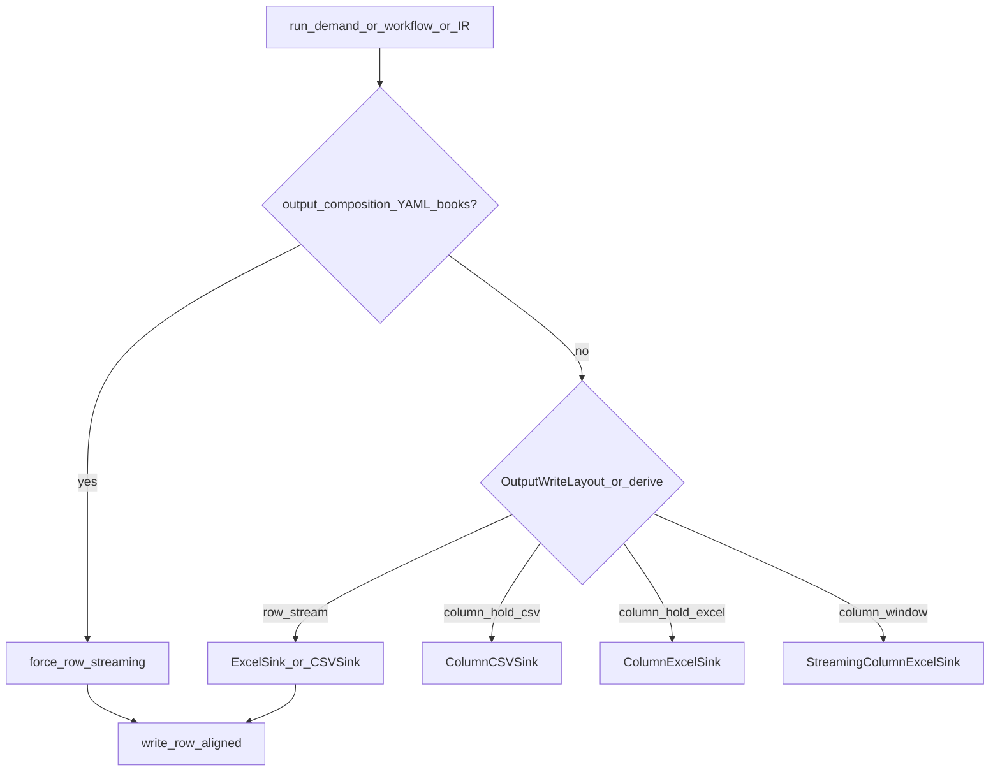

# Excel 列式写出策略（HOLD / WINDOW）

??? note "适用读者"
    - 用 Python IR / `ExecutionRequest` 写宽表 Excel、关心峰值内存的使用方
    - 写 YAML books 报表、误以为有 streaming knobs 的集成方
    - 需要给调用方选型建议的 agent / 维护者

本文是 **写出布局选型 SSOT**（人类页）。闭集 `OutputWriteLayout`（`row_stream` / `column_hold` / `column_window`）挂在 `DemandRunRuntimeOptions` / `ExecutionRequest`；**禁止 YAML authoring**。未设时由 `streaming` + `excel_column_residency` 推导，默认路径与下表一致。

更严的契约以 `llmanspec/specs/runtime-output-write-layout/`、`output-sink-contracts` 与 `yaml-dsl-runtime-policy-boundary` 为准。  
Agent 入口：`agentdev/skills/scalim-yaml-dsl/references/streaming-column-excel-guidance.md`；迁移卡：`.../upgrades/2026-08-11-output-write-layout.md`。

## 1. 先分清三条路径

| 路径 | 典型入口 | 实际实现 | 峰值特征 |
|---|---|---|---|
| **A. YAML / workflow books** | `resources.books` + `outputs.to` | 组合层强制行写出 → `ExcelSink` / workbook sheet | 行流式；**不是**列式 sink |
| **B. IR 列式 HOLD（默认）** | `OutputSpec(format="excel", streaming=False)` | `ColumnExcelSink`（layout=`column_hold`） | 列缓存到 `close`；宽表 `pre_close` 可很高 |
| **C. IR 列式 WINDOW（opt-in）** | 同上 + `OutputWriteLayout.COLUMN_WINDOW` | `StreamingColumnExcelSink` | 按行窗刷盘释放；宽表 peak 可大幅下降 |

证据口径（列 HOLD vs 多 batch WINDOW，100k×300）：hold peak ≈ **3.59GB** → window peak ≈ **0.12GB**（约 97%）。  
medium 双跑（约 2万–5万行 × 50–100 列）：峰值 RSS 比 HOLD/WINDOW ≈ **2.5–4.9×**，墙钟差约 **2%**，业务行数一致。  
产物在本地 `.tmp/evidence/`（勿提交）；脚本：`scripts/bench_output_write_layout_dual_run.py`。  
通俗说明：`llmanspec/notplan/c40-output-write-layout-advisory/research/write-layout-advisory-explainer.html`。

## 2. 策略怎么选

### 推荐默认：`column_hold`（HOLD）

- 列数/行数不大，或机器内存充足
- 需要与历史 `ColumnExcelSink` 行为完全一致
- **不要改默认**；未设置 layout / residency 时即为 `column_hold`

### 何时启用：`column_window`（WINDOW）

同时满足：

1. 使用 **列式** Excel：`format=excel` 且 `streaming=False`（或框架工厂走该分支）
2. 宽表 / 高行数导致 `pre_close` / peak RSS 不可接受（启发式：约 **`n_fields × n_rows ≳ 1e6`** 时可优先考虑）
3. **没有** `output_composition`（不是 YAML books 多输出行组合）

**没有自动切换，也没有默认 `run_stats` 布局 hint**——由调用方显式设 `OutputWriteLayout.COLUMN_WINDOW`。迁移窗仍可用 `ExcelColumnResidency.WINDOW`（仅当未设 layout 时等价推导）。

调用示例（推荐）：

```python
from scalim.dsl.yaml_dsl import DemandRunOptions, DemandRunRuntimeOptions, OutputWriteLayout
# 也可: from scalim.execution import OutputWriteLayout

options = DemandRunOptions(
    runtime=DemandRunRuntimeOptions(
        output_write_layout=OutputWriteLayout.COLUMN_WINDOW,
    ),
    # security=...
)
```

或纯 IR：

```python
from scalim.execution import ExecutionRequest, OutputSpec, OutputWriteLayout

req = ExecutionRequest(
    export_layout=...,
    output=OutputSpec(format="excel", path="out.xlsx", streaming=False),
    output_write_layout=OutputWriteLayout.COLUMN_WINDOW,
)
```

迁移窗（旧 API，未设 layout 时仍推导为 `column_window`）：

```python
from scalim.execution import ExcelColumnResidency, ExecutionRequest, OutputSpec

req = ExecutionRequest(
    export_layout=...,
    output=OutputSpec(format="excel", path="out.xlsx", streaming=False),
    excel_column_residency=ExcelColumnResidency.WINDOW,
)
```

pipeline 列模式会每批 `set_row_ids(本批)` 再写满列——与 WINDOW sink 的多 batch 语义对齐。

### 正确性：改 WINDOW 会不会写错？

| 维度 | 结论 |
|---|---|
| 合法 IR 列式路径 | HOLD↔WINDOW **业务格子等价**（对拍用业务列，勿比 xlsx 字节） |
| YAML books / composition、行式 `streaming=True` | 与 WINDOW / `COLUMN_*` 同开 → **fail-fast** |
| 某窗列未写齐 | WINDOW `close` **更严**报错 |

### 何时不要用 `column_window`

| 场景 | 原因 |
|---|---|
| YAML / workflow `resources.books` Excel | 已是行 sink；设 `COLUMN_WINDOW` + composition → **fail-fast**（禁止假开关） |
| `streaming=True` 行式 Excel | WINDOW 仅对列式生效；会 **fail-fast** |
| 指望 YAML 里写 streaming / layout knobs | **禁止**；runtime policy 只在 Python |
| shared-book 物化峰值 | 另案（spill 等）；不是本 Enum |
| 一次 `set_row_ids(全量行)` 再按列写 | 仍会预分配全表壳；peak 收益差很多——应 **按 batch 追加** `set_row_ids` |

### 手写 sink

需要完全自管写出时，可直接：

```python
from scalim.sinks import StreamingColumnExcelSink
```

按 batch：`set_row_ids(本批)` → 写满全部列 → `close()`。  
显式传入 `ExecutionRequest.sink=...` 时优先于工厂选择。

## 3. `run_demand` / workflow 能设什么？（有手动、无自动）

**现状：有 Python 手动开关，没有按宽表/长表自动选 sink，也没有默认写出布局 hint。**

| 入口 | 能否指定 | 实际效果 |
|------|----------|----------|
| YAML `resources.books` / `outputs` | **不能**写 layout / residency / streaming knobs | 组合层强制 **行式** → `ExcelSink` / `CSVSink` + `write_row_aligned` |
| `DemandRunOptions.runtime.output_write_layout` | **能**（推荐） | 显式 `ROW_STREAM` / `COLUMN_HOLD` / `COLUMN_WINDOW`；与 `output_composition` 同开列布局 → **fail-fast** |
| `DemandRunOptions.runtime.excel_column_residency` | **能**（迁移窗） | 仅当未设 layout 时参与推导；`WINDOW` 仅 `excel`+`streaming=False`；与 composition 同开 → **fail-fast** |
| `WorkflowRunOptions.demand` | 嵌套同一套 `DemandRunOptions.runtime` | 同上；workflow **没有**单独的 layout/residency 字段 |
| 纯 IR `ExecutionRequest(...)` | 完整可控 | 显式 layout 优先；否则 `streaming`+residency 推导 → 对应 sink |
| 手写 `ExecutionRequest.sink=...` | 最高自主 | 绕过工厂；pipeline 按 `IColumnSink` / 行 sink 二选一 |

工厂选择见 `src/scalim/execution/run_ir.py` → `_create_file_sink`。



未设 `output_write_layout` 时的推导：`streaming=True` → `row_stream`；`excel`+`WINDOW` residency → `column_window`；其余列式 → `column_hold`（CSV 忽略 residency）。

### 数据形状 × 策略（人工选型，非自动）

| 形状 | 推荐 | 原因 |
|------|------|------|
| 日常 YAML 报表（中等行列） | 默认行流式 | 已 aligned；零配置 |
| 大量行、列不多、落盘 CSV/xlsx | 行流式 / `ROW_STREAM` | 峰低；写出税多在 IO / openpyxl |
| 大宽表 Excel、IR、峰不可接受 | `COLUMN_WINDOW` | HOLD→WINDOW 可大幅降峰（见上文证据） |
| 宽表但要历史列缓存语义 | `COLUMN_HOLD` | 峰高；行为兼容 |
| 二次处理全表 `List[dict]` | `sink=None` / capture | **最吃内存**；勿当主路径 |
| YAML books + 想 WINDOW | **不可** | fail-fast；改 IR 列式或接受行式 |

### 常见误区

在 YAML books 路径上设置：

```python
DemandRunOptions(
    security=...,
    runtime=DemandRunRuntimeOptions(
        output_write_layout=OutputWriteLayout.COLUMN_WINDOW,
    ),
)
```

**不会**把 books 变成列式 WINDOW；与 `output_composition` 同开会 **fail-fast**（有意禁止假开关）。  
WINDOW 只对「无 composition 的 IR 列式 Excel（`streaming=False`）」生效。

## 4. 与 YAML 的关系（重要）

- YAML authoring **没有** `output_write_layout` / `excel_column_residency` / `write.streaming` 字段
- books 路径保持行组合；宽表 YAML 峰值问题请先排查 shared-book / 执行上下文，而不是找本开关
- Python `ResourcesPolicy` / `BookWritePolicy` 只管 book 容器语义，**不要**把列式 layout 挂到 books 上

## 5. 相关链接

- 公共 API：`scalim.execution.OutputWriteLayout`、`ExcelColumnResidency`、`scalim.dsl.yaml_dsl` 同名导出、`scalim.sinks.StreamingColumnExcelSink`
- Spec：`llmanspec/specs/runtime-output-write-layout/`
- Agent skill 指引：`agentdev/skills/scalim-yaml-dsl/references/streaming-column-excel-guidance.md`
- Upgrade 卡：`agentdev/skills/scalim-yaml-dsl/references/upgrades/2026-08-11-output-write-layout.md`
- 并行调参：[`parallel-modes.md`](../architecture/parallel-modes.md)
- Perf 判断链路：`llmanspec/notplan/2026-08-11-perf-roi-judgment-chain.md`
- Advisory 研究（搁置实现）：`llmanspec/notplan/c40-output-write-layout-advisory/`
- 归档证据：`llmanspec/changes/archive/2026-07-12-c0-streaming-column-excel-sink/`、`.../c0-streaming-column-excel-multi-batch/`、`.../c0-excel-column-residency-opt-in/`
