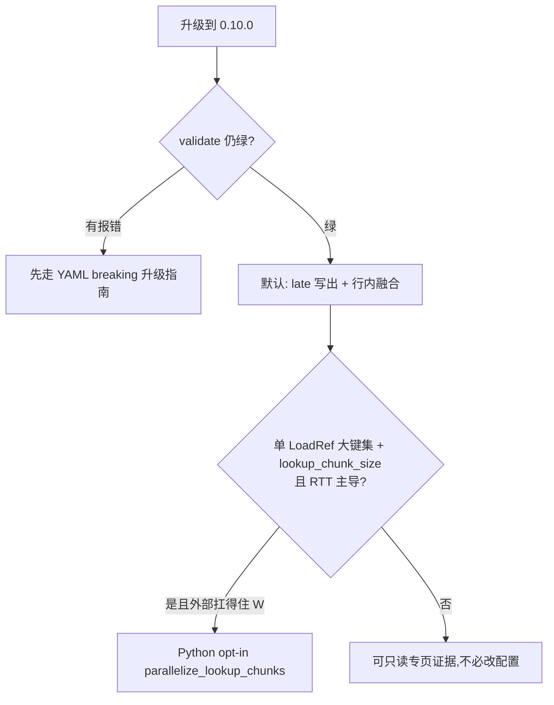

# 0.10.0 重点特性

??? note "适用读者"
    - 从 **≤0.9.x** 升到 **0.10.0** 的使用方
    - 写发版说明 / 评估默认行为是否影响下游的维护者与 agent

**相对 `v0.9.x`：YAML authoring 主线无强制迁移。**  
本版三项性能相关能力：**两项默认开启（零新 YAML）**，**一项 Python opt-in**。  
对拍与图表见下方专页；运行期护栏正文见 [并行模式](../../architecture/parallel-modes.md) / [架构](../../architecture/arch.md)。

## 一览

| 能力 | 默认 | YAML 要改吗 | 专页 |
|------|------|-------------|------|
| write-precompute（写出前晚算） | **开** | 否 | [write-precompute-0.10(../write-precompute-0.10.md) |
| row-wise fusion（同 deps 行内融合） | **开**（安全外壳内） | 否 | [rowwise-fusion-0.10(../rowwise-fusion-0.10.md) |
| lookup chunk 并行 | **关** | 否（开关只在 Python） | [lookup-chunk-parallel-0.10(../lookup-chunk-parallel-0.10.md) |



## 迁移 / 适配清单（最短）

### 1. write-precompute（默认）

- **不必改 YAML**。仅被最终写出消费的派生字段，Compute 段可能跳过，写出前再物化。
- 若依赖「Compute 段结束后 `BatchContext` 已有全部派生」的旁路逻辑（少见），需要改调用侧或把字段变成被其它派生 / LoadRef 消费。
- 观测：`FIELD_COMPUTE` 可能带 `meta.scalim_compute_phase` = `operator` \| `write_precompute`。
- 契约：输出值与 calculator 调用次数与早算路径一致（`golden_ok`）。

### 2. row-wise fusion（默认，有外壳）

- **不必改 YAML**。同 compute 段、deps 完全相同的派生按行融合读 deps。
- **不融合**当：列 sink、订阅 `FIELD_COMPUTE` / `OPERATOR_SPAN`、`fast_fail` 启用、EXP `call_by` memo 命中组内字段等（见专页）。
- 契约：`calc_calls` 仍为 `N×M`；值与 field-major 一致。

### 3. lookup chunk 并行（opt-in）

- **`lookup_chunk_size` 不是并行开关**（语义不变）。
- 开启：`DemandRunRuntimeOptions(parallel_mode="adaptive", parallelize_lookup_chunks=True)`（或 `PipelineOverrides` / `ExecutionRequest`）。
- `seq` 即使 opt-in 也串行分片；全局在途 ≤ adaptive workers `W`。
- 订阅 `loader_call`：并行下为完成序 + `chunk_offset`；单 LoadRef 退化层时回调 **MAY** 在 worker 线程（须线程安全）。
- 失败路径：已在途 chunk MAY 仍跑完（调用次数 MAY > 串行）；成功路径 calls 与串行相等。

### 4. 与 YAML breaking 的关系

本页**不**替代 [upgrades 索引../../yaml-dsl/upgrades/index.md)。若配置仍含已删字段（如 `write_defaults` / `budget` / `xlsx_file`），先按对应 upgrade 批次改 YAML。

## 发版引用（可贴 Release）

```text
## Highlights (0.10.0)
- write-precompute（默认）：只写出用派生字段延后到写出前；无新 YAML。
  docs/doc/releases/write-precompute-0.10.md
- row-wise fusion（默认）：同 deps 行内融合减框架税；calc_calls 不变。
  docs/doc/releases/rowwise-fusion-0.10.md
- lookup chunk 并行（opt-in）：adaptive + parallelize_lookup_chunks；lookup_chunk_size ≠ 开关。
  docs/doc/releases/lookup-chunk-parallel-0.10.md
总览：docs/doc/releases/0.10.0/index.md
```

## Agent skill

YAML / 运行参数侧指引：`agentdev/skills/scalim-yaml-dsl/references/0.10-release-highlights.md`。
