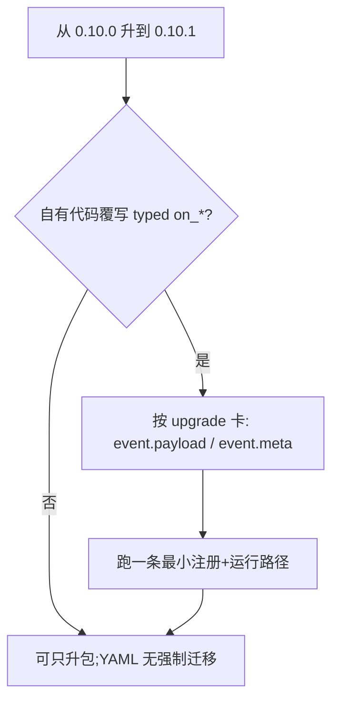

# 0.10.1 重点特性

??? note "适用读者"
    - 已在 **0.10.0**、准备升到 **0.10.1** 的使用方
    - 自定义 `EventDispatchObserver` / `BaseHook` typed `on_*` 的下游与 agent

**相对 `v0.10.0`：YAML authoring 主线仍无强制迁移。**  
本版核心是 **Python 观测 / Hook 公开契约的一处 breaking**：typed 回调入参改为完整 `Event` 信封。  
性能三项（write-precompute / row-wise fusion / lookup chunk 并行）与 0.10.0 相同，不重复展开；总览仍见 [0.10.0 重点特性](../0.10.0/)。

## 一览

| 变更 | 默认影响 | YAML 要改吗 | 适配 SSOT |
|------|----------|-------------|-----------|
| typed Observer/Hook `on_*` 收 `Event` | **Breaking**（仅自定义 typed handler） | 否 | [2026-08-02-typed-handlers-receive-event](../../../agentdev/skills/scalim-public-api/references/upgrades/2026-08-02-typed-handlers-receive-event.md) |
| `meta.scalim_compute_phase` 在 typed 路径可读 | 能力补齐（0.10.0 已有 meta，0.10.1 起不必绕 `on_event`） | 否 | 同上 + [write-precompute-0.10](../write-precompute-0.10.md) |
| 仓内 presets / viz / notebooks | 已随版本迁移 | 否 | — |



## 迁移 / 适配清单（最短）

### 1. typed `on_*` 收 `Event`（Breaking）

- **命中条件**：自定义 `EventDispatchObserver` / `BaseHook`（或其它 Hook）并覆写 `on_pipeline_start`、`on_field_compute`、`on_loader_call` 等。
- **调整**：参数类型为 `Event`；公开字段经 `event.payload`；横切经 `event.meta`（含 `scalim_compute_phase`）。
- **无兼容层**：不要依赖「payload 与 Event 双签名」分发。
- Before/After 与检索模式：见 public-api upgrade 卡（上表）。

### 2. 仅为读 phase 而覆写 `on_event` 时可简化

- 0.10.0 下 typed 路径看不到 `Event.meta`，常被迫绕 `on_event`。
- 0.10.1 起 typed `on_field_compute` 等可直接读同一 `event.meta`；`on_event` 与 typed 并存语义不变。

### 3. 与 YAML / 0.10.0 性能项

- **不必为 0.10.1 改 YAML**。
- write-precompute / fusion / chunk 并行契约与 0.10.0 一致；若尚未读过 0.10.0 总览，从 [0.10.0](../0.10.0/) 进入。

## 发版引用（可贴 Release）

```text
## Highlights (0.10.1)
- Breaking（Python）：typed Observer/Hook on_* 收完整 Event；经 event.payload / event.meta 消费。
  agentdev/skills/scalim-public-api/references/upgrades/2026-08-02-typed-handlers-receive-event.md
- 能力：typed 路径可读 meta.scalim_compute_phase（不必仅为 phase 绕 on_event）。
- YAML：无强制迁移；0.10.0 三项性能默认/opt-in 不变。
总览：docs/doc/releases/0.10.1/index.md
```

## Agent skill

- Python Observer/Hook 升级：`agentdev/skills/scalim-public-api/references/task-event-type-adaptation.md` + `references/upgrades/2026-08-02-typed-handlers-receive-event.md`
- 0.10.0 性能亮点（仍适用）：`agentdev/skills/scalim-yaml-dsl/references/0.10-release-highlights.md`
