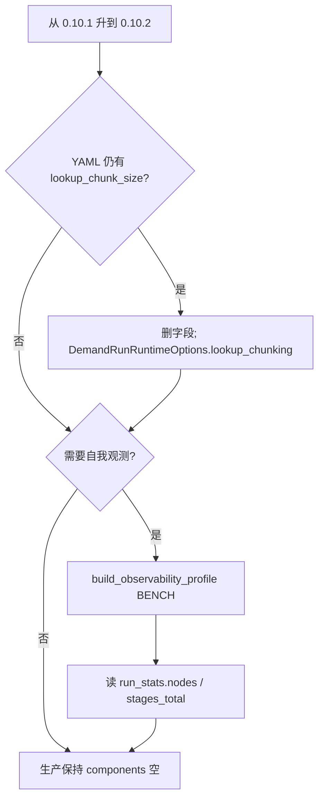

# 0.10.2 重点特性

??? note "适用读者"
    - 已在 **0.10.1**、准备升到 **0.10.2** 的使用方
    - 仍在 YAML 写 `lookup_chunk_size`，或需要 workflow 级低漂移观测的下游与 agent

**相对 `v0.10.1`：YAML 有一处强制迁移（lookup 分片）；观测能力为 opt-in。**  
本版两块：**(1)** `LookupChunking` 收口到 Python SSOT；**(2)** `scalim_run_stats/v1` + profiles + viz 旁路读数。  
typed `Event` 契约与 0.10.1 相同，不重复展开；见 [0.10.1 重点特性](../0.10.1/)。

## 一览

| 变更 | 默认影响 | YAML 要改吗 | 适配 SSOT |
|------|----------|-------------|-----------|
| `sources.*.lookup_chunk_size` 迁出 | **Breaking**（仍写则 fail-fast） | **是**（删字段） | [2026-08-09-lookup-chunking-python-ssot](../../../agentdev/skills/scalim-yaml-dsl/references/upgrades/2026-08-09-lookup-chunking-python-ssot.md) |
| `LookupChunking` / `SourceCache` / `RowsReuse` | Python 运行策略；cache YAML 可留 | 否（cache） | 同上 + [yaml-runtime-policy-boundary](../../../agentdev/skills/scalim-yaml-dsl/references/yaml-runtime-policy-boundary.md) |
| `ObservabilityProfile` + `WorkflowStatsAccumulator` | **opt-in**；生产默认可 `components=[]` | 否 | [run-stats.md](../../viz/run-stats.md) + `agentdev/skills/scalim-run-stats/` |
| run_stats sibling + scalim-viz 面板 | 落盘旁路；不改业务 sink | 否 | 同上 |
| `RunOverrides` header 工厂默认 `name` | 仅旧工厂默认依赖者 | 否 | lookup upgrade 卡「相关覆盖」 |



## 迁移 / 适配清单（最短）

### 1. YAML `lookup_chunk_size` → Python `LookupChunking`（Breaking）

- **命中条件**：demand/workflow YAML 的 `sources.*` 仍写 `lookup_chunk_size`。
- **调整**：删 YAML 字段；在 `DemandRunRuntimeOptions.lookup_chunking` 用 `LookupChunking.sized(...)` / `.off()`。
- 片间并行：`LookupChunking.sized(n, parallel=True)` + `parallel_mode="adaptive"`。
- Before/After：见 yaml-dsl upgrade 卡（上表）。

### 2. 低漂移 run_stats（opt-in）

- 日常：`ObservabilityProfile.BENCH` → `accum.build_run_stats()`；workflow 读 **`nodes[]`**，勿读共享 Perf 末态。
- 落盘：`write_run_stats_sibling`（可与 viz 同目录旁路）；**勿**嵌入 `viz_snapshot.json`。
- 生产 / 正式非 DEBUG：保持 `components=[]`；开发服 / bench 才开 memory（需 `psutil`）。
- 门控与二开：见 [run-stats.md](../../viz/run-stats.md) 与 skill 卡 `task-downstream-env-gating` / `task-observer-hook-extension`。

### 3. 与 0.10.1 / 0.10.0

- typed Observer/Hook 仍收完整 `Event`（0.10.1）。
- write-precompute / fusion / chunk 并行契约与 0.10.0 一致。

## 发版引用（可贴 Release）

```text
## Highlights (0.10.2)
- Breaking（YAML）：sources.*.lookup_chunk_size 迁出；改 DemandRunRuntimeOptions.lookup_chunking=LookupChunking...
  agentdev/skills/scalim-yaml-dsl/references/upgrades/2026-08-09-lookup-chunking-python-ssot.md
- Opt-in：scalim_run_stats/v1 + ObservabilityProfile；生产默认可静默；viz 可读 sibling run_stats.json
  docs/doc/viz/run-stats.md
- 文档：下游环境门控 / Observer·Hook 二开 skill 卡
总览：docs/doc/releases/0.10.2/index.md
```

## Agent skill

- Lookup 分片迁移：`agentdev/skills/scalim-yaml-dsl/references/upgrades/2026-08-09-lookup-chunking-python-ssot.md`
- Run stats 装配：`agentdev/skills/scalim-run-stats/SKILL.md`
- 生产静默 vs 开发服：`agentdev/skills/scalim-run-stats/references/task-downstream-env-gating.md`
- Observer/Hook 扩展：`agentdev/skills/scalim-public-api/references/task-observer-hook-extension.md`
