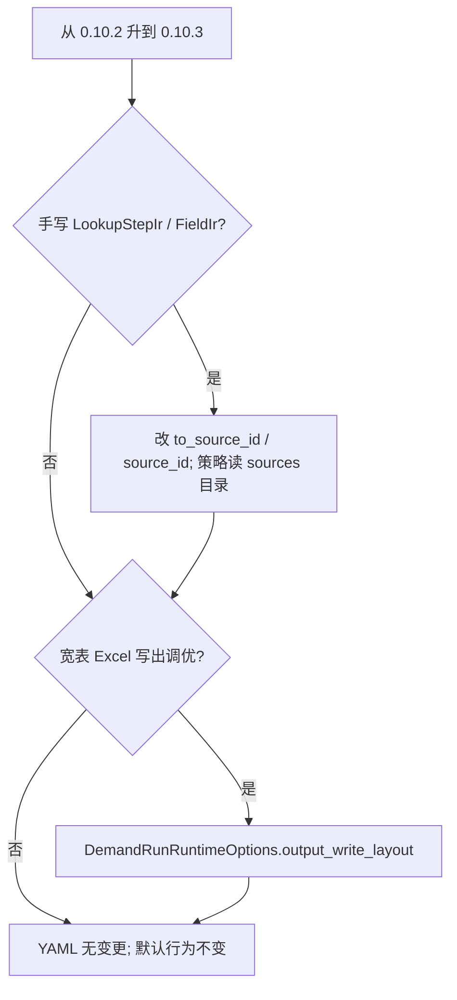

# 0.10.3 重点特性

??? note "适用读者"
    - 已在 **0.10.2**、准备升到 **0.10.3** 的使用方
    - 手写 Python IR / 规划图，或需要宽表 Excel 写出布局显式选型的下游与 agent

**相对 `v0.10.2`：手写 Python IR 图边改 `source_id`（Breaking）；`OutputWriteLayout` 写出布局 Python SSOT（opt-in）。**  
YAML 编写面 **不变**；0.10.2 的 lookup 分片迁移与 opt-in run_stats **不变**；见 [0.10.2 重点特性](../0.10.2/)。

## 一览

| 变更 | 默认影响 | YAML 要改吗 | 适配 SSOT |
|------|----------|-------------|-----------|
| 图边只存 `source_id`（c50） | **Breaking**（手写 IR / 规划图） | **否** | [2026-08-18-source-id-graph-refs](repo:agentdev/skills/scalim-yaml-dsl/references/upgrades/2026-08-18-source-id-graph-refs.md?ref) |
| `LookupStepIr.to_source_id` / `FieldIr.source_id` | 嵌套 `SourceIr` / `to_source=` 已删 | 否 | 同上 + [yaml-runtime-policy-boundary](repo:agentdev/skills/scalim-yaml-dsl/references/yaml-runtime-policy-boundary.md?ref) |
| `OutputWriteLayout`（c30） | Python opt-in；未设则行为不变 | **否** | [2026-08-11-output-write-layout](repo:agentdev/skills/scalim-yaml-dsl/references/upgrades/2026-08-11-output-write-layout.md?ref) |
| sink 写出路径矩阵 + WINDOW | 文档与 API 对齐；默认不变 | 否 | [excel-column-residency.md](../../getting-started/excel-column-residency.md) |
| 0.10.2 契约 | lookup / run_stats / typed Event | 否 | [0.10.2](../0.10.2/) |



## 迁移 / 适配清单（最短）

### 1. 图边 `source_id`（Breaking，仅手写 Python IR）

- **命中条件**：手写 `LookupStepIr(to_source=...)` / `FieldIr(source=...)`；或从 `step.to_source.*` 读策略。
- **调整**：图边改 `to_source_id` / `source_id`；live `SourceIr` 只住 `DemandIr.sources` / `ExecutionRuntime.sources`。
- overlay 只 `replace(DemandIr.sources)`；缺 catalog id **fail-fast**，无嵌套句柄回退。
- Before/After：见 yaml-dsl upgrade 卡（上表）。

```python
# 旧
LookupStepIr(to_source=lookup_source)
FieldIr(source=lookup_source)

# 新
LookupStepIr(to_source_id=lookup_source.source_id)
FieldIr(source_id=lookup_source.source_id)
```

### 2. `OutputWriteLayout`（opt-in）

- 宽表 Excel / 列式写出：在 `DemandRunRuntimeOptions.output_write_layout` 显式选型。
- 未设时由 `streaming` + `ExcelColumnResidency` 推导，**与历史默认一致**。
- **禁止**在 YAML 声明 layout / residency / `write.streaming`。
- 例子：`notebooks/marimo/example_public_api_suite/chapters/ch162_public_api_output_write_layout.py`

### 3. 与 0.10.2 / 0.10.1 / 0.10.0

- YAML `lookup_chunk_size` 仍须已迁移（0.10.2 Breaking）。
- run_stats / typed Observer·Hook 契约不变（0.10.1）。
- write-precompute / fusion / chunk 并行默认不变（0.10.0）。

## 发版引用（可贴 Release）

```text
## 亮点（相对 0.10.2）

- Breaking（Python IR）：图边改 source_id；to_source=/source= 已删
  agentdev/skills/scalim-yaml-dsl/references/upgrades/2026-08-18-source-id-graph-refs.md
- Opt-in：OutputWriteLayout 写出布局 Python SSOT；YAML 不变
  agentdev/skills/scalim-yaml-dsl/references/upgrades/2026-08-11-output-write-layout.md
- Excel 列驻留选型：docs/doc/getting-started/excel-column-residency.md
总览：docs/doc/releases/0.10.3/index.md
```

## 升级提示（复制到下游代理 / 聊天中）

请将以下代码块粘贴到已打开的**下游**仓库编码代理中。目标：**扫描 + 按需迁移**（除非你明确要求编辑，否则先出报告）。

````markdown
# 任务：升级 / 扫描此仓库，检查 Scalim v0.10.3 适配点（基准 0.10.2）

你正在处理一个依赖于 `scalim` 的**下游**项目。目标版本：**0.10.3**（相对 **0.10.2**）。

## 结论先行
- **Python IR Breaking**：关联图边改 `source_id`；`to_source=` / `source=` 已删除。策略只从 `DemandIr.sources` 目录读 live `SourceIr`。
- **OutputWriteLayout opt-in**：宽表写出在 Python options 显式选型；YAML 不变；未设 layout 行为与旧版一致。
- **0.10.2 仍适用**：YAML `lookup_chunk_size` 须已删；run_stats 仍 opt-in；typed Event 契约不变。

## SSOT
- 总览：https://github.com/StrayDragon/scalim/blob/v0.10.3/docs/doc/releases/0.10.3/index.md
- Source-id 升级卡：https://github.com/StrayDragon/scalim/blob/v0.10.3/agentdev/skills/scalim-yaml-dsl/references/upgrades/2026-08-18-source-id-graph-refs.md
- OutputWriteLayout 升级卡：https://github.com/StrayDragon/scalim/blob/v0.10.3/agentdev/skills/scalim-yaml-dsl/references/upgrades/2026-08-11-output-write-layout.md
- Excel 列驻留：https://github.com/StrayDragon/scalim/blob/v0.10.3/docs/doc/getting-started/excel-column-residency.md
- 0.10.2 总览：https://github.com/StrayDragon/scalim/blob/v0.10.2/docs/doc/releases/0.10.2/index.md

## 步骤
1. 记录当前 `scalim` 固定版本（`pyproject.toml` / requirements / lock / vendored `libs/scalim`）。
2. 扫描（仓库根目录；跳过 `.git` / `.venv` / `node_modules`）：

```bash
rg -n --hidden -g '!**/.git/**' -g '!**/.venv/**' -g '!**/__pycache__/**' \
  'LookupStepIr\(|FieldIr\(|to_source=|source=|to_source_id|source_id' .

rg -n --hidden -g '!**/.git/**' -g '!**/.venv/**' \
  'OutputWriteLayout|output_write_layout|lookup_chunk_size' .
```

3. 对每个命中分类：`HIT-SOURCE-ID` | `HIT-WRITE-LAYOUT` | `HIT-LOOKUP-CHUNK` | `OK` | `FALSE-POSITIVE`
4. 若有 `HIT-SOURCE-ID`：改 `to_source_id` / `source_id`；策略从 catalog 读；组 `sources={id: source}` 单测。
5. 若有 `HIT-WRITE-LAYOUT`：按升级卡在 Python options 设 `OutputWriteLayout`；勿写 YAML。
6. 输出简短 Markdown 报告：仓库 / 分支 / scalim 版本 / 结论（`no impact` / `needs source_id migration` / `needs write_layout` / `needs lookup_chunking` / `uncertain`）。
````

## Agent skill

- Source-id 迁移：`agentdev/skills/scalim-yaml-dsl/references/upgrades/2026-08-18-source-id-graph-refs.md`
- OutputWriteLayout：`agentdev/skills/scalim-yaml-dsl/references/upgrades/2026-08-11-output-write-layout.md`
- 列驻留 / 选型：`docs/doc/getting-started/excel-column-residency.md`
- Lookup 分片（0.10.2）：`agentdev/skills/scalim-yaml-dsl/references/upgrades/2026-08-09-lookup-chunking-python-ssot.md`
- Run stats（0.10.2）：`agentdev/skills/scalim-run-stats/SKILL.md`
