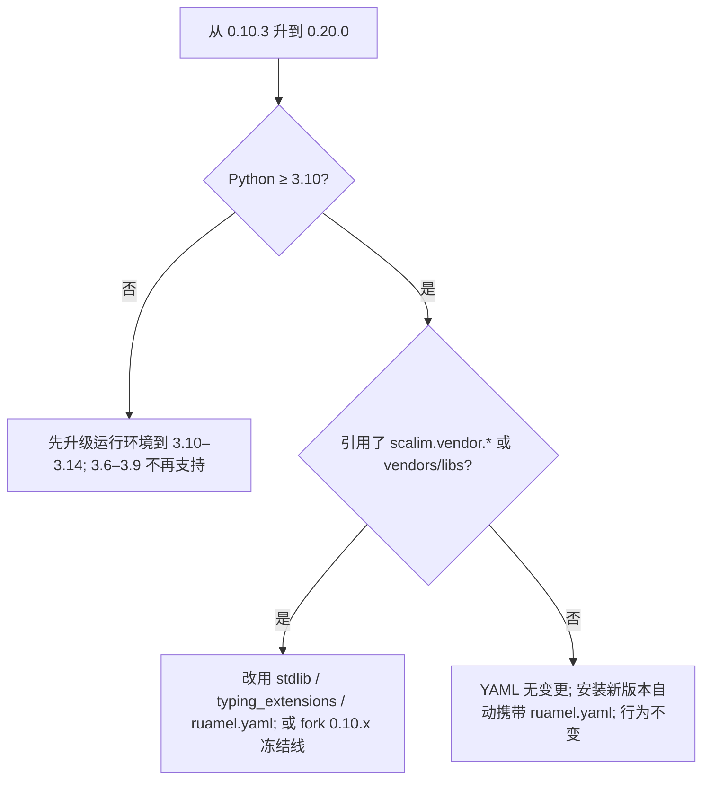

# 0.20.0 重点特性（现代化统一发布）

??? note "适用读者"
    - 仍在使用 Python 3.6–3.9、或依赖 `scalim.vendor.*` / `vendors/libs` 同步链路的存量下游
    - 准备升级运行环境、核对依赖面 / wheel 体积的维护者与 agent

**相对 `v0.10.3`：现代化统一发布。** Python floor 升到 **3.10**（支持窗口 3.10–3.14）；YAML 后端去
vendor 化（vendored `yamlx` → PyPI `ruamel.yaml`）；`vendor/` 目录整体退役（`scalim.vendor.*` 命名空间
消失）；vendors/libs 下游同步链路移除；wheel 体积显著下降。**YAML authoring 面无字段变化。**

## 一览

| 变更 | 默认影响 | YAML 要改吗 | 适配 SSOT |
|------|----------|-------------|-----------|
| Python floor 3.10（c52） | **Breaking**（3.6–3.9 不再支持） | **否** | [2026-09-08-python-floor-310-and-vendor-retirement](repo:agentdev/skills/scalim-yaml-dsl/references/upgrades/2026-09-08-python-floor-310-and-vendor-retirement.md?ref) |
| YAML 后端 → `ruamel.yaml>=0.19.1`（c53） | 运行时新增依赖；YAML 1.2 语义/rt 幂等合约不变 | 否 | 同上 |
| `scalim.vendor.*` 整体移除（c54） | **Breaking**（内部命名空间；tier1 公共 API 不受影响） | 否 | 同上 + 归档提案 |
| `just sync-project-vendors` / `vendors/libs` 链路移除 | **Breaking**（采用机制废止；0.10.x 冻结线可 fork） | 否 | 同上 |
| `typing-extensions>=4.4` / 依赖清理 | 环境依赖变化；删 7 个零引用 dev 依赖 | 否 | 同上 + 根 `ROADMAP.md` |
| wheel 体积下降 | **Perf**（vendor 树约 5.8MB + 3.1MB cp36 二进制移出发布物） | 否 | 同上 |
| Marimo 示例 cells-native 化（42 章） | 示例/治理形态变化；oracle 契约不变 | 否 | `llmanspec/specs/examples-marimo`（r497/r1111/r1112） |



## 迁移 / 适配清单（最短）

### 1. 运行环境（Breaking）

- 将 CI / 部署 / 本地解释器升到 **Python 3.10–3.14**（floor 3.10；`requires-python >= 3.10`）。
- 安装新版本后自动携带 `ruamel.yaml>=0.19.1` 与 `typing-extensions>=4.4`，无需手工加依赖。

### 2. `scalim.vendor.*` 引用（Breaking，仅用了内部命名空间的下游）

- 曾 `import scalim.vendor.dataclassesx` → `from dataclasses import ...`（stdlib）。
- 曾 `import scalim.vendor.compact`（`StrEnum`/`Self`/`override`）→ `StrEnum` 自备（3.11+）或 backport；`Self`/`override` 从 `typing_extensions` 引入；`Literal`/`TypeGuard`/`TypedDict`/`Protocol` 等用 stdlib `typing`。
- 曾 `import scalim.vendor.yamlx` → `import ruamel.yaml`（safe load / `YAML(typ="rt")`）。
- `litejinja2` / `importlibx` 迁入仓库内对应**内部**模块（不在 public API 的 17 个 tier1 模块内，普通用户无感知；下游勿依赖）。

### 3. vendors/libs 同步链路（Breaking，采用机制废止）

- 曾用 `just sync-project-vendors` 把源码镜像到下游 `vendors/libs/scalim/` → 改用正常依赖安装；该用法可在 0.10.x 冻结线 fork 保留。

### 4. 其余

- `dump_effective_demand_yaml`（review/debug 用途）排版可能随 ruamel 版本变化——load 语义与 no-op rt 字节幂等合约不变。
- 0.10.2 / 0.10.3 的既有迁移（`lookup_chunk_size`、`source_id`、`OutputWriteLayout`）不受影响。

## 发版引用（可贴 Release）

```text
## 亮点（相对 0.10.3）

- Breaking（环境/依赖）：Python floor 3.10（3.6–3.9 不再支持）；YAML 后端 → PyPI ruamel.yaml>=0.19.1；
  scalim.vendor.* 命名空间整体消失；vendors/libs 同步链路移除；typing-extensions>=4.4
  agentdev/skills/scalim-yaml-dsl/references/upgrades/2026-09-08-python-floor-310-and-vendor-retirement.md
- Perf：wheel 体积显著下降（vendor 树约 5.8MB + 3.1MB cp36 二进制移出发布物）
- New：Marimo 示例 cells-native 化（42 章；oracle 契约不变，examples-marimo spec r497/r1111/r1112）
- YAML authoring 面无字段变化；load 语义与 rt 字节幂等合约不变
总览：docs/doc/releases/0.20.0/index.md
```

## 升级提示（复制到下游代理 / 聊天中）

请将以下代码块粘贴到已打开的**下游**仓库编码代理中。目标：**扫描 + 按需迁移**（除非你明确要求编辑，否则先出报告）。

````markdown
# 任务：升级 / 扫描此仓库，检查 Scalim v0.20.0 适配点（基准 0.10.3）

你正在处理一个依赖于 `scalim` 的**下游**项目。目标版本：**0.20.0**（相对 **0.10.3**）。

## 结论先行
- **环境 Breaking**：Python floor 升到 3.10（3.6–3.9 不再支持）；CI / 部署需升级。
- **依赖 Breaking**：新增运行时依赖 `ruamel.yaml>=0.19.1`（自动携带）；`typing-extensions>=4.4`。
- **命名空间 Breaking**：`scalim.vendor.*` 整体消失；`just sync-project-vendors` / `vendors/libs/scalim` 同步链路移除。
- **YAML 无变化**：authoring 面零字段变更；load 语义与 rt 字节幂等合约不变。

## SSOT
- 总览：https://github.com/StrayDragon/scalim/blob/v0.20.0/docs/doc/releases/0.20.0/index.md
- 升级卡：https://github.com/StrayDragon/scalim/blob/v0.20.0/agentdev/skills/scalim-yaml-dsl/references/upgrades/2026-09-08-python-floor-310-and-vendor-retirement.md
- Python 支持策略：https://github.com/StrayDragon/scalim/blob/v0.20.0/ROADMAP.md

## 步骤
1. 记录当前 `scalim` 固定版本与运行 Python 版本（`pyproject.toml` / requirements / lock / CI workflow）。
2. 扫描（仓库根目录；跳过 `.git` / `.venv` / `node_modules`）：

```bash
rg -n --hidden -g '!**/.git/**' -g '!**/.venv/**' -g '!**/__pycache__/**' \
  'scalim\.vendor|vendor\.yamlx|vendor\.compact|vendor\.dataclassesx' .

rg -n --hidden -g '!**/.git/**' -g '!**/.venv/**' \
  'sync-project-vendors|vendors/libs' .
```

3. 对每个命中分类：`HIT-VENDOR-IMPORT` | `HIT-VENDOR-SYNC` | `OK` | `FALSE-POSITIVE`
4. 若有 `HIT-VENDOR-IMPORT`：按升级卡改成 stdlib / `typing_extensions` / `ruamel.yaml`（`vendor.litejinja2` / `vendor.compact.importlibx` 为内部路径，勿依赖）。
5. 若有 `HIT-VENDOR-SYNC`：改用正常依赖安装；或 fork 0.10.x 冻结线保留镜像用法。
6. 确认运行环境 Python ≥ 3.10（CI matrix / Docker base / pyproject `requires-python`）。
7. 输出简短 Markdown 报告：仓库 / 分支 / scalim 版本 / Python 版本 / 结论（`no impact` / `needs python upgrade` / `needs vendor migration` / `uncertain`）。
````

## Agent skill

- 升级卡（0.20.0 全部 Breaking 迁移一步）：`agentdev/skills/scalim-yaml-dsl/references/upgrades/2026-09-08-python-floor-310-and-vendor-retirement.md`
- 0.10.x 既有迁移（不受影响）：`2026-08-18-source-id-graph-refs.md`、`2026-08-11-output-write-layout.md`、`2026-08-09-lookup-chunking-python-ssot.md`
- Python 支持窗口与 ratchet：根 `ROADMAP.md`