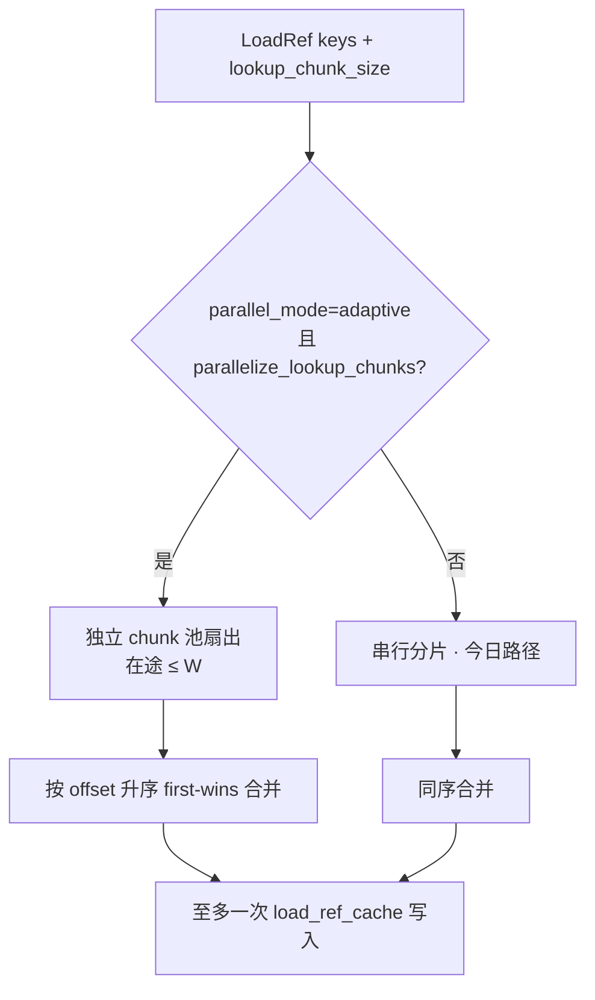
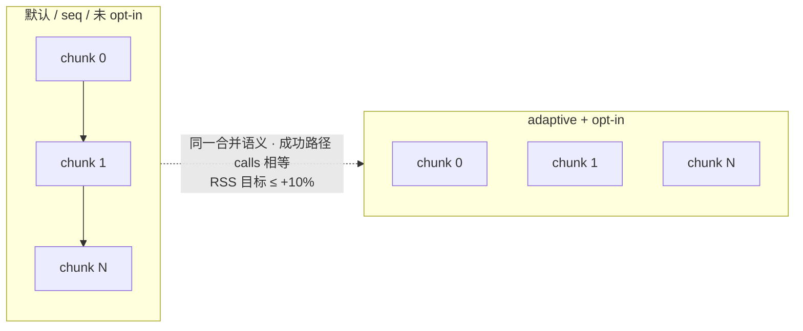
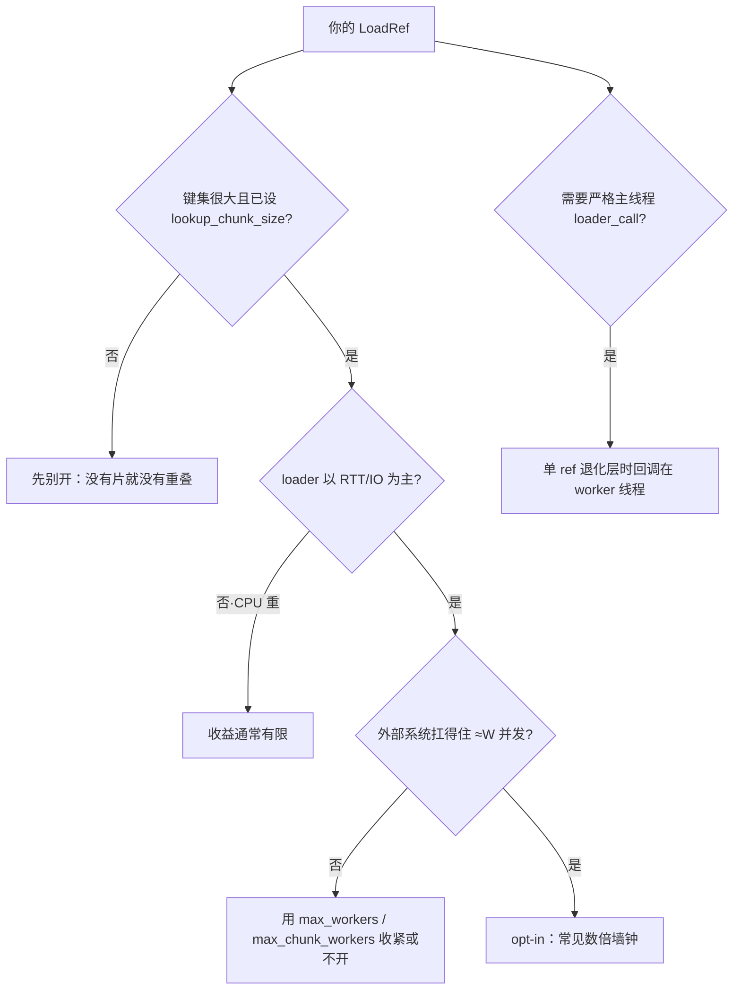

# 0.10.0：lookup chunk 并行（opt-in）

??? note "适用读者"
    - 关心 **0.10.0** 单 `LoadRef` 大键集 + `lookup_chunk_size` 等待重叠的使用方
    - 需要讲清「命名变更 / 何时加速 / 何时不变 / QPS 风险」的维护者
    - 想看前后对拍数字与图的同学

**版本锚定：Scalim 0.10.0。**  
同一 `LoadRef(keys)` 被 `lookup_chunk_size` 拆成多片后，片间默认仍**串行**。  
0.10 新增 Python **opt-in**：在 `parallel_mode="adaptive"` 下允许片间并行，重叠 RTT 等待——**无新 YAML 键**；`lookup_chunk_size` 仍只表示分片大小。

| 契约 | 0.10.0 行为 |
|------|-------------|
| Authoring YAML | **无新键**；`lookup_chunk_size` 语义不变 |
| 默认 | **关闭**；未 opt-in ≡ 今日串行分片 |
| `parallel_mode=seq` | **永不分片并行**（即使 opt-in） |
| 合并 / 成功路径调用次数 | ≡ 串行（first-wins by `chunk_offset`） |
| 峰值 RSS（分进程对拍） | ≤ **+10%** |
| 观测 | `loader_call.chunk_offset`；完成序；回调可能在 worker 线程 |

架构 / 护栏：[`parallel-modes.md` §3.6](../architecture/parallel-modes.md#36-opt-in-lookup_chunk_size-adaptive)。  
版本亮点总览：[0.10.0 重点特性](0.10.0/)。

??? info "0.10.0 重点特性 · 版本总览(折叠)"

    > 单一事实来源为独立章节 [0.10.0 重点特性](0.10.0/)，此处折叠预览。

姊妹能力：[write-precompute-0.10](write-precompute-0.10.md) · [rowwise-fusion-0.10](rowwise-fusion-0.10.md)。

测量摘要日期：<span id="lcp10-measured-at"></span>。  
<span id="lcp10-host-note" class="lcp10-note"></span>

数据：[`assets/data/lookup-chunk-parallel-0.10.json`](../assets/data/lookup-chunk-parallel-0.10.json)。
---

## 1. 命名与公开面（相对 ≤0.9）

| 名称 | 变更 | 说明 |
|------|------|------|
| `parallelize_lookup_chunks` | **新增** | `DemandRunRuntimeOptions` / `PipelineOverrides` / `ExecutionRequest`；`bool`，默认 `False` |
| `max_chunk_workers` | **新增** | 单步扇出可选帽；`None` = 只受 resolved adaptive workers `W` |
| `lookup_chunk_size` | **不变** | YAML / IR 仍只表示分片大小；**不是**并行开关 |
| `parallel_mode` | **不变** | 仍只有 `seq` / `adaptive`；不新增第三种 mode |
| `LoaderCallEvent.chunk_offset` | **新增可选** | 分片路径填充；并行为完成序；订阅方须线程安全 |

启用示例（Python）：

```python
from scalim.dsl.yaml_dsl import DemandRunRuntimeOptions

options = DemandRunRuntimeOptions(
    parallel_mode="adaptive",
    parallelize_lookup_chunks=True,
    max_workers=8,          # 全局在途帽 W
    max_chunk_workers=None, # 可选：单步扇出再收紧
)
```



---

## 2. 一图看懂：串行分片 vs opt-in 并行



**读法**：加速来自 **RTT 重叠**，不是少调 loader。片数 × RTT 主导时收益最大；外部 QPS 会被放大到约 `W`。

---

## 3. 实际例子：前后对拍

合成 sleep-RTT shape（固定 `time.sleep`，无真实 DB）；**分进程**分别跑串行 / 并行，避免同进程 `ru_maxrss` 高水位交叉污染。

### 3.1 加速比（D3）

约 **3.3×–6.4×**（Python 3.6.15 sleep 上限；真实库通常更低，取决于连接池与 QPS）。

<div id="lcp10-chart-speedup" class="lcp10-chart" style="width:100%;min-height:240px;margin:1rem 0;"></div>

### 3.2 墙钟：串行 vs 并行（D3）

<div id="lcp10-chart-wall" class="lcp10-chart" style="width:100%;min-height:320px;margin:1rem 0;"></div>

### 3.3 峰值 RSS 增量（D3；虚线 = +10% 目标）

<div id="lcp10-chart-rss" class="lcp10-chart" style="width:100%;min-height:240px;margin:1rem 0;"></div>

### 3.4 明细表

测量环境：Python **3.6.15**，分进程 A/B。数据：[`assets/data/lookup-chunk-parallel-0.10.json`](../assets/data/lookup-chunk-parallel-0.10.json)。

| Shape | keys / chunk / 片数 / RTT / W | 串行 (s) | 并行 (s) | 加速 | RSS Δ | calls |
|-------|------------------------------|---------:|---------:|-----:|-------:|------:|
| 小键集·高 RTT | 600 / 100 / 6 / 50ms / 6 | 0.303 | 0.053 | **5.71×** | +2.0% | 6 = |
| 中等·200 片 | 20k / 100 / 200 / 5ms / 8 | 1.086 | 0.192 | **5.65×** | +10.3% | 200 = |
| 大键集·100k | 100k / 500 / 200 / 5ms / 8 | 1.355 | 0.416 | **3.26×** | +11.5% | 200 = |
| 高扇出·800 片 | 40k / 50 / 800 / 5ms / 8 | 4.215 | 0.655 | **6.44×** | +11.1% | 800 = |

**读法**

- 「更快」= 片间等待重叠，**不是**少算 / 少调用（成功路径 `calls` 相等）。
- 大键集加速比略低：物化与合并占比上升，RTT 占比下降。
- 全部 shape：`values_sample` 相等。大 shape 进程 RSS Δ 约 **+10.3%–+11.5%**（略高于目标 ≤10%；属 sleep-RTT 合成证据 / 解释器差异，不改变成功路径语义）。

复现：

```bash
# 开发环境
uv run python docs/doc/releases/repro/chunk-parallel/run_ab.py \
  --keys 20000 --chunk-size 100 --rtt-ms 5 --max-workers 8
# Python 3.6 运行时边界
PYTHONPATH=src .tmp/venvs/py36-scalim/bin/python docs/doc/releases/repro/chunk-parallel/run_ab.py \
  --keys 100000 --chunk-size 500 --rtt-ms 5 --max-workers 8 \
  --out .tmp/evidence/c30-chunk-parallel/ab_100k.json
```

---

## 4. 谁受益 / 谁不变



失败路径注意：已在途 chunk **MAY** 仍跑完，错误路径 loader 调用次数可能 **高于** 串行；成功路径次数一致。半份 merged / 半份 cache **不会**当成功返回。

---

## 5. GitHub Release 引用

```text
## Highlights
- lookup chunk 并行（opt-in）：adaptive + parallelize_lookup_chunks，
  同 LoadRef 多片重叠 RTT；无新 YAML；lookup_chunk_size ≠ 并行开关。
  详述与对拍：docs/doc/releases/lookup-chunk-parallel-0.10.md
- write-precompute：docs/doc/releases/write-precompute-0.10.md
- row-wise fusion：docs/doc/releases/rowwise-fusion-0.10.md
```

---

## 6. 相关链接

- Spec：`llmanspec/specs/execution-refloader-chunk-parallelism/`
- 归档 change：`llmanspec/changes/archive/2026-08-02-c30-refloader-chunk-parallelism/`
- 复现脚本（已入库）：[`docs/doc/releases/repro/chunk-parallel/run_ab.py`](repro/chunk-parallel/run_ab.py)；输出证据（可再生成，不入库）：`.tmp/evidence/c30-chunk-parallel/`
