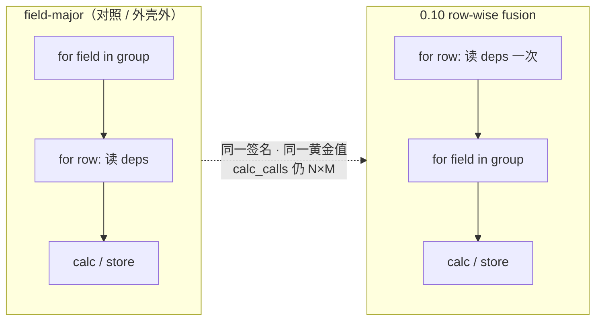
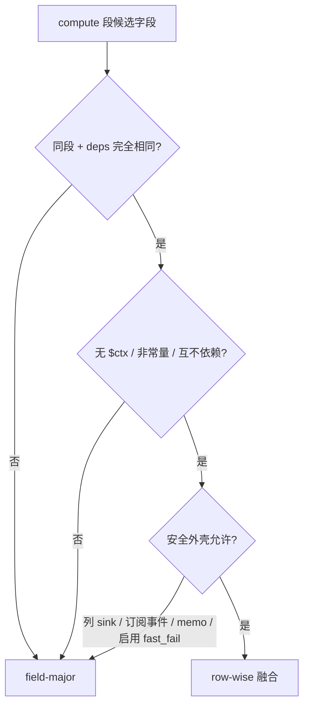
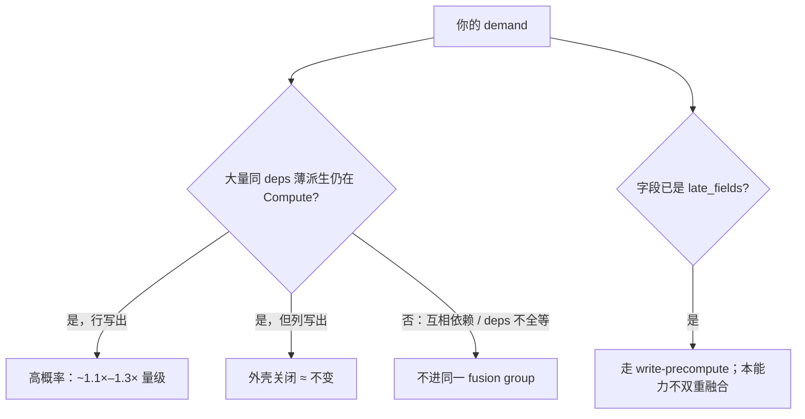

# 0.10.0：row-wise fusion（同 deps 行内融合）

??? note "适用读者"
    - 关心 **0.10.0** 宽表薄 `call_by` / `compute_expr` 吞吐的使用方
    - 需要讲清「何时融合 / 何时回退 / 与 write-precompute 如何分工」的维护者
    - 想看前后对拍数字与图的同学

**版本锚定：Scalim 0.10.0。**  
同一 compute 段内、**依赖集合完全相同**的派生字段，引擎默认改为 **按行读一次 deps → 依次算组内字段**——**零新 YAML、无总开关**。  
**不减少** calculator 调用次数（仍为 `N×M`）；减的是重复取依赖与字段循环框架税。

| 契约 | 0.10.0 行为 |
|------|-------------|
| Authoring | 不变 |
| 输出值 | 与 field-major 一致（`golden_ok`） |
| Calculator 调用次数 | 仍为每字段每行一次（`calc_calls == N×M`） |
| 列 sink | **不融合**（安全外壳） |
| 观测订阅 `FIELD_COMPUTE` / `OPERATOR_SPAN` | **不融合** |
| EXP `call_by` memo 命中组内字段 | **整组不融合** |

架构：[`arch.md` §5.4](../architecture/arch.md#54-row-wise-fusion-同-deps-派生字段按行融合减-nm-框架税)。  
版本亮点总览：[0.10.0 重点特性](0.10.0.md)。  
姊妹能力（写出前晚算）：[write-precompute-0.10](write-precompute-0.10.md)。  
姊妹能力（同 LoadRef 分片并行）：[lookup-chunk-parallel-0.10](lookup-chunk-parallel-0.10.md)。

测量摘要日期：<span id="rf10-measured-at"></span>。  
<span id="rf10-host-note" class="rf10-note"></span>

数据：[`assets/data/rowwise-fusion-0.10.json`](../assets/data/rowwise-fusion-0.10.json)。

---

## 1. 一图看懂：field-major vs row-wise





### 与 write-precompute（c10）的分工

| | write-precompute | row-wise fusion |
|--|--|--|
| 作用对象 | 只写出、无下游消费者的 `late_fields` | 仍在 **Compute 段** 的同 deps 组 |
| 主收益 | 少扛中间驻留 + 行路径墙钟 | 少重复读 deps / 调度税 |
| 调用次数 | 不变 | 不变 |
| 同字段会不会「双重优化」 | late 在 compute 被跳过 → **不会**再进 fusion | 只融 early 字段 |

本页证据为隔离 c20：**清空 `late_fields`** 后对拍（否则 write-only 派生会走 c10 晚算路径）。

---

## 2. 实际例子：前后对拍

合成计数 shape：薄 `call_by`、共享 `(v0, v1)`、内存 sink、**全表黄金**；同一 plan 仅切 `compute_fusion_groups`（空 = field-major）。

### 2.1 加速比（D3）

宽表行路径约 **1.11×–1.26×**；列路径接近 **1.0×**（外壳关闭，噪声带）。

<div id="rf10-chart-speedup" class="rf10-chart" style="width:100%;min-height:260px;margin:1rem 0;"></div>

### 2.2 行路径墙钟：field-major vs fused（D3）

<div id="rf10-chart-wall" class="rf10-chart" style="width:100%;min-height:300px;margin:1rem 0;"></div>

### 2.3 明细表（对拍）

| Shape | N / M / sink | field-major (s) | fused (s) | 加速 | 组数 | 黄金 / calc_calls |
|-------|--------------|----------------:|----------:|-----:|-----:|:-----------------:|
| 宽表同 deps·行 | 10k / 80 / row | 1.248 | 0.990 | **1.26×** | 1 | ✓ / 相等 |
| 报表宽派生·行 | 20k / 48 / row | 1.447 | 1.261 | **1.15×** | 1 | ✓ / 相等 |
| 大行数中等宽·行 | 50k / 32 / row | 2.523 | 2.181 | **1.16×** | 1 | ✓ / 相等 |
| 引擎代理宽表·行 | 8k / 120 / row | 1.320 | 1.184 | **1.11×** | 1 | ✓ / 相等 |
| 宽表同 deps·列 | 10k / 80 / column | 0.913 | 0.935 | **0.98×** | 1* | ✓ / 相等 |
| 窄表同 deps·行 | 40k / 4 / row | 0.538 | 0.514 | **1.05×** | 1 | ✓ / 相等 |

\*列路径计划期仍能识别组，但运行时安全外壳禁用融合；墙钟接近噪声。

**读法**

- 「更快」= 少重复读 deps / 少字段级循环税，**不是**少算业务函数。
- `M` 越大、deps 完全相同的簇越宽，行路径收益越明显。
- 所有 case：`golden_ok` + `calc_calls == N×M` 两边相等。

---

## 3. 迷你 walkthrough（教学）

2 行 × 3 个同 deps 薄 `call_by`：

| | 依赖读取次数 | calculator 调用 |
|--|--:|--:|
| field-major | ≈ **12**（N×M×D，D=2） | **6** |
| row-wise | ≈ **4**（N×D） | **6**（不变） |

引擎 MVP 复现：

```bash
uv run python llmanspec/changes/archive/2026-08-02-c20-compute-expr-rowwise-fusion/mvp/repro_nxm_framework_tax.py \
  --rows 4000 --wide-fields 40 --runs 3
```

本页同款 workload：

```bash
uv run python .tmp/repro/c20-workload-shapes/run_ab.py --runs 3
```

---

## 4. 谁受益 / 谁不变



---

## 5. GitHub Release 引用

```text
## Highlights
- row-wise fusion（默认）：同 deps 派生字段按行融合，减 N×M 框架税；calc_calls 不变。
  详述与对拍：docs/doc/releases/rowwise-fusion-0.10.md
- write-precompute：docs/doc/releases/write-precompute-0.10.md
```

---

## 6. 相关链接

- Spec：`llmanspec/specs/execution-compute-rowwise-fusion/`
- 归档 change：`llmanspec/changes/archive/2026-08-02-c20-compute-expr-rowwise-fusion/`
- 大形状 RSS（≤10%）：`.tmp/evidence/c20-rowwise-fusion-rss/`（可再生，不入库）
