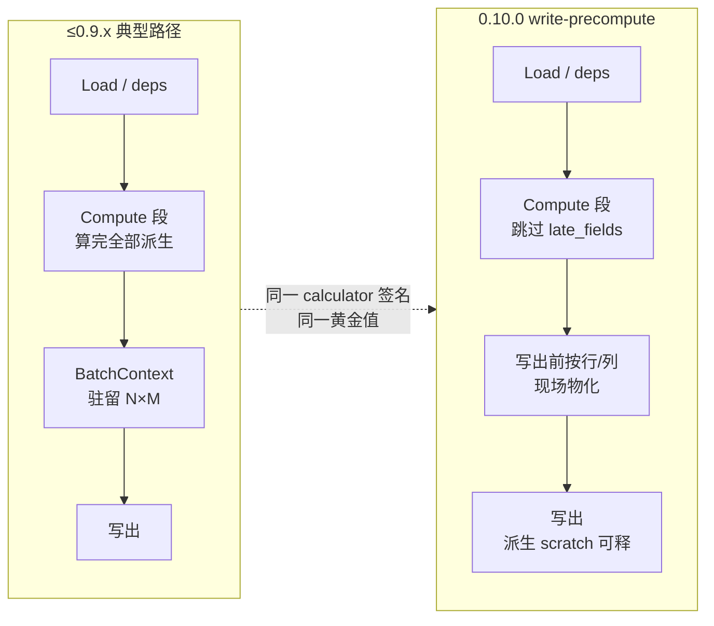
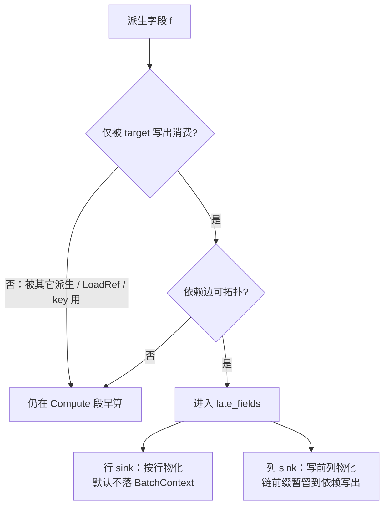
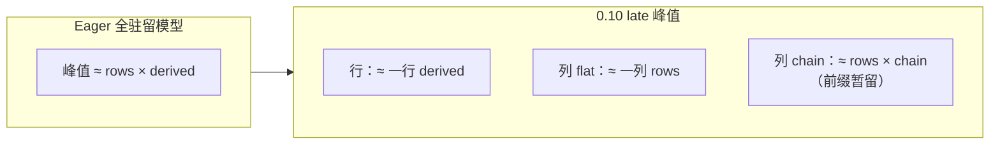
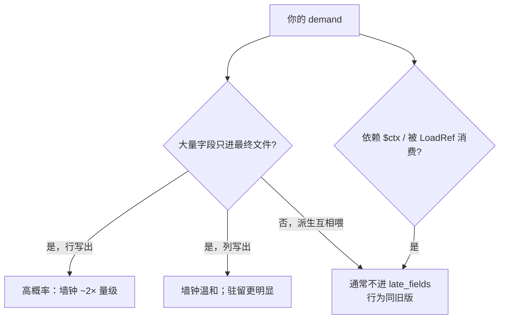

# 0.10.0：write-precompute（写出前延迟物化）

??? note "适用读者"
    - 关心 **0.10.0** 性能提升、是否要改 YAML/脚本的使用方
    - 需要给业务方讲清「何时变快 / 何时不变」的维护者与 agent
    - 想深窥数据与图的同学（本页含表格、Mermaid、D3 交互图）

**版本锚定：Scalim 0.10.0。**  
只用于最终写出、不被其它派生 / LoadRef 消费的派生字段，引擎**默认**改为写出前再算——**零新 YAML、无总开关、无需改脚本**。

| 契约 | 0.10.0 行为 |
|------|-------------|
| Authoring | 不变 |
| 输出值 | 与早算路径一致（`golden_ok`） |
| Calculator 调用次数 | 仍为每字段每行一次 |
| 失败 | `fast_fail` → 报错 + sink discard |
| 观测 | `FIELD_COMPUTE` 带 `meta.scalim_compute_phase` = `operator` \| `write_precompute` |

架构语义：[`arch.md` §5.3](../architecture/arch.md#53-write-precompute)。  
版本亮点总览：[0.10.0 重点特性](0.10.0/)。

??? info "0.10.0 重点特性 · 版本总览(折叠)"

    > 单一事实来源为独立章节 [0.10.0 重点特性](0.10.0/)，此处折叠预览。

姊妹能力（同 deps 行内融合）：[rowwise-fusion-0.10](rowwise-fusion-0.10.md)。  
姊妹能力（同 LoadRef 分片并行）：[lookup-chunk-parallel-0.10](lookup-chunk-parallel-0.10.md)。

测量摘要日期：<span id="wp10-measured-at"></span>。
<span id="wp10-host-note" class="wp10-note"></span>

数据文件（可复用）：[`assets/data/write-precompute-0.10.json`](../assets/data/write-precompute-0.10.json)。
---

## 1. 一图看懂：早算 vs 晚算





---

## 2. 主卖点数字（报表形状 workload）

合成计数 shape（无业务字段名）：薄 `call_by`、内存 sink、全表黄金；同一 plan 仅切 `late_fields`（eager=清空 vs auto late）。

### 2.1 加速比（D3）

行路径（青绿）约 **~1.47×–1.60×**（Python 3.6.15 全量对拍）；列路径（蓝）约 **~1.07×–1.11×**。

<div id="wp10-chart-speedup" class="wp10-chart" style="width:100%;min-height:280px;margin:1rem 0;"></div>

### 2.2 行路径墙钟：早算 vs 晚算（D3）

<div id="wp10-chart-wall" class="wp10-chart" style="width:100%;min-height:320px;margin:1rem 0;"></div>

### 2.3 明细表

测量环境：Python **3.6.15**，`runs=1`，合成 workload。数据：[`assets/data/write-precompute-0.10.json`](../assets/data/write-precompute-0.10.json)。

| Shape | N / flat / chain / sink | eager (s) | late (s) | 加速 | late 字段 | 仿真峰值比 | 黄金 / 调用 |
|-------|-------------------------|----------:|---------:|-----:|----------:|-----------:|:-----------:|
| 报表混合·行 | 20k / 48 / 8 / row | 2.483 | 1.582 | **1.57×** | 56 | 20000× | ✓ / 相等 |
| 报表混合·列 | 20k / 48 / 8 / column | 1.990 | 1.790 | **1.11×** | 56 | 7× | ✓ / 相等 |
| 宽表纯导出·行 | 10k / 80 / 0 / row | 1.639 | 1.057 | **1.55×** | 80 | 10000× | ✓ / 相等 |
| 宽表纯导出·列 | 10k / 80 / 0 / column | 1.400 | 1.310 | **1.07×** | 80 | 80× | ✓ / 相等 |
| 链式派生·行 | 30k / 4 / 24 / row | 2.201 | 1.378 | **1.60×** | 28 | 30000× | ✓ / 相等 |
| 引擎代理宽表·行 | 8k / 120 / 0 / row | 1.875 | 1.207 | **1.55×** | 120 | 8000× | ✓ / 相等 |
| 大行数中等宽·行 | 50k / 32 / 4 / row | 4.321 | 2.944 | **1.47×** | 36 | 50000× | ✓ / 相等 |

**读法**

- 「更快」来自少扛中间结构与调度税，**不是**少算业务函数。
- 派生若大量被下游消费 → 不会进 `late_fields` → 行为与旧版一致。

---

## 3. 微扫参：仅写出派生数 M↑ → 收益↑

N=4000，薄 calc，只变写出派生字段数 M。

<div id="wp10-chart-micro" class="wp10-chart" style="width:100%;min-height:260px;margin:1rem 0;"></div>

| M | 行加速 | 列加速 |
|--:|-------:|-------:|
| 1 | 1.23× | — |
| 4 | 1.46× | — |
| 40 | **2.18×** | **1.23×** |

---

## 4. 驻留：5 / 15 / 30 GiB 规模矩阵

校准 **~64 B/derived-cell**（eager 全驻留模型）。下图横轴为估 eager GiB，纵轴为 **峰值派生格比（log）**；悬停看 case。



<div id="wp10-chart-residency" class="wp10-chart" style="width:100%;min-height:340px;margin:1rem 0;"></div>

### 4.1 代表档位（摘录）

| 档位 | 拓扑 | sink | 形状量级 | 估 eager | 估 late 峰值 | 峰值比 |
|------|------|------|----------|---------:|-------------:|-------:|
| small (~5 GiB) | flat | row | 52k × 1600 | ~5.0 GiB | ~0.0001 | **~5.2e4×** |
| small | flat | column | 同上 | ~5.0 | ~0.003 | **1600×** |
| small | mixed | row | 103k × 816 | ~5.0 | ~0 | **~1.0e5×** |
| small | mixed | column | 同上 | ~5.0 | ~0.10 | **51×** |
| medium (~15 GiB) | flat | row | 105k × 2400 | ~15 | ~0.0001 | **~1.0e5×** |
| large (~30 GiB) | flat | row | 157k × 3200 | ~30 | ~0.0002 | **~1.6e5×** |

!!! warning "诚实边界"
    纯 **chain + column** 时 late 仍需保留链前缀，峰值比可接近 **~1.1×**。发版叙事应强调 **flat / mixed 宽导出**，不要写成「一切场景 30×」。

完整 18 case 见 JSON 的 `residency_matrix`。

### 4.2 ~5 GiB 真跑引擎（discard sink + late）

6/6 `golden_ok`。估 eager 全驻留 ~5 GiB，实测进程峰值 RSS 远低于该量级（写出校验不攒全表 + late 不预热整批）。

<div id="wp10-chart-engine-rss" class="wp10-chart" style="width:100%;min-height:280px;margin:1rem 0;"></div>

| case | 拓扑 / sink | 墙钟 (s) | 峰值 RSS (MiB) | 估 eager (GiB) | golden |
|------|-------------|---------:|---------------:|---------------:|:------:|
| small_flat_row | flat / row | 127.1 | 83.7 | 5.00 | ✓ |
| small_flat_column | flat / column | 110.1 | 64.1 | 5.00 | ✓ |
| small_chain_row | chain / row | 145.8 | 472.2 | 5.62 | ✓ |
| small_chain_column | chain / column | 116.6 | 471.4 | 5.62 | ✓ |
| small_mixed_row | mixed / row | 125.9 | 94.9 | 5.00 | ✓ |
| small_mixed_column | mixed / column | 111.1 | 86.1 | 5.00 | ✓ |

---

## 5. 谁受益 / 谁不变



| 场景 | 预期 |
|------|------|
| 宽表报表、多列只导出 | 行路径主收益区 |
| 列式 Excel / 列 sink | 驻留优先；墙钟次要 |
| 几乎所有派生被下游再用 | 几乎无 late → 无变化 |
| 指望少调用 calculator | **不在本版**（另案 multi-output / c20 也不减次数） |

---

## 6. 对二次开发 / 观测

- 订阅 `FIELD_COMPUTE`：用 `meta["scalim_compute_phase"]` 区分 `operator` 与 `write_precompute`。
- 勿假设「Compute 段结束后上下文已有全部写出派生」。
- Excel / `openpyxl` 主路径不是本版主优化；宽表列峰值另见 [Excel 列式写出策略](../getting-started/excel-column-residency.md)。

---

## 7. 复现与证据索引

复现脚本（已入库）：[`docs/doc/releases/repro/c10-workload-shapes/run_ab.py`](repro/c10-workload-shapes/run_ab.py) / [`c20-workload-shapes/run_ab.py`](repro/c20-workload-shapes/run_ab.py)（本页 workload 同款 A/B）。

```bash
# workload A/B（生成图表同款数字；仓库根目录运行）
uv run python docs/doc/releases/repro/c10-workload-shapes/run_ab.py --runs 3
# Python 3.6 运行时边界：
PYTHONPATH=src .tmp/venvs/py36-scalim/bin/python \
  docs/doc/releases/repro/c10-workload-shapes/run_ab.py --runs 1

# 微扫参
uv run python llmanspec/changes/archive/2026-08-01-c10-write-precompute-derived-fields/mvp/repro_row_late_vs_eager.py \
  --rows 4000 --derived-fields 40 --runs 3

# 驻留矩阵（仿真）
uv run python llmanspec/changes/archive/2026-08-01-c10-write-precompute-derived-fields/mvp/run_scale_matrix.py \
  --scales smoke,small,medium,large --sim-only
```

| 证据 | 位置 |
|------|------|
| 本页图表数据 | `docs/doc/assets/data/write-precompute-0.10.json` |
| 变更归档 | `llmanspec/changes/archive/2026-08-01-c10-write-precompute-derived-fields/` |
| 规模矩阵基线 | `.../mvp/evidence/baseline-matrix-*.json` |

---

## 8. GitHub Release 引用

发 **0.10.0** 时，Release 正文直接指向本页即可，例如：

```text
## Highlights
- write-precompute（默认）：只写出派生字段延后到写出前物化。详述与图表见文档：
  docs/doc/releases/write-precompute-0.10.md
```

（站点发布后换成站点 URL 对应路径。）

---

## 9. 同版本后续（非本页范围）

- **c20** 行内融合：减框架税，**不**减 `calc_calls`。
- **c30** LoadRef chunk 并行：adaptive 下 opt-in。
