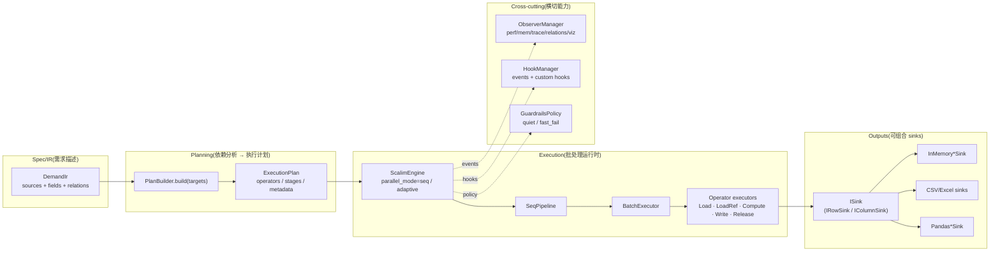
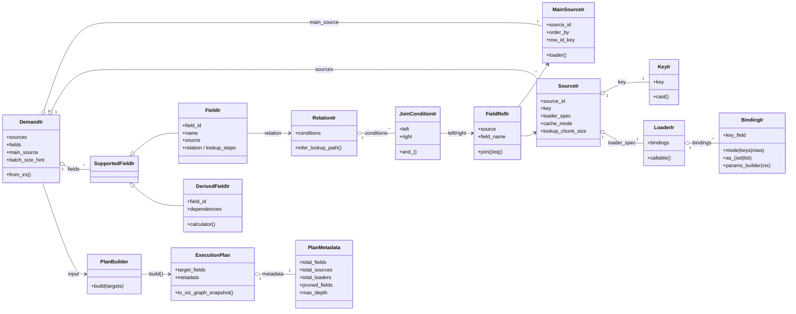
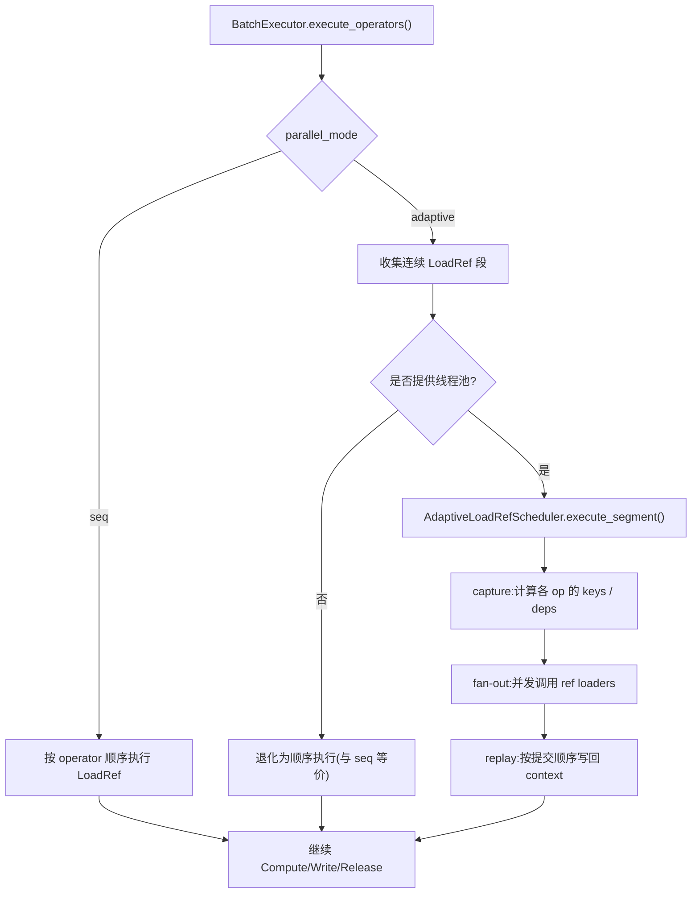

# scalim

Scalim 是一个 **Python-first** 的计算运行时:用 IR(中间表示)描述数据需求,构建执行计划并执行,输出到不同 sink,同时提供 hooks / observability / guardrails 等运行时能力.

> 仓库根目录的 `README.md` 会保持精简:这份站点是更完整的说明入口.

## 快速链接

- 本地预览文档:`just docs-serve`
- 构建文档:`just docs-build`
- marimo 笔记本列表:见左侧 **Notebooks**

## 能力概览

- **IR**:Demand / Source / Field / Relation / Binding
- **Planning**:依赖分析、字段剪枝、执行计划可视化快照
- **Execution**:`ScalimEngine`(seq / adaptive 并行 load_ref)
- **Sinks**:memory / csv / excel / pandas(excel/pandas 为可选依赖)
- **Observability**:performance / memory / trace / relations + 可选 viz 产物
- **Guardrails**:quiet / fast_fail
- **编排**:`run_ir`(与 DSL 无关的执行编排)

## 安装

开发环境(推荐):

```bash
uv sync --dev
```

可编辑安装(pip):

```bash
pip install -e .
```

可选依赖:

```bash
pip install -e '.[pandas,excel,notebooks]'
```

## Quick start(Python API)

```python
from scalim.execution.engine import ScalimEngine
from scalim.planning.builder import PlanBuilder
from scalim.spec.ir.demand import DemandIr
from scalim.spec.ir.fields import FieldIr
from scalim.spec.ir.sources import MainSourceIr


def load_orders(ids=None):
    rows = [{"id": 1, "amount": 100}, {"id": 2, "amount": 200}]
    if ids is None:
        return rows
    wanted = set(ids)
    return [row for row in rows if row["id"] in wanted]


main = MainSourceIr(source_id="orders", loader=load_orders)
fields = [
    FieldIr(field_id="id", name="ID", source=main, is_primary=True),
    FieldIr(field_id="amount", name="Amount", source=main),
]
demand = DemandIr.from_irs(sources=[], fields=fields, main_source=main)

plan = PlanBuilder(demand).build(targets=["id", "amount"])
engine = ScalimEngine(demand=demand, plan=plan, batch_size=100)
print(engine.run(main_rows=load_orders()))
```

## 示例与集成测试(marimo)

本仓库把“可交互示例”和“集成测试”统一为同一套 marimo notebook:

- **可交互**:本地探索/教学
- **无交互**:`marimo export` 执行 notebook 并导出 HTML,然后退出(适合 CI / 本地快速验证)

入口(推荐):

- `notebooks/marimo/examples/demo_big_data_report/demo_tutor.py`

交互式打开:

```bash
just notebook
```

导出为静态 HTML(用于 GitHub Pages / 本地文档站点展示):

```bash
just docs-export-notebooks
```

导出的静态页面可在文档站点里直接打开:

- [`demo_tutor.html`](notebooks/demo_big_data_report/demo_tutor.html)

## 架构图(Mermaid)

### 运行时总览:IR → Plan → Engine → Sink



### 对外接口:IR / Plan 结构(类图)



### 自适应并行:LoadRef fan-out / fan-in(`parallel_mode="adaptive"`)



### `run_ir`:DSL-agnostic 编排(输出/观测/对外组件组合)

```mermaid
sequenceDiagram
  autonumber
  participant Caller as 调用方 (DSL/Notebook/Tests)
  participant RI as run_ir()
  participant PB as PlanBuilder
  participant OB as Observability/ObserverManager
  participant HK as HookManager
  participant OP as OutputPlan (file sink + tee)
  participant EN as ScalimEngine
  participant PL as SeqPipeline
  participant BE as BatchExecutor
  participant SK as Sink

  Caller->>RI: ExecutionRequest + DemandIr
  RI->>PB: build(targets=ExportLayout.field_ids)
  PB-->>RI: ExecutionPlan
  RI->>OB: build_manager(); register observers
  RI->>HK: register hooks
  alt output.streaming=true (row)
    RI->>OP: CSVSink/ExcelSink + IRowSink tee
  else output.streaming=false (column)
    RI->>OP: ColumnCSVSink/ColumnExcelSink + IColumnSink tee
  end
  RI->>EN: __init__(plan, parallel_mode, guardrails, managers)
  RI->>EN: run(sink)
  EN->>PL: run(...)
  PL->>BE: execute_batch(...)
  BE-->>SK: write_row/batch/columns
  RI->>SK: close()
  RI->>OB: close()
  RI-->>Caller: ExecutionResult(duration, total_rows, output_path)
```

## 文档构建与发布(GitHub Pages)

本仓库用 MkDocs 构建文档,并在 CI 中导出 marimo notebooks 到 `docs/notebooks/`,最后发布到 GitHub Pages:

- CI:`.github/workflows/ci.yaml`(格式化/检查/测试)
- Deploy Pages:`.github/workflows/deploy-pages.yaml`(构建文档 + 部署 GitHub Pages)

如果需要启用 GitHub Pages:到仓库 Settings → Pages,把 Source 设为 “GitHub Actions”.

## 开发

```bash
just qa
```

## License

Apache-2.0(见 `LICENSE`).
