## Context

现状（as implemented）：

- demand YAML 解析入口：`src/scalim/dsl/by_yaml/config_parsing/loader.py`
  - 支持 `template_vars`（LiteJinja2）：在 YAML parse 前对文本进行预编译
  - 支持 `imports/$import`（V1）：在 schema/validator 之前做编译期展开
- imports 展开与诊断：`src/scalim/dsl/by_yaml/config_parsing/imports.py`
- schema SSOT：`src/scalim/dsl/by_yaml/schema_dsl/`
  - 生成物：`src/scalim/dsl/by_yaml/schema/*.gen.json`（禁止手改；`just gen-yaml-dsl-schema`）
  - editor schema copy：`frontend/scalim-yaml-dsl-editor/public/schema/*.gen.json`（禁止手改；`just gen-yaml-dsl-editor-schema`）
- marimo 覆盖清单：`notebooks/marimo/marimo_coverage.gen.md`（禁止手改；`just gen-marimo-coverage`）

作者侧的真实需求：

- 同文件复用：anchors/alias 对 outputs/aggregate/metrics 极其省心（尤其需要“共享 guardrails + 多个输出复用 metrics/fields 列表”时）
- 跨文件复用：`imports/$import` 能解决复制粘贴，但 V1 同目录约束会逼迫“碎片平铺”或“继续复制”
- 工具链诉求：需要一个能把 imports/template 展开成 effective YAML 的稳定出口，用于 review/debug/对拍门禁

约束：

- 部署机/容器环境可能没有 `.git`，因此 imports 不应依赖 git root 推断路径基准
- 不引入 `kind:` 判别式 AST 写法；保留嵌套表达（例如 `aggregate:`）
- runtime 必须确定性解析，不做“基于 key 的模糊推断”；推断仅允许在 editor/UI 层做辅助

## Goals / Non-Goals

**Goals:**

- Imports v2：在保持“文件路径 + 确定性解析”的前提下，支持 `./` / `../` / 子目录路径
- 提供 `render effective YAML` 的库 API 入口（`loads/dumps` 形态），让复用从黑盒变成可审计产物
- 把作者侧主线边界写清楚：单文件 `demand.yaml` 为主，`outputs` 留在主文件，anchors/alias 优先；跨文件复用走 `$import`
- 在实现前收敛 SSOT/生成物边界，并给出 drift gate（`just` 入口 + `just qa`）

**Non-Goals:**

- 不引入远程 imports、包管理式 imports
- 不在 runtime 引入推断/猜测语义；不引入 Rust/pyo3 作为第一阶段硬依赖
- 不推动 profile/overlay 多文件装配（除非未来执行面板 churn 被证明值得承担 provenance 成本）

## Decisions

### 1) Imports v2 仅做“文件路径”，基准为当前 YAML 文件目录

选择：

- 支持：`./x.yaml`、`../x.yaml`、`x.yaml`、`x/y.yaml`
- 基准：当前 YAML 文件所在目录（demand.yaml 与 fragments 一致）
- 拒绝：绝对路径、任意 URI scheme（`*://...`）、预留 alias 前缀（例如 `@/x.yaml`、`COMMON:/x.yaml`）

理由：

- 不依赖 git repo（docker/部署机稳定）
- 语义简单（只是一套可预测的路径解析规则），并且和现有 loader 的“文件路径入口”契合

备选方案（未选）：

- 以 git root 作为 `@/` 的默认解析基准：部署机不可依赖 `.git`
- 禁用 `../`（仅允许子目录）：安全边界更硬，但跨目录复用会被迫复制/平铺；后续可结合显式 roots/aliases 做治理

### 2) `$import` 合并语义维持现状，并写成规范

一句话：`$import` 提供 defaults；本地显式写了就赢。

- scalar：本地覆盖
- mapping：递归 fill
- list：本地 list replace
- 类型不匹配：fail-fast（type mismatch）

### 3) `render` 输出的是 effective YAML（用于 review/debug），不是“可逆的 authoring 形态”

`render` 的目标是可审计与对拍：

- 展开 imports 后，不再保留 `imports/$import`
- 保留 `{$init_var: ...}` / `$keys` / `$rows` 指令节点（运行期模板 AST）
- 不试图保留 anchors/alias（YAML parse 后 anchors 已被解析；render 输出是“展开后的普通结构”）

### 4) `init_vars` 与 `template_vars` 不冲突，但必须写清楚阶段

- `template_vars`：LiteJinja2 预编译，作用于 YAML **文本**（YAML parse 前）
- `init_vars`：解析 `{$init_var: <name>}` 指令节点，作用于 YAML **结构**（parse 后的编译期/运行期）

这两者的混用风险不是“语法冲突”，而是“作者误以为能把复杂对象安全序列化到 YAML 文本里”。因此文档要明确：模板渲染结果必须仍是合法 YAML。

### 5) 文档/生成物边界与 drift gate（必须在实现前写死）

- schema SSOT：`src/scalim/dsl/by_yaml/schema_dsl/`
  - 生成：`just gen-yaml-dsl-schema`
- editor schema copy：`just gen-yaml-dsl-editor-schema`
- marimo 覆盖：`just gen-marimo-coverage`
- OpenSpec：`just openspec-check`
- 总门禁：`just qa`

## Risks / Trade-offs

- [允许 `../` 读取父目录文件] → 禁用 URI/绝对路径；错误信息输出“解析基准 + 目标绝对路径”；后续用显式 roots/aliases 做治理
- [render 输出不保留 anchors/alias，diff 可能更长] → 这是刻意选择：render 是“可审计结果”，不是“作者格式化输出”；必要时在 PR 贴 effective YAML diff
- [imports 展开后报错定位可能缺少行号] → 维持现有 `trace + logical_path` 诊断模型；单文件主线下 `attach_locations()` 仍可靠

## Migration Plan

分阶段（先闭环 DX，再清理门禁）：

1) Imports v2：
   - 升级 `imports.<alias>` 路径解析规则
   - 同步 schema 的 pattern/markdownDescription
2) Render API：
   - 新增库侧 `loads/dumps` 形态 API（effective YAML）
3) 对拍与门禁：
   - 升级 marimo fixtures（如涉及 imports）
   - 运行 `just gen-marimo-coverage`、`just qa`
4) 清理临时文档：
   - 以本 OpenSpec change 为 SSOT，移除 `_YAML_DSL_FINAL/`

## Open Questions

- `render_explain` 是否要作为 MVP：用于输出“本次展开做了什么”的摘要（对 review 很值，但不是必须）

## Diagram (data flow)

```mermaid
flowchart TD
  D[authoring: demand.yaml] --> T[template precompile<br/>&#123;&#123; var &#125;&#125;]

  T --> I[imports/$import expansion]
  I --> V[validate<br/>jsonschema + semantic + unknown fields]
  I --> R[render effective YAML<br/>for review/debug]

  V --> C[parse -> DemandConfig]
  C --> IR[convert -> DemandIr]
  IR --> RQ[build ExecutionRequest<br/>outputs/observability/guardrails/retry]
  RQ --> RUN[run_ir]
  RUN --> S[sinks<br/>csv/workbook/viz events]
```

