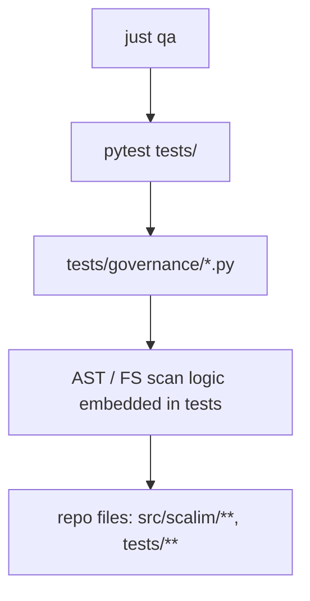
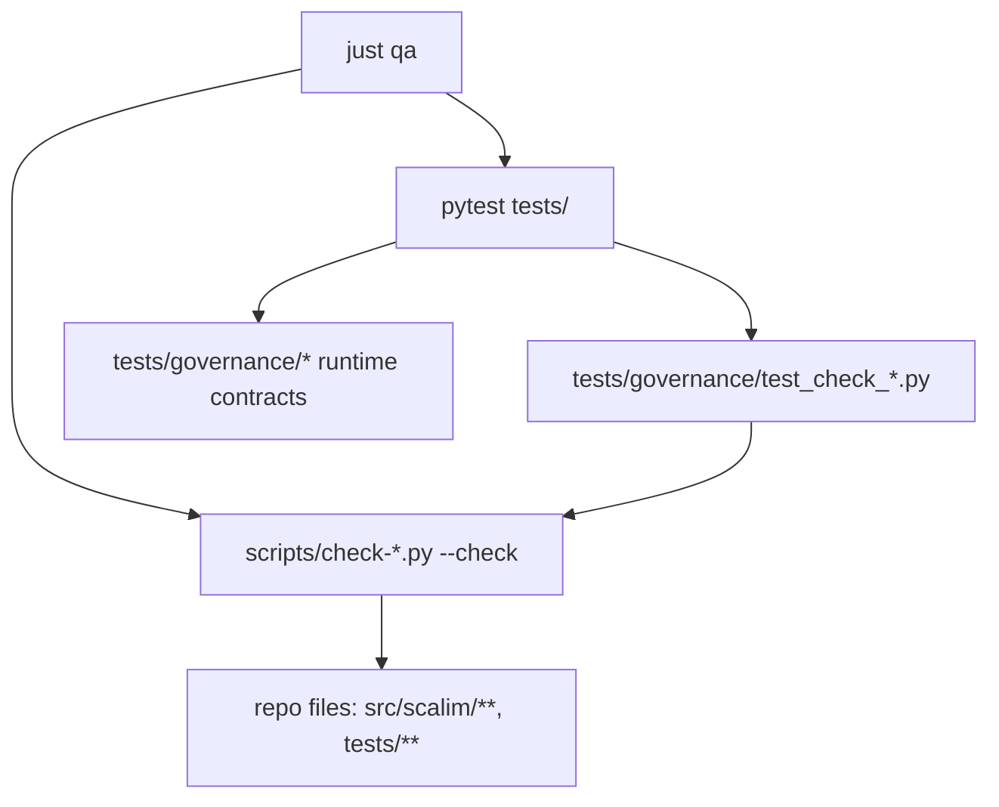

## Context

仓库当前存在两套“质量/治理门禁”实现形态：

- `scripts/check-*.py`：以脚本形式实现的静态门禁（如 `cast`/`no cover`/`dynattr` 等），由 `just qa` 的快速检查阶段执行。
- `tests/governance/`：以 `pytest` 用例实现的门禁/契约测试，混合了三种不同性质的检查：
  1) check 脚本自身的单元测试（加载 `scripts/check-*.py` 并用 tmp repo 断言行为）
  2) 运行时/公共入口契约测试（验证导入路径、optional deps 惰性加载、vendor 行为等）
  3) 纯静态扫描门禁（AST/文件系统扫描，作为 pytest 测试执行）

其中第 (3) 类门禁与 pytest 的覆盖率/执行模型耦合过强：开发者很难“只跑某个门禁”而不触发覆盖率失败或不必要的全量测试执行，从而降低反馈速度并模糊 tests 的语义边界。

本变更目标是把第 (3) 类从 `pytest` 迁移为 `scripts/check-*.py`，并在 `just qa` 的 `quick-check-only-py` 中统一 fail-fast 执行。

## Goals / Non-Goals

**Goals:**

- 将“静态扫描类治理门禁”迁移到 `scripts/check-*.py`，形成可独立运行、可复用、输出可定位的 gate。
- `just qa` 在 pytest 之前执行这些静态 gate（与现有 check-cast/no-cover/dynattr 等一致）。
- `tests/governance/` 的职责边界更清晰：保留运行时契约测试 + check 脚本单元测试；不再承载纯静态扫描门禁。
- 为迁移后的脚本保留最小单元测试，避免规则在重构中悄然失真。

**Non-Goals:**

- 不改变任何运行时行为、公开 API、或 Python 3.6 兼容边界。
- 不统一/重写所有现存 `tests/governance/` 的运行时契约测试；本变更只聚焦于“静态扫描门禁”的落点与执行方式。
- 不引入新的格式化器或 lint 基础设施（仍以 ruff/basedpyright/just qa 为 SSOT 入口）。

## Decisions

### Decision: 静态治理门禁以 `scripts/check-*` 为主入口

我们将把符合以下特征的检查定义为“静态治理门禁”，并迁移为脚本：

- 仅依赖仓库文件系统与 AST（无需 import 运行时模块以验证行为）
- 输出为“违规清单 + 定位信息”，本质是 lint/gate
- 运行成本低，适合在 pytest 之前 fail-fast

迁移目标（候选清单，按优先级）：

- 导入结构门禁（导入图无环、主包禁止函数内导入，排除 vendor）
- workflow layering gate（`src/scalim/workflow/**` 不得依赖 `scalim.dsl.*` 等）
- tests domain suites gate（tests 目录结构、禁止 `tests.*` 字符串引用越界、禁止 `*_additional.py`）
- monkeypatch policy gate（禁止 patch private name / patch global import）

### Decision: 迁移脚本命名与现有 pytest gate 一一对应

为了保持可发现性并避免“同一规则多处实现”,每个迁移出的静态 gate SHOULD 有一个稳定的脚本入口（`scripts/check-*.py`）以及可选的 pytest 单测（`tests/governance/test_check_*.py`）：

- `tests/governance/test_import_graph_no_cycles_and_no_local_imports.py` → `scripts/check-import-graph.py`
- `tests/governance/test_workflow_layering_gates.py` → `scripts/check-workflow-layering.py`
- `tests/governance/test_tests_domain_suites_gates.py` → `scripts/check-tests-domain-suites.py`
- `tests/governance/test_monkeypatch_policy.py` → `scripts/check-monkeypatch-policy.py`

pytest 侧保留“脚本行为单测”,但不再把门禁逻辑直接写在 pytest 测试文件里（避免与 coverage/xdist/pytest 插件行为强耦合）。

### Decision: 保留 pytest 对脚本的单元测试（但不再把脚本逻辑写在测试里）

脚本仍需要可测试性来避免规则漂移。策略：

- 脚本实现放在 `scripts/check-*.py`
- `tests/governance/` 中新增或保留 `test_check_*.py`：用 tmp repo 构造小样例，加载脚本模块并调用其 `main([...])` 或核心函数验证：
  - 能抓到违规
  - 能输出可定位信息
  - `--check` 返回码符合约定

这样 pytest 负责“脚本行为是否正确”，脚本负责“门禁规则本身”，职责分离。

### Decision: `just qa` 继续作为质量门禁 SSOT，并在 quick-check-only-py 中前置执行

静态门禁脚本会被加入 `justfile` 的 `quick-check-only-py` 链路，与现有的 `check-*.py --check` 一致：

- 目标：开发者在不跑 pytest 的情况下，也能快速获得结构/规范反馈。
- pytest 继续覆盖运行时行为与契约（并在默认 addopts 下进行 coverage gate）。

### Decision: 文档/生成边界在设计阶段明确

本变更涉及的 SSOT 与生成物边界如下：

- SSOT：
  - `scripts/check-*.py`（新增/修改的静态门禁脚本）
  - `justfile`（门禁编排）
  - `openspec/specs/**/spec.md`（规范文本）
  - `tests/governance/test_check_*.py`（脚本单测）
- 生成物：
  - 任何 `*.gen.*` 文件禁止手改；若脚本迁移影响到受控产物（例如 skills references），必须通过对应生成入口重建（如 `scripts/gen-agent-skill.py`）。
  - 文档 injected blocks（`BEGIN/END AUTOGEN:*`）禁止区块内手改；需要更新时用 `just gen-docs`。

## Risks / Trade-offs

- [重复门禁/双重执行] → 迁移过程中可能出现“pytest 版 gate + 脚本 gate”并存导致重复检查；缓解：迁移一个删一个，或在 tasks 中明确“切换点”与删除清单。
- [规则分散] → 新增多个 `check-*` 脚本可能造成 discoverability 下降；缓解：统一 CLI 约定，并在 `just --list` 与 `just qa` 链路中可见。
- [脚本与仓库结构耦合] → 静态扫描脚本对路径/结构敏感；缓解：在脚本单测中使用 tmp repo fixture 覆盖关键路径，降低回归风险。

## Migration Plan

1) 抽取静态 gate 为脚本（先导入结构 + workflow layering + tests domain suites + monkeypatch policy）。
2) 为每个脚本补齐最小单测（`tests/governance/test_check_*.py` 风格）。
3) 将脚本接入 `justfile` 的 `quick-check-only-py` 并在 `just qa` 中执行。
4) 删除/替换原先对应的 pytest 静态 gate 测试文件，保留运行时契约测试。
5) 更新 OpenSpec 规范（见 specs artifact）并运行 `just openspec-check`。

## Module Dependency Graphs (Before/After)

### Before

静态 gate 作为 pytest 测试执行，直接受 coverage/pytest 执行模型影响：

### After

静态 gate 以脚本形式独立执行，pytest 仅负责脚本行为单测与运行时契约：

## Open Questions

- 是否需要为 `scripts/check-*` 提供统一的 “common CLI helper”（例如统一的 `--root`、输出格式、stderr/stdout 约定），还是保持轻量复制粘贴？
- `tests/governance/` 是否需要进一步拆分为 `tests/governance/scripts/` 与 `tests/governance/contracts/`，以更明确语义边界？（本变更可选）
