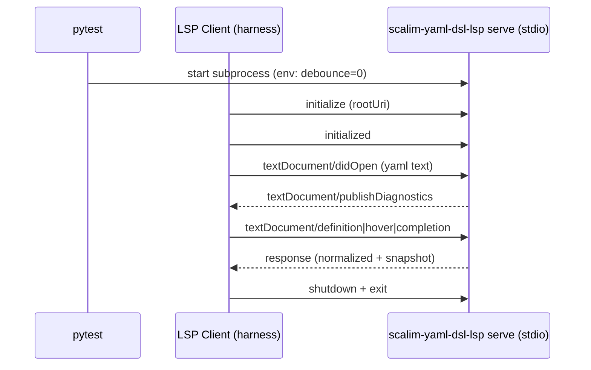

## Context

当前仓库里已经存在一些 YAML DSL LSP 的集成测试（例如通过子进程启动 `scalim-yaml-dsl-lsp serve`，再用 JSON-RPC 消息驱动 definition/completion/hover），但它们整体上更像“功能点回归”，而不是“体系化的协议契约基线”：

- harness（LSP client、消息编解码、初始化流程、诊断等待）在多个测试文件里重复；
- 断言风格不统一：有的只断言“有结果”，有的断言细节但包含不稳定的绝对路径；
- 场景覆盖缺少一个“清单/矩阵”，后续 refactor 时难以回答“我们到底保证哪些行为不变？”；
- 缺少明确的 normalize 策略与 golden 更新流程，容易导致“为了过测试而弱化断言”。

在 `c30-yaml-dsl-compiler-frontend` 开始之前，我们希望把 LSP 的现有能力固化为可执行的 contract suite（黑盒、协议级），让后续重构主要通过“让 contract tests 继续通过”来验证行为没有漂移。

## Goals / Non-Goals

**Goals**

- 为 `packages/scalim-yaml-dsl-lsp` 的现有能力建立 **协议级集成测试基线**：
  - diagnostics 发布（含降级语义）；
  - go-to-definition / hover / completion 的关键路径；
  - code actions / executeCommand 的关键路径。
- 测试结果 **跨环境稳定**：
  - 不依赖临时绝对路径；
  - 输出排序稳定（诊断、候选列表、多 location）；
  - 异步/防抖带来的 nondeterminism 可控。
- 测试可维护：
  - 一个统一的 harness；
  - fixture 场景清晰、可复用；
  - golden 更新流程明确（只在行为变更审查通过时更新）。

**Non-Goals**

- 不覆盖 editor 插件侧（VSCode/JetBrains）的 UI 集成；
- 不做“全量 LSP 协议一致性”验证（只验证我们支持的 endpoints）；
- 不把测试与内部实现强绑定（避免直接调用 `core.py` 的私有函数来断言细节）。

## Architecture (black-box LSP contract tests)

核心决策：以 **真实 LSP Server 进程（stdio）** 作为被测对象，通过 JSON-RPC/LSP 驱动行为并断言协议输出。

## Design Decisions

### D1) 统一 harness：`LspSession` + helpers

**决策：** 在 `tests/support/` 提供单一 harness，封装以下能力（名字仅示意，按实现调整）：

- 进程生命周期：start/stop/shutdown（确保不泄漏子进程与线程）；
- JSON-RPC 消息编解码（stdio framing）；
- request/notification API：
  - `initialize(root_uri, workspace_folders=...)`
  - `did_open(uri, text, version=...)`
  - `did_change(uri, text, version=...)`（可选，用于诊断刷新）
  - `definition(uri, position)` / `hover(...)` / `completion(...)`
  - `code_actions(...)` / `execute_command(...)`
- 通用等待：`recv_until(predicate, timeout=...)`，用于等待 publishDiagnostics 与 request responses。

这样测试用例只描述“场景与期望”，不再反复写协议细节（尤其是 offset/line/char 计算与初始化流程）。

### D2) 确定性：禁用 debounce + 统一超时策略

**决策：**

- 在启动 server 子进程时设置 `SCALIM_YAML_DSL_LSP_DID_CHANGE_DEBOUNCE_MS=0`，避免打字防抖引入的 nondeterminism 与不必要等待。
- 统一为每个等待点设置超时（例如 5~10s），并在失败时输出最近 N 条收包日志，便于排障。
- 在 suite 层面允许复用一个 server 进程（可选优化）：同一测试文件/同一 scenario 组复用，减少启动开销；但要确保 workspace 隔离与 state reset（例如每个 test 用独立 tmp workspace）。

### D3) Normalize：去除绝对路径与不稳定字段

**决策：** 对协议输出做稳定化处理后再断言：

- 将所有 `file://.../tmp/...` URI 归一化为 `file://<WORKSPACE>/...`（或等价 placeholder），避免机器/CI 路径差异。
- 对列表类返回做稳定排序：
  - diagnostics：按 `range.start` + `severity` + `message` 排序；
  - completion items：按 `sortText`/`label` 排序；
  - definition locations：按 `uri` + `range.start` 排序（并保持 server 约定的优先级）。
- 过滤掉显然与行为无关、但容易漂移的字段（例如 server 版本号、耗时、非关键 metadata）。

normalize 的目标是：**保留行为相关信息**（range、message、label、目标位置），只去除环境噪音。

### D4) Golden snapshots：以“场景”为单位固化协议输出

**决策：** 将核心交互结果保存为 golden JSON（或 YAML）：

- fixtures：`tests/fixtures/yaml_dsl_lsp_contract/<scenario>/...`
- snapshots：`tests/fixtures/yaml_dsl_lsp_contract/<scenario>/snapshots/*.json`

每个 scenario 建议至少包含：

- 输入：workspace 文件布局（`*.yaml`, `*.py`, `scalim.yaml` 等）
- 交互：请求序列（initialize → didOpen → requests）
- 输出：期望 snapshots（diagnostics/definition/hover/completion/code actions）

更新策略：

- 默认不自动更新 snapshots（防止无意漂移）；
- 提供一个显式的更新入口（例如 `UPDATE_GOLDEN=1 pytest ...` 或新增 `just lsp-contract-update`），仅在确认行为变更合理时更新。

### D5) 覆盖矩阵：把“我们保证什么”写成清单

**决策：** 将已有 LSP 能力映射到最小覆盖矩阵（示例，最终以实现为准）：

| Feature | 场景最小集合（建议） |
|---|---|
| diagnostics 基础发布 | 单文件 YAML；语法错/未知字段错 |
| imports + $import 跳转 | imports 定义点跳转；$import token 跳 fragment |
| Python reference definition/hover | `mymod:func`；对象方法 `obj.method` 多 location |
| completion：Python module/attr | 模块段补全；属性段补全 |
| builtin callable reference | `^workflow/...` completion/hover/definition |
| outputs.fields 智能 | 同文件字段；import 引入字段；空 list item completion |
| YAML alias | `&anchor` / `*alias` hover/definition |
| code actions | create minimal scalim.yaml；add import roots/alias；dump discovery |

设计目标不是“把所有组合都测一遍”，而是用最小场景覆盖 **我们承诺不回归的关键行为**。

## Verification

- 本变更落地后，`just test` 应默认覆盖该 suite（与现有测试一起运行）。
- 新增/重构的 contract tests 必须满足：
  - 不依赖网络；
  - 失败可诊断（打印最后收包/发包）；
  - 单测运行时长可控（目标：整套 contract tests < 20~30s，视 CI 资源可调）。

## Risks / Trade-offs

- **snapshot 过脆**：任何 range/message 小调整都要更新 golden。缓解：normalize + 只 snapshot 关键字段 + 允许在设计上明确“哪些输出允许变化”。
- **异步导致 flaky**：publishDiagnostics 与请求处理存在并发。缓解：禁用 debounce、明确等待点、统一超时、打印诊断。
- **维护成本上升**：测试本身需要维护。缓解：将 suite 作为 c30 的前置基准，后续每次行为变更必须“有意更新”并写明理由。
