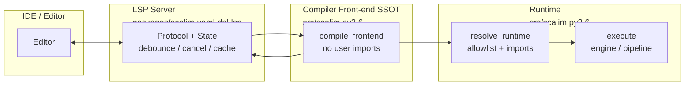
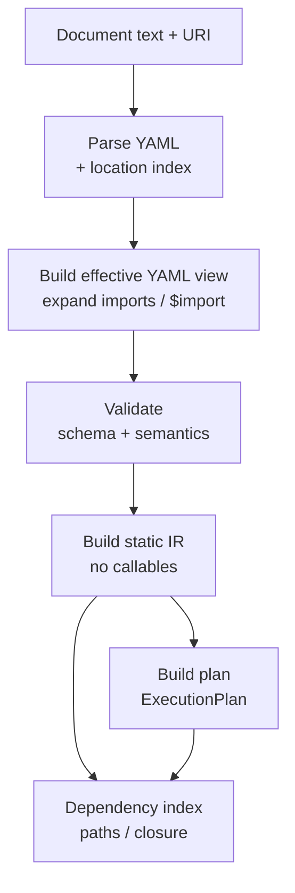
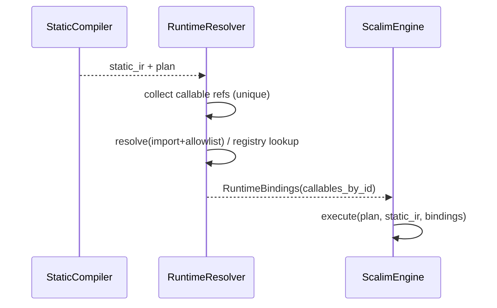
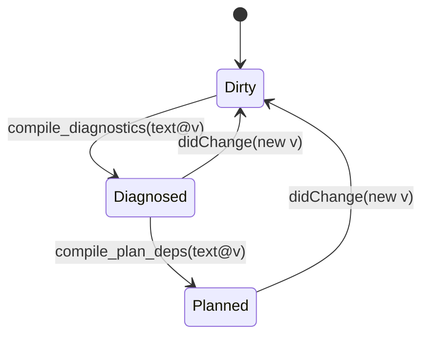
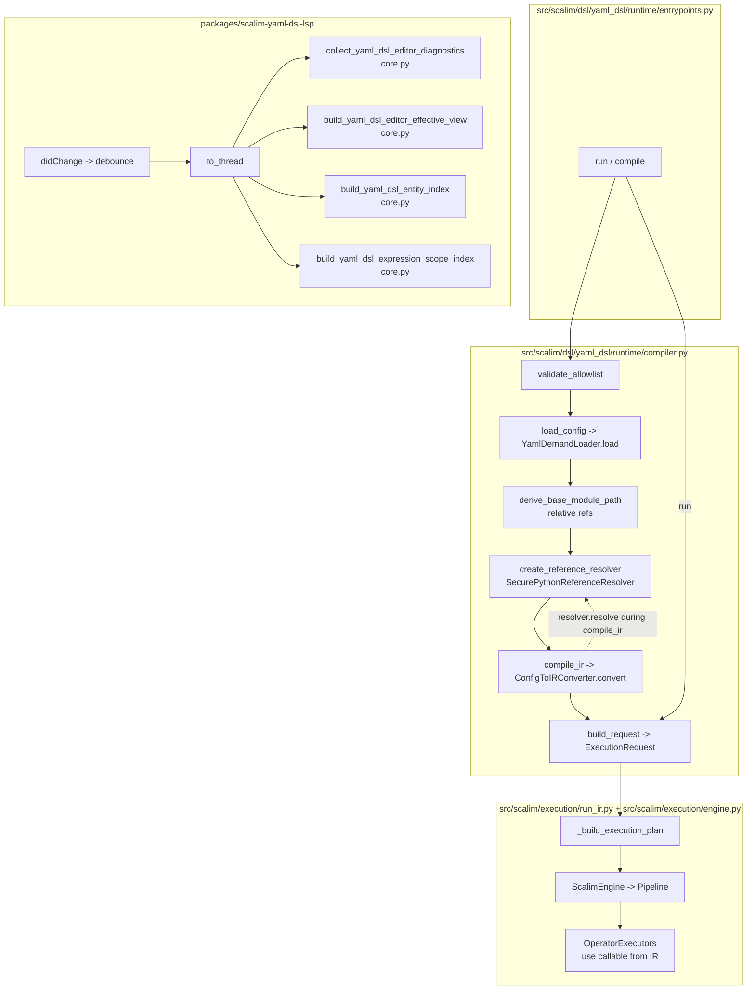
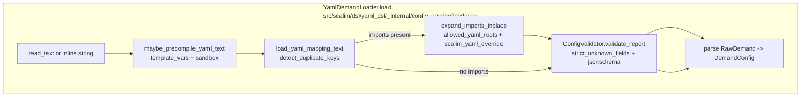
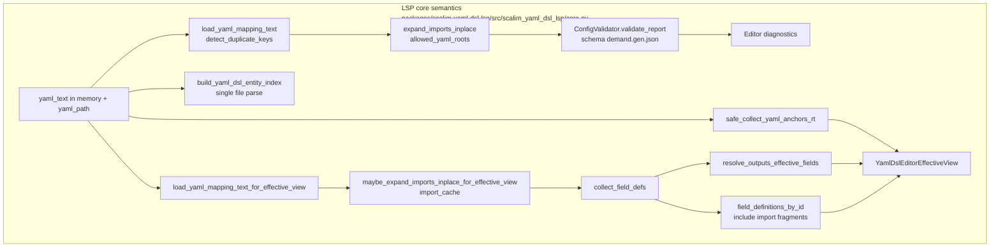
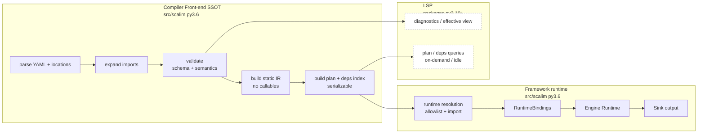
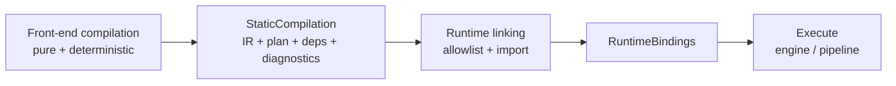

## Context

现状（核心痛点）：

- `packages/scalim-yaml-dsl-lsp` 的语义核心（`packages/scalim-yaml-dsl-lsp/src/scalim_yaml_dsl_lsp/core.py`）直接依赖 `scalim.dsl.yaml_dsl._internal.*`。
  - 主框架内部重构会级联破坏 LSP 包，导致“每次改 DSL/IR 都要同步修 LSP”的高维护成本。
- 目前很多“执行前可预测”的信息（字段依赖、执行计划、路径解释）无法在编辑器侧稳定获得：
  - 运行时 `scalim.dsl.yaml_dsl.compile/run` 会触发 allowlist/导入/解析 callable 的路径；
  - LSP/编辑器希望静态、确定性、无副作用（不导入/不执行用户代码）并可做高频增量刷新。
- 我们希望把 LSP 视为“静态实时编译点”，并让同一套静态编译产物可复用到其它 dev tooling（逐步替代 `frontend/scalim-viz` 的部分能力），维护点集中在主框架。

关键约束：

- `src/scalim/` 必须保持 **Python 3.6** 兼容（语法与依赖边界, 因为我们老项目有3.6依赖）。
- `packages/scalim-yaml-dsl-lsp` 可使用 **Python >= 3.10**（dev/tooling 边界）。
- 静态编译阶段必须满足：**确定性、无副作用、可诊断降级（不 crash）**。
- 文档治理：禁止手改任何 `*.gen.*` 与 `BEGIN/END AUTOGEN:*` 区块；如需更新注入/生成内容，走 `just gen-docs`。

本设计不以既有 OpenSpec 为唯一事实来源（代码为 SSOT），但会在落地时同步修订受影响的 specs，避免行为漂移。

## Goals / Non-Goals

**Goals:**

- 在主框架内建立一个可复用的“静态编译 SSOT”，将单个 YAML DSL 文档编译到 **ExecutionPlan** 与依赖索引（无需导入/执行用户代码）。
- 明确并实现 “静态（compile-time）” 与 “运行时（run-time）” 的边界：IR/plan 可静态构建；callable 解析只在运行时发生且受 allowlist 约束。
- 让 LSP package 变成薄层：协议/缓存/调度 + 调用主框架静态编译 API（降低后续维护成本）。
- 为高级 dev features 打底：字段上游依赖展开、路径解释、plan 可视化/序列化导出（供 LSP / viz / 调试工具复用）。

**Non-Goals:**

- 不在本变更内一次性实现完整的 IDE refactor 能力（rename/find references/全工程索引等）。
- 不在本变更内重写 VSCode/JetBrains/Neovim 客户端侧集成（只调整 server/语义层）。
- 不追求保留旧的“IR 内携带 callable”兼容写法；按项目约定直接升级到新结构（仓内调用点一并迁移）。

## Architecture Overview

### Compile-time vs Run-time boundary (end-to-end)



### Query/caching pipeline (what we cache and why)



设计要点：

- LSP handler 负责“何时重算/何时取消”，编译前端负责“如何确定性计算”。
- pipeline 必须可分段缓存：diagnostics 需要 P+EV+V；上游依赖展开需要 DI；plan 可视化需要 PL。

## Decisions

### D0) 定义两阶段产物：StaticCompilation vs RuntimeBindings

**决策：** 将整个链路拆成两个明确阶段，并用不同数据结构承载：

- **StaticCompilation（compile-time）**：面向编辑器与 dev tooling，必须确定性、可诊断、可缓存、可序列化（不含任何 Python callable）。
- **RuntimeBindings（run-time）**：面向执行，允许导入/解析 callable，但必须受 allowlist 约束并在执行前 fail-fast。

这条边界是本变更的核心护栏：任何需要导入用户模块的逻辑都不得出现在 StaticCompilation 阶段。

### D1) 引入主框架编译前端作为 SSOT（3.6 兼容）

**决策：** 在 `src/scalim/dsl/yaml_dsl/` 下新增一个明确的编译前端子包（建议命名：`compiler_frontend/`），并将下列能力收敛为稳定 API：

- project discovery（复用现有 `scalim.yaml` 解析与 roots 推断）
- YAML 解析（含 location index）
- imports/$import 展开（受 allowed roots 约束）
- schema + 语义校验（对齐现有 validator）
- 静态 IR 构建（不包含任何 callable）
- ExecutionPlan 构建与依赖索引（字段闭包、路径追踪）

**输出：** 定义一个 `StaticCompilation`（或同等命名）对象，包含：

- `diagnostics`（errors/warnings，含 path + range）
- `effective_yaml`（只读映射/索引，便于 LSP 做 hover/definition/补全）
- `static_ir`（规划期 IR）
- `plan`（ExecutionPlan，引用 ID 而非 callable）
- `dependency_index`（便于快速查询“字段上游/下游依赖”与“最短依赖路径”）

**替代方案：**

- A) 继续把 editor semantics 放在 `packages/scalim-yaml-dsl-lsp`：会持续承受内部重构耦合，不符合“维护点集中”目标。
- B) 静态编译仍复用运行时 compile 并“想办法禁用导入”：边界不清晰、容易被未来特性打穿。

结论：选择 D1。

### D2) IR/Plan 不再携带 callable；runtime resolution 显式化

**决策：** 将 `DemandIr/SourceIr/MainSourceIr/LoaderIr/BindingIr`（以及 planning operators/plan）调整为 **纯描述**：

- loader / params_builder / normalize.call_by 等从 “callable” 改为 “reference descriptor”（例如 `PythonReference`：原始引用字符串 + 解析结果）。
- 任何需要 `importlib.import_module` 或 `inspect.signature` 的逻辑，移动到运行时解析步骤中。

对应地，引入一个显式的运行时解析步骤：

- `resolve_runtime_callables(static_ir, *, options: RunOptions, discovery: ...) -> RuntimeRegistry/ExecutionRequest`
- 运行时解析必须：
  - 受 allowlist 约束；
  - 错误分类明确（resolver error vs config error）；
  - 可缓存（同一个引用在一次 run 内只解析一次）。

**替代方案：**

- A) 让 IR 同时支持 `callable | reference`：会长期制造“到底哪个阶段允许副作用”的歧义，也会迫使 LSP/规划层写兼容分支。
- B) 仅把 callable 移出 YAML DSL 路径，但保留 Python DSL 可 callable：会导致 IR 语义不统一，难以让 plan 成为可序列化 SSOT。

结论：选择 D2，统一 IR 语义。

#### D2.1) “No callables” 的严格定义（避免歧义）

**决策：** StaticCompilation 产物（静态 IR / plan / index）中禁止出现所有 Python callable，包括：

- YAML DSL 的 loader/call_by/normalize.call_by/params_builder；
- 派生字段的 calculator（无论来自 `compute` 表达式还是 `call_by` 引用）；
- Python DSL 的 `transform` / `value_formatter` 等任何函数对象。

静态阶段只允许存储：

- 原始表达式字符串（如 compute expr）与其静态解析结果（AST/依赖 token）；
- Python reference 字符串（及其 parse 结果）；
- 或 “runtime handle id”（用于 Python DSL 直接注入 callable 的场景，见 D2.2）。

这样 StaticCompilation 才天然可序列化（JSON）并能作为跨工具 SSOT。

**我赞同这是一个强约束**，理由是：

- 只要有任意一个“洞”允许把 callable 塞回静态产物（哪怕只是 `transform`/`formatter`），静态边界就会被未来特性不断打穿，最终 LSP/静态编译仍不得不“追着运行时走”。
- 静态产物如果不能保证 JSON 级可序列化，就无法做：稳定快照对拍、跨进程缓存、LSP/viz 复用、以及“高频增量刷新”的版本化缓存。

**表达力是否会被削弱？（从用户角度）**

- 对 YAML DSL 用户：表达力基本不降，甚至更好。
  - 复杂逻辑仍可写在 Python 函数里，用 `call_by: "pkg.mod:fn(...)"` 表达（运行时 allowlist 控制）。
  - 常见逻辑应逐步内建为“可组合的纯数据 op”（例如 “value_cast / transform pipeline / formatter pipeline” 的 steps 形态；见 D2.3），这样 LSP 可以完成补全/hover/可视化且无需导入。
- 对 Python DSL 用户：需要一个新的“运行时绑定”通道承载 callable（`RuntimeHandleId` → callable），但可通过 builder API 把成本降到可忽略（见 D7）。

**我们需要补齐的用户便利能力（用于弥补/超越 callable 直塞 IR）**

- 内建一组稳定 ID 的 `builtin transforms/formatters/calculators`（可文档化、可补全、可静态分析）。
- 支持 transform pipeline（列表形式的 step），让 80% 场景不必写 Python。
- 允许 YAML 中的 PythonReference 做“静态语法校验 + 运行时解析”，并在 LSP 中提供 definition/hover（基于文件系统与 AST，不依赖 import 执行）。

#### D2.2) Python DSL 的承载方式（避免把“可执行对象”塞回 IR）

**决策：** 静态 IR 中允许两类“可调用引用描述”：

1) **PythonReference**（可由 YAML DSL 产生）：`"pkg.mod:fn"` / `"pkg.mod.fn"` 等（run-time 通过 allowlist+import 解析）。
2) **RuntimeHandleId**（可由 Python DSL 产生）：一个稳定字符串 id（run-time 直接从 `RuntimeBindings`/registry 获取，不需要 import）。

取舍：

- 这允许 Python DSL 使用 closure/动态函数（无法 import 的 callable）而不污染静态产物；
- 同时 YAML DSL 仍保持“配置即引用”的安全边界（必须 allowlist + import）。

#### D2.3) 字段后处理能力（YAML 侧 vs IR 侧）与静态表示（避免“语法=IR 字段”的误解）

核心澄清：YAML DSL 的配置语法并不与 IR 结构一一对应；很多“能力”是在 conversion 阶段映射出来的。

以字段后处理为例：

- **YAML 语法（当前已有）**：
  - 源字段：`value_cast: <auto|int|str|decimal|...>`（`src/scalim/dsl/yaml_dsl/schema_dsl/models/field.py:110`）
  - 派生字段：`compute:`（安全表达式）或 `call_by:`（Python 引用 + 参数列表）
- **IR 能力（当前已有）**：
  - `FieldIr.transform` / `FieldIr.value_formatter`（`src/scalim/spec/ir/_fields.py`）
  - `DerivedFieldIr.calculator`（`src/scalim/spec/ir/_fields.py`）
- **关键事实（代码真值）**：`value_cast` 在 runtime conversion 时会被编译为 `FieldIr.transform` 的 callable（`src/scalim/dsl/yaml_dsl/runtime/_internal/conversion_sources.py:536`）。

本变更关心的是：在 “no callables” 前提下，**静态 IR/plan 该如何表达这些后处理逻辑**，从而让 plan/deps 可序列化并且 LSP 可静态分析。

**决策：** 静态 IR 里把“字段后处理”统一表达为一段 *纯数据 steps*（名称仅示意，最终字段名以实现为准）：

```json
{
  "field_id": "amount",
  "value_ops": [
    {"op": "cast", "to": "decimal"},
    {"op": "round", "ndigits": 2}
  ]
}
```

映射规则（v1 建议）：

- YAML `value_cast: decimal` → `value_ops=[{op:"cast", to:"decimal"}]`（静态可知，无需 import）
- 派生字段：
  - `compute:` → `calculator_expr`（表达式字符串 + 静态 token/依赖）
  - `call_by:` → `python_ref`（字符串 + parse 结果），运行时再 resolve
- Python DSL 若确实存在 `FieldIr.transform/value_formatter` callable：
  - 静态 IR 用 `RuntimeHandleId` 或 `PythonReference` 描述（D2.2）；运行时通过 `RuntimeBindings` 物化。

### D3) ExecutionPlan/operators 仅保存 ID + 最小元信息（可序列化）

**决策：**

- planning operators（`LOAD/LOAD_REF/COMPUTE`）不再内嵌完整 `SourceIr/FieldIr/DerivedFieldIr` 对象；
- operators 只保存：
  - `source_id` / `field_key` / `depends_on` / `lookup_steps`（必要时）等；
  - 可视化/调试所需的最小元信息（例如 `use_cache`、stage 信息）。
- 执行层需要的“字段 data_key / 关系步骤”等，统一从 `static_ir`（或其索引）查询，而非分散在 operators 上。

好处：

- plan 成为天然的 JSON 产物（LSP/viz/排障可以直接消费）。
- 避免把 “执行用对象图” 与 “静态编译产物” 混在一起，降低后续演进耦合。

**替代方案：**

- A) operators 继续携带 IR 对象：会把 IR 的任何扩展都扩散到 plan 的序列化/缓存/对拍中。

结论：选择 D3。

#### D3.1) Plan/依赖图序列化策略（为 LSP/viz 消费做准备）

**决策：** 为静态产物定义一套稳定的 JSON 表达（不依赖 `dataclasses.asdict` 的偶然顺序）：

- `plan_snapshot = { "schema_version": "v1", "operators": [...], "field_order": [...], ... }`
- `deps_snapshot = { "schema_version": "v1", "edges": [...], "paths": { ... } }`

说明：

- `schema_version` 必须显式写入，允许未来演进（增加字段不破坏旧 client）。
- snapshot 只表达 “what”（结构与依赖），不表达 “how”（callable 细节）。

### D4) LSP package 变薄：协议层 + 缓存调度，语义委托编译前端

**决策：**

- `packages/scalim-yaml-dsl-lsp` 保留 pygls server、workspace 文档状态管理与 debounce/cancellation。
- diagnostics / entity index / effective view / dependency queries 统一调用主框架编译前端 API（front-end compilation）。
- 仍保留 LSP 侧的 Python “静态 definition/hover/completion”（基于文件系统 + AST），但其输入（python_roots、base_module_path 推断、错误解释）统一来自 discovery/编译前端产物，避免重复实现。

参考成熟 LSP 的通用模式（概念层面）：

- 以“可缓存的纯函数 query”组织语义层（类似 rust-analyzer/salsa 的 query 思路，但在 Python 中用显式缓存实现）。
- server 负责增量调度与取消；语义层负责确定性计算与错误封装。

### D5) 文档/生成边界收敛 + drift gates

**决策：**

- 本变更只手工修改：
  - `src/scalim/**`（运行时 3.6 兼容边界）
  - `packages/scalim-yaml-dsl-lsp/**`（tooling 边界）
  - 以及必要的 tests/notebooks 对拍样例
- 禁止手改：
  - `*.gen.*`
  - 任意 `BEGIN/END AUTOGEN:*` 区块内部
- Drift gates：
  - `just qa`
  - `just openspec-check`

### D6) imports / effective view 的一致性与失效策略（性能与正确性平衡）

**决策：** v1 先采用“可解释、可实现”的一致性策略：

- 编译前端入口在收到入口文档 `text` 时使用内存态文本；
- 对 imports/$import 引用的其它 YAML，默认从磁盘读取（避免必须做 workspace-wide in-memory FS）。
- 失效策略：
  - 入口文档 didChange → 立即失效并重算入口相关缓存；
  - 被 imports 引用的文件在 didSave/mtime 变化后 → 下次查询触发重算（LSP 可在 didSave 主动触发一次重算）。

后续增强（不阻塞 v1）：

- 引入可注入 `TextProvider`/`FileReader`，支持“被 imports 引用的 open 文档也走内存态”，并建立引用依赖图做主动失效。

### D7) Runtime registry 放置与 execution 接入（RuntimeBindings 贯穿；错误模型；run-scope 缓存）

**决策：** 不扩展 `ExecutionRequest`（它是 DSL 无关 contracts），改为引入独立的 `RuntimeBindings` 并贯穿 execution 相关对象。

理由：

- `ExecutionRequest` 当前被明确定位为 “DSL 无关 contracts”；把 allowlist / resolver / binding 混进去会污染边界并迫使更多模块感知 YAML DSL。
- `RuntimeBindings` 是“可选但强隔离”的运行时输入：静态编译/LSP 完全不需要它；执行路径需要它且可以 fail-fast。
- Python DSL 需要承载 closure/动态 callable 时，天然只能通过 bindings 注入，扩展 `ExecutionRequest` 并不能解决“跨模块注入 + 复用”的问题。

建议结构（概念，不是最终命名）：

- `RuntimeBindings`：一个不可变对象，包含：
  - `callables_by_id: Mapping[str, Callable[..., Any]]`
  - `provenance_by_id: Mapping[str, Provenance]`（可选：用于报错/可观测性）
- `RuntimeCallableId`（字符串）：统一 ID 方案，避免在执行层出现 “ref union” 分支：
  - `python_ref:<normalized_ref>`（来自 YAML DSL 的 `PythonReference`）
  - `handle:<handle_id>`（来自 Python DSL 的 `RuntimeHandleId`）

落地建议（代码组织）：

- contracts/异常：`src/scalim/execution/runtime_bindings.py`（3.6 兼容；只放数据结构与错误类型）
- 运行时解析入口（YAML DSL）：仍放在 `src/scalim/dsl/yaml_dsl/runtime/**`，但输出必须是 `RuntimeBindings`（这样 execution 侧不感知 YAML DSL 的 allowlist 细节）
- execution wiring：
  - `ScalimEngine`/`ExecutionRuntime` 构造时接收 `runtime_bindings`（或由更上层在创建 engine 前 resolve）
  - operator executors 通过 `runtime.bindings.get(callable_id)` 获取真正的 callable（不再从 IR 取）

运行时解析流程（fail-fast + 去重）：



#### D7.1) 错误模型（allowlist violation vs resolver error）

**决策：** 运行时解析阶段把错误分成两大类（并且都必须“可定位”到具体引用点）：

- **AllowlistViolation**（策略/配置错误）：引用语法正确，但不在 allowlist 允许范围内。
- **ResolverError**（解析失败）：允许但无法导入、属性不存在、不是 callable、签名不匹配、相对引用缺少 base_module_path 等。

约定：

- 静态编译阶段只做 *reference 语法* 与 *结构* 校验（能在不 import 的情况下完成的部分），把“会在运行时失败”的风险以 **warning** 形式暴露给 LSP（例如引用为空、形态不合法、疑似危险模式）。
- 运行时解析阶段必须 fail-fast：只要存在任何 `AllowlistViolation/ResolverError`，就不进入执行（满足 spec 场景）。

#### D7.2) run-scope 缓存策略（避免解析引用重复）

**决策：** runtime resolution 必须在单次 run 内对引用做去重与缓存，至少做到：

- `callable_id` 级别去重：同一个引用字符串/handle 多处出现 → 只 resolve 一次；
- `ParsedReference`/signature preflight 去重：避免对同一个 callable 反复 `inspect.signature` 或参数校验；
- cache 生命周期 = **run-scope**（一次 `run_ir`/workflow node），默认不做跨 run 的强缓存（避免 dev 环境热更新与隐式状态污染）。

注：Python 自身的 module cache 仍会带来“跨 run 复用”，这是 Python 语义；我们只保证 resolver 自己不做额外的跨 run memoization。

#### D7.3) 可观测性（让性能与失败更可诊断）

**决策：** runtime resolution 必须可观测（至少日志/事件级别），以支持：

- 定位 “为什么 resolver 失败”（在哪个引用点、哪个 allowlist 规则、底层异常）；
- 定位 “为什么变慢”（解析了多少个 unique refs、cache 命中率、各阶段耗时）。

建议输出（概念）：

- `runtime_resolution.summary`：`unique_refs`, `resolved`, `failed`, `cache_hit`, `duration_ms`
- `runtime_resolution.failure`：`callable_id`, `kind`, `message`, `source_id/field_key/yaml_path`（若能定位）

### D8) LSP 性能与失效：diagnostics 优先，plan/deps 按需/空闲补齐

**决策：** LSP v1 采用 “diagnostics-first” 的调度策略：

- `didChange`（高频）：
  - 只保证 **diagnostics/effective view**（解析 + imports 展开 + 校验）在 debounce 后尽快产出；
  - plan/deps 不强制每次都算（除非用户触发需要 plan/deps 的 feature）。
- `on-demand queries`（例如 “展开字段上游依赖/显示执行计划”）：
  - 若缓存命中 → 直接返回；
  - 若缺失 → 触发后台计算 plan/deps，并在完成后返回/刷新视图（允许 command 等待，也允许先返回 “computing”）。
- `idle backfill`（空闲补齐）：
  - 若在一段时间内未发生新的 didChange（例如 500ms~1s），可后台补齐 plan/deps，提升后续交互响应。

对应的 per-document cache 形态（概念）：



#### D8.1) 失效与一致性（imports）

继续采用 D6 的 v1 折中，并把它明确为“可解释语义”：

- 入口文档：始终用内存态（当前 didChange 的 text）；
- imports 引用：默认用磁盘态（以 mtime 作为失效信号）；
- 若用户修改了被 imports 引用的文件但未保存：LSP 看到的是磁盘旧版本，这是 v1 已知限制。

同时，为 v2 留出接口（不阻塞 v1）：

- 编译前端通过 `TextProvider` 抽象读取 imports：
  - LSP 可实现 “open docs in-memory + others on-disk”；
  - 并在 server 侧维护引用图，做到主动失效与更好的跨文件一致性。

#### D8.4) allowlist 与 LSP（开发时不应成为阻塞项）

**决策：** LSP/静态编译阶段不要求提供 allowlist，也不做“必须通过 allowlist 才能产生 plan/deps”的强校验。

原因：

- allowlist 属于运行时安全边界（是否允许 import/执行用户代码），不应污染静态编译 SSOT；
- LSP 的核心价值是“开发时即时反馈”，如果缺少 allowlist 就无法得到静态 plan/deps，会显著降低可用性。

说明：

- LSP 可以（可选）基于项目配置（例如 `scalim.yaml`）做 *提示级* 的 allowlist 预警（warning/hint），但不得把它作为阻断静态编译的条件；
- 真正的 allowlist enforcement 仍只发生在 runtime resolution（D7.1）。

#### D8.2) 为什么不建议“每次 didChange 都算 plan/deps”

- plan/deps 的成本随 imports 数量与字段规模增长，且对打字反馈不总是必须；
- 强制每次 didChange 都算会放大线程池竞争与取消开销，反而导致 diagnostics 延迟与 UI 抖动；
- diagnostics-first + on-demand 是 LSP 的常见成熟折中：保证核心反馈即时，其它能力按需计算。

#### D8.3) 性能预算（建议）与降级策略

建议给 LSP 侧一个“可操作的目标”：

- `compile_diagnostics`：目标 < 200ms（含 imports IO 的常见规模；超出则降级/延后并提示）
- `compile_plan_deps`：目标 < 800ms（字段规模增长时允许更慢，但必须支持 cancellation）

降级策略（必须可控）：

- diagnostics 永远优先；plan/deps 计算失败或被取消时，不影响 diagnostics 发布；
- plan/deps 可返回最近一次成功的快照（标注 `stale=true` + `compiled_from_version`），避免 UI 无响应；
- 对 imports IO 失败/超时：effective view 可降级为“入口 YAML 自身视图 + warning”。

### D9) “同一条静态流水线”同时服务框架与 LSP（把你图里的边界画准）

你画的方向是对的，但需要把“运行时解析/allowlist/import”明确切开，否则静态链路会被污染。

**当前实现（基于代码，简化但不失真）**：



为了把 “当前重复实现在哪里” 说清楚，下面把 runtime loader 与 LSP 的关键子流程按代码真值展开（仍是简化图，但节点对应真实函数/模块）：





痛点：

- runtime compile 从一开始就 `validate_allowlist(...)`，导致“只想静态拿 plan/deps”也必须带 allowlist；
- LSP 复刻了大量内部步骤，且依赖 `_internal.*`，主框架重构会级联破坏。

**目标实现（静态 SSOT + 运行时解析边界；框架与 LSP 共享静态链路）**：



为了把“共享静态链路”落到代码层面，我们需要把上面 Current RuntimeCompiler 中的 `load_config`/imports/schema validate 这一段抽成静态 SSOT（并从 runtime compile 移除 allowlist 硬依赖）。

结论：

- **框架与 LSP 共用同一个静态编译流水线**（直到 `StaticCompilation`/plan/deps），这部分必须是 SSOT；
- 只有框架执行才进入 runtime resolution（allowlist+import），LSP 不进入。

### D10) “暴露足够多静态信息给 LSP” 的达成口径（设计验收标准）

你强调的点我同意：**框架内部要暴露足够多的静态信息**，让 LSP 可以像“静态实时编译器”一样推理；而不是 LSP 自己拼很多半成品逻辑。

因此本变更在设计层面把验收口径定为：

- LSP 的 YAML 语义层（diagnostics / effective view / deps / plan）只依赖 `src/scalim` 的静态编译 SSOT API；
- LSP 不需要 allowlist、不 import 用户模块即可得到 **稳定** 的：
  - 字段依赖闭包与路径解释（上游/下游/最短路径）
  - 执行计划（operators + field order + required fields 等）
  - imports 展开后的 effective view（用于 definition/hover/completion）
  - range/path 稳定的 diagnostics（不 crash，允许降级）

为了让“暴露的信息足够用”可讨论、可追踪，给出一个 LSP feature coverage（静态输出 → 支撑能力）矩阵（字段名为概念名，最终以实现为准）：

| LSP / Dev Feature | 需要的静态信息（来自 StaticCompilation / indexes） | 是否必须无 import |
|---|---|---|
| diagnostics（schema + semantics） | `diagnostics` + `location_index` | 是 |
| imports 跳转 / hover | `effective_yaml` + `import_graph`（或 `import_fragment_files`） | 是 |
| 字段 go-to-definition | `field_def_index`（跨 imports）+ ranges | 是 |
| expression completion / scope | `expression_scope_index`（field ids + output scope） | 是 |
| 展开字段上游依赖 | `dependency_index`（edges + closure + path explain） | 是 |
| plan 可视化 / 导出 | `plan_snapshot`（schema_version + operators + targets） | 是 |
| runtime 失败预警（提示级） | `runtime_preflight_hints`（allowlist/relative ref/可能的 resolver 风险） | 是（提示级） |

非目标（设计上明确无法做到“纯静态”）：

- 真实 loader 输出结构、动态数据分支导致的运行期行为；
- 需要 import 才能知道的 callable 真签名/副作用（这些只能做提示级或 opt-in trusted mode）。

### D11) 不是“两套 compiler”，而是“一套 compiler 的前端 + 运行时链接（linking）”

你提到的维护者体验问题非常关键：如果我们把 `static compiler` 当成“另一套编译器”，那一定会走向重复实现与语义漂移。

**决策：** 把 “static compiler” 明确定位为 **编译前端(front-end)阶段**，而运行时 compile 则是：

- `front-end compilation`（纯静态：parse/imports/validate/static IR/plan/deps）
- `runtime linking`（有副作用：allowlist + import 解析引用 → RuntimeBindings）
- `execution`（engine/pipeline/sink）

也就是说：我们保留两个入口（静态入口给 LSP、runtime 入口给执行），但它们共享同一个前端实现；runtime 入口只是 “front-end + linking + execute”的组合。



落地到代码组织（建议，不是最终命名）：

- `src/scalim/dsl/yaml_dsl/compiler_frontend/**`：只做静态前端（LSP 与 runtime 都调用）
- `src/scalim/dsl/yaml_dsl/runtime/**`：只做 linking + run-time options 组装（调用前端输出）
- 现有 `runtime/compiler.py` 最终应改造成“组合器”：调用前端拿 StaticCompilation，然后做 linking，再构建 request/执行

与成熟生态的对应类比（帮助维护者心智模型统一）：

- TypeScript：`createProgram`/type-check 是前端；`emit` 是后端；tsserver/IDE 复用前端不做 emit。
- Go：`go/parser`/`go/types` 提供可复用的静态语义层，gopls 复用；`go build`/link 是另一步。
- 编译器通用：parse/type-check/IR 是前端；链接(link)负责符号解析；执行/运行是最后一步。

## Risks / Trade-offs

- [大范围 IR/plan 重构] → 用“接口行为”回归为主线：为静态编译产物（plan/deps/diagnostics）建立 golden fixtures；notebooks 作为集成对拍；分阶段落地并保持可 bisect。
- [静态与运行时边界被新特性打穿] → 在静态编译 API 上写死契约：禁止导入/执行用户代码；对需要导入的能力提供明确的 runtime API（并在 LSP 中不调用）。
- [运行时性能回退（解析引用重复）] → 引入 run-scope 缓存：reference → callable 的解析在一次 run 内去重；并提供 cache 命中统计用于观测。
- [LSP 性能/抖动] → 采用“版本化缓存 + debounce + cancellation”：文档版本变化触发重算；长计算放到线程池；计算失败降级为空产物但保留 warnings。
- [Python 3.6 语法/typing 限制] → 编译前端保持 3.6 语法；tooling 包可用 3.10 类型增强但不得反向污染运行时模块。

### 性能影响与权衡（显式说明）

静态编译到 plan 会比当前 LSP 的 “diagnostics + entity index” 更重，主要成本来自：

- imports 展开（IO + 多文件 YAML parse）
- schema/语义校验（可选 jsonschema）
- plan 构建（依赖图构建 + 拓扑排序）

缓解策略（v1 建议）：

- LSP 仍保留 debounce（例如 200ms）并在后台线程计算；
- 编译前端提供“分段计算”能力（至少区分 diagnostics 与 plan/deps）：
  - 打字时优先产出 diagnostics；
  - plan/deps 在空闲或按需时补齐（例如用户触发“展开上游依赖”命令时）。

## Migration Plan

建议按“先建立静态 SSOT，再迁移执行层”分段推进：

1) **引入编译前端 API（只读）**：先在 `src/scalim/dsl/yaml_dsl/` 下提供 `StaticCompilation` 与 plan/deps/diagnostics 输出，但暂不改执行路径。
2) **IR 去 callable（breaking）**：将 YAML DSL compiler 输出切换到静态 IR；同步改 planning 只依赖静态 IR。
3) **引入 `RuntimeBindings`**：实现 runtime resolution（allowlist 约束）并让 execution 从 `RuntimeBindings` 获取 callables（IR/plan 保持纯描述）。
4) **瘦身 LSP package**：将 `packages/scalim-yaml-dsl-lsp` 的语义计算替换为对静态编译 API 的调用；保留 handler/caching。
5) **全仓迁移与清理**：升级 tests/notebooks/示例；删除旧路径；补齐 docs/specs 中受影响的行为描述。

回滚策略（工程层面）：

- 由于变更是结构性 breaking，推荐以阶段性 PR 合并保持可回滚粒度；
- 每阶段确保 `just qa` 与 notebooks 对拍通过，避免“最后一把大合并”不可控。

## Resolved Questions (Decisions)

- 编译前端入口命名：优先使用 `scalim.dsl.yaml_dsl.compiler_frontend` 作为包名；`tools` 仅在稳定后再暴露薄封装 API（避免过早承诺）。
- Python DSL 承载方式：采用 `RuntimeHandleId` + registry（D2.2），避免把 callable 塞回静态 IR。
- plan/依赖图序列化：引入显式 `schema_version`（D3.1）。
- imports 一致性：v1 使用“入口内存态 + 其余磁盘态 + mtime 触发失效”（D6）。
- runtime registry 接入方式：采用独立 `RuntimeBindings`（不污染 `ExecutionRequest`），并在运行时解析阶段 fail-fast（D7）。
- LSP 调度策略：diagnostics-first；plan/deps 按需/空闲补齐；并用版本化缓存 + cancellation 兜底（D8）。
