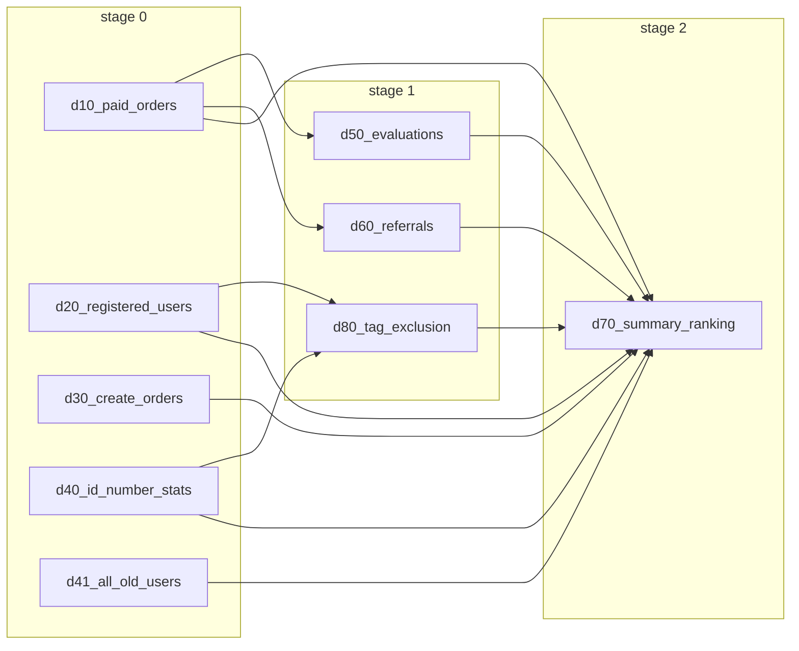

## 背景 / 动机

业务侧在编排 workflow DAG 时，通常以“阶段（stage）”理解：同一阶段内并行、阶段之间存在明确屏障。当前 scheduler 采用 DAG pipeline（ready 就跑）语义，吞吐更好，但会出现“上一阶段尚未全部完成，下一阶段部分节点已开始”的形态，导致可预期性、排障与资源规划（例如希望“按阶段观察并行度/资源占用”）变差。

需要提供一个明确、可配置的 scheduling preset：既保留现有 pipeline 行为，也支持严格阶段屏障（上一阶段全部终态后才进入下一阶段），并让调用方能以较低配置成本表达“阶段性并行”的意图。

## 变更内容

- 在 workflow 的运行期策略边界（`workflow_runtime_options`）新增一个 scheduling preset：`WorkflowRuntimeOptions.scheduler`
  - 该配置以策略对象（typed dataclass preset）承载，避免后续扩展退化为“字符串策略 + 大平铺散字段”。
  - preset 1：`pipeline`（默认）：保持现有 DAG pipeline（ready 就跑）语义。
  - preset 2：`stage_barrier`：严格屏障；仅当当前阶段内全部节点到达终态（成功/失败/取消）后，才允许下一阶段节点开始。
- `stage_barrier` 的阶段划分由系统自动推导，无需用户手写额外依赖边模拟屏障：
  - 对 demand 节点：`stage(node)=max(stage(dep))+1`（无 deps 则为 0）
  - 对内部 write nodes：用户侧 `stage` 折叠到其输入 demand 的 `stage`（更贴近用户心智；拓扑层级仍可作为诊断/布局参考）
- 同一阶段内仍受全局并发上限约束（worker 数），用于限制阶段内最大并发节点数（具体 worker 配置来源由 runtime policy 决定）。
- 提供最小但覆盖面完整的可观测性/可视化提示（事件为主、viz snapshot 为辅）：
  - 在 workflow node start/end/cancelled 事件 payload 中增量暴露 `stage` 与 `schedule_mode`
  - 在 workflow viz snapshot 的 `meta.metadata` 中暴露 `schedule_mode`；节点层级（`level`/`stage_id`）可直接用于展示阶段信息（无需前端重复推导）

## Capabilities

### New Capabilities
- `workflow-stage-scheduling`: 为 workflow DAG 提供可配置的调度 preset（`pipeline` vs `stage_barrier`），并对外暴露可解释的阶段归因信息。

### Modified Capabilities
- `yaml-dsl-workflow`: workflow 执行语义增加 scheduling preset 的配置入口与语义约束；并更新示例与用户指引（runtime options 侧配置）。

## Impact

- **运行语义**：新增 `stage_barrier` 会改变启动顺序与并行形态（吞吐可能降低但可预期性提升）；默认 `pipeline` 不变。
- **配置面**：workflow 的 runtime options 将新增一个稳定的 orchestrator knob（scheduling preset）；并与 runtime 并发/资源策略解耦。
- **可视化/排障**：建议在 workflow 可视化输出中标注 stage 层级，以降低“为什么它先跑/后跑”的解释成本。

## 示例（动机 DAG）

以下 DAG 在业务上非常容易被理解成“阶段”：

- 阶段 0：`d10/d20/d30/d40/d41`
- 阶段 1：`d50/d60/d80`
- 阶段 2：`d70`

在当前 `pipeline` 模式下，只要 `d10` 结束，`d50/d60` 就可能开始，即便同属 stage 0 的 `d20/d30/...` 仍在运行；这对“阶段性并行”的预期与排障不友好。

在 `stage_barrier` 模式下，stage 1 必须等待 stage 0 全部节点到达终态（成功/失败/取消/跳过）后才能开始，从而实现严格屏障语义。

