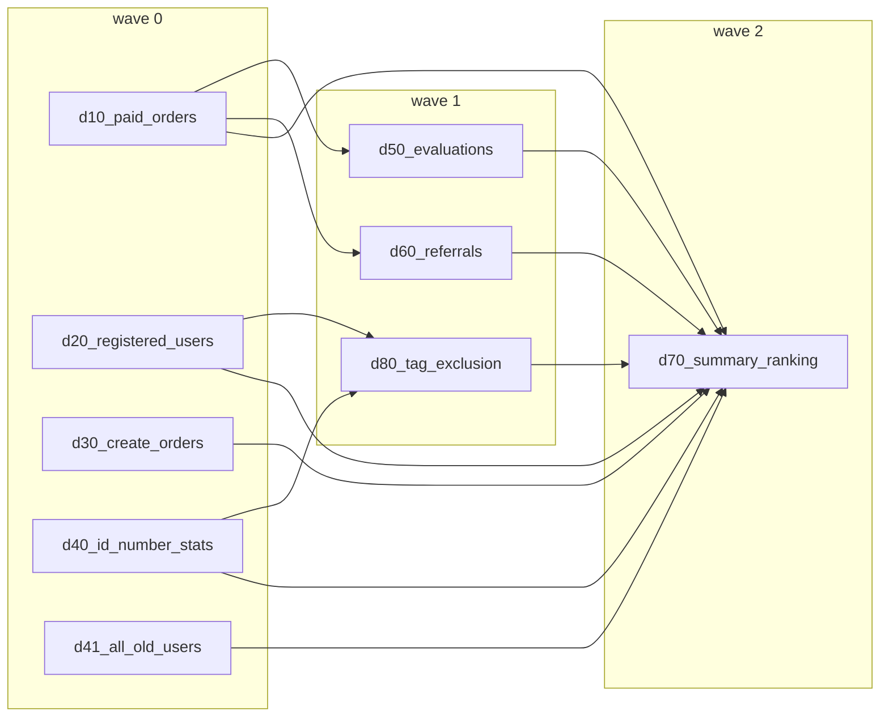

## Why

用户在 authoring workflow DAG 时常以“波次/阶段（wave/phase）”来理解：同一波次内并行、波次之间有显式屏障。当前 scheduler 采用 DAG pipeline（ready 就跑）的语义，虽然吞吐更好，但会出现“上一波尚未全部完成，下一波部分节点已开始”的现象，导致可预期性、排障与资源规划（例如限制同波次并发）变差。

需要提供一个明确、可配置的 scheduling preset：既保留现有 pipeline 行为，也支持严格波次屏障（上一波全部完成才进入下一波），并让调用方能以更少的配置成本表达“阶段性并行”的意图。

## What Changes

- 在 workflow 的 `workflow_runtime` 中新增一个 scheduling preset（命名待定，例如 `WorkflowRuntimeOptions.scheduler`）：
  - 为避免 “大平铺 + 字符串策略” 难维护，该配置建议以策略对象/内聚数据类承载（例如 `PipelineSchedulerOptions` / `WaveBarrierSchedulerOptions` 两种实现），而不是新增多个正交性不清晰的散字段。
  - preset 1：`pipeline`（默认）：保持现有 DAG pipeline（ready 就跑）语义。
  - preset 2：`wave_barrier`：严格屏障；仅当当前波次全部可运行节点终止（成功/失败/取消）后才允许下一波次节点开始。
- `wave_barrier` 的波次划分基于 DAG 拓扑层（`wave(node)=max(wave(dep))+1`），无需用户手写额外依赖边来模拟屏障。
- 同一波次内仍受全局并发上限约束（worker 数），用于限制同波次最大并发 demand 节点数（具体 worker 配置来源由 runtime policy 决定）。
- 提供最小的可视化/可观测性提示（例如在 workflow viz snapshot 或事件 meta 中暴露 `wave`/`schedule_mode`），便于排障与解释执行顺序。

## Capabilities

### New Capabilities
- `workflow-wave-scheduling`: 为 workflow DAG 提供可配置的调度 preset（pipeline vs wave barrier），并对外暴露可解释的 wave 归因信息。

### Modified Capabilities
- `yaml-dsl-workflow`: workflow 执行语义增加 scheduling preset 的配置入口与语义约束；并更新示例与用户指引（runtime options 侧配置）。

## Impact

- **运行语义**：新增 `wave_barrier` 会改变启动顺序与并行形态（吞吐可能降低但可预期性提升）；默认 `pipeline` 不变。
- **配置面**：workflow 的 runtime options 将新增一个稳定的 orchestrator knob（scheduling preset）；并与 runtime 并发/资源策略解耦。
- **可视化/排障**：建议在 workflow 可视化输出中标注 wave 层级，以降低“为什么它先跑/后跑”的解释成本。

## Example (Motivating DAG)

以下 DAG 在业务上非常容易被理解成“波次”：

- wave 0：`d10/d20/d30/d40/d41`
- wave 1：`d50/d60/d80`
- wave 2：`d70`

在当前 `pipeline` 模式下，只要 `d10` 结束，`d50/d60` 就可能开始，即便同属 wave 0 的 `d20/d30/...` 仍在运行；这对“阶段性并行”的预期与排障不友好。

在 `wave_barrier` 模式下，wave 1 必须等待 wave 0 全部节点到达终态（成功/失败/取消/跳过）后才能开始，从而实现严格屏障语义。

